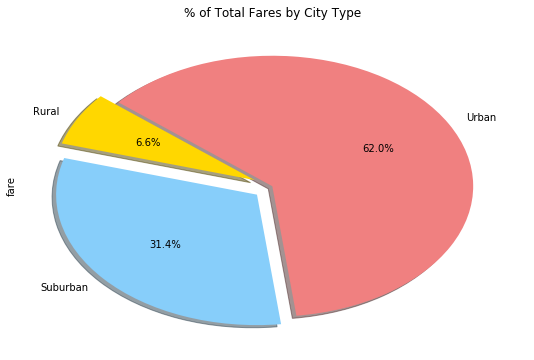
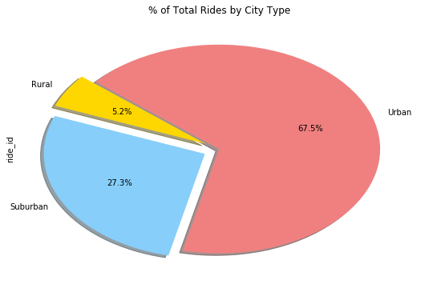
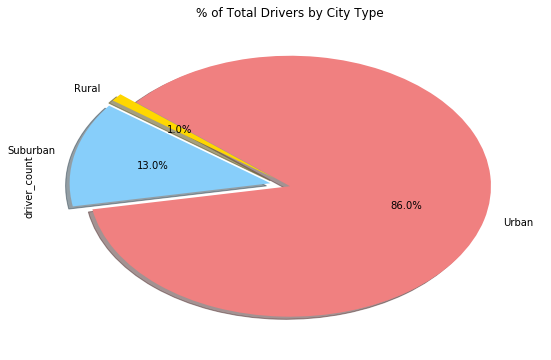

# Pyber Ride Sharing
- Observed Trend 1: As expected, most of the rides and drivers are concentrated in Urban cities.
- Observed Trend 2: The total fares are hence generated more in Urban cities, exceeding Suburban & Rural combined. 
- Observed Trend 3: However, average fare per ride is higher in Suburb and Rural cities than it is in Urban.


```python
import matplotlib.pyplot as plt
import numpy as np
import pandas as pd
import os
```


```python
csvpath1 = os.path.join("raw_data", "city_data.csv")
csvpath2 = os.path.join("raw_data", "ride_data.csv")
pyber_df1 = pd.read_csv(csvpath1)
pyber_df2 = pd.read_csv(csvpath2)
totalmerge_df = pd.merge(pyber_df1, pyber_df2, on="city")
sample_df = pyber_df2.sample(5)
samplemerge_df = pd.merge(sample_df, pyber_df1, on="city")
samplemerge_df
```


<div>
<style>
    .dataframe thead tr:only-child th {
        text-align: right;
    }

    .dataframe thead th {
        text-align: left;
    }

    .dataframe tbody tr th {
        vertical-align: top;
    }
</style>
<table border="1" class="dataframe">
  <thead>
    <tr style="text-align: right;">
      <th></th>
      <th>city</th>
      <th>date</th>
      <th>fare</th>
      <th>ride_id</th>
      <th>driver_count</th>
      <th>type</th>
    </tr>
  </thead>
  <tbody>
    <tr>
      <th>0</th>
      <td>North Tracyfort</td>
      <td>2016-01-21 22:58:39</td>
      <td>49.20</td>
      <td>8858130821345</td>
      <td>18</td>
      <td>Suburban</td>
    </tr>
    <tr>
      <th>1</th>
      <td>Travisville</td>
      <td>2016-09-25 07:58:14</td>
      <td>29.28</td>
      <td>4285150865112</td>
      <td>37</td>
      <td>Urban</td>
    </tr>
    <tr>
      <th>2</th>
      <td>Johnland</td>
      <td>2016-06-10 14:01:07</td>
      <td>15.35</td>
      <td>6010029428604</td>
      <td>13</td>
      <td>Suburban</td>
    </tr>
    <tr>
      <th>3</th>
      <td>Johnland</td>
      <td>2016-07-17 16:27:49</td>
      <td>46.96</td>
      <td>7239195028961</td>
      <td>13</td>
      <td>Suburban</td>
    </tr>
    <tr>
      <th>4</th>
      <td>New Samanthaside</td>
      <td>2016-02-15 01:27:51</td>
      <td>28.39</td>
      <td>9183374328787</td>
      <td>16</td>
      <td>Suburban</td>
    </tr>
  </tbody>
</table>
</div>


# Bubble Plot of Ride Sharing Data


```python
grouped_data = totalmerge_df.groupby(["city"])
averagefare = grouped_data["fare"].mean().apply("{:,.2f}".format)
totalrides = grouped_data["ride_id"].count()
print(averagefare)
print(totalrides)

# df.plot(kind='scatter', x='Total Rides', y='Average Fare', s=df.'Driver Count')

# plt.title("Pyber Ride Sharing Data (2016)")
# plt.xlabel("Total Number of Rides (Per City)")
# plt.ylabel("Average Fare ($))")

# plt.scatter(x_values, times, marker="o", color="red")
# plt.show()
```

    city
    Alvarezhaven            23.93
    Alyssaberg              20.61
    Anitamouth              37.32
    Antoniomouth            23.62
    Aprilchester            21.98
    Arnoldview              25.11
    Campbellport            33.71
    Carrollbury             36.61
    Carrollfort             25.40
    Clarkstad               31.05
    Conwaymouth             34.59
    Davidtown               22.98
    Davistown               21.50
    East Cherylfurt         31.42
    East Douglas            26.17
    East Erin               24.48
    East Jenniferchester    32.60
    East Leslie             33.66
    East Stephen            39.05
    East Troybury           33.24
    Edwardsbury             26.88
    Erikport                30.04
    Eriktown                25.48
    Floresberg              32.31
    Fosterside              23.03
    Hernandezshire          32.00
    Horneland               21.48
    Jacksonfort             32.01
    Jacobfort               24.78
    Jasonfort               27.83
                            ...  
    South Roy               26.03
    South Shannonborough    26.52
    Spencertown             23.68
    Stevensport             31.95
    Stewartview             21.61
    Swansonbury             27.46
    Thomastown              30.31
    Tiffanyton              28.51
    Torresshire             24.21
    Travisville             27.22
    Vickimouth              21.47
    Webstertown             29.72
    West Alexis             19.52
    West Brandy             24.16
    West Brittanyton        25.44
    West Dawnfurt           22.33
    West Evan               27.01
    West Jefferyfurt        21.07
    West Kevintown          21.53
    West Oscar              24.28
    West Pamelaborough      33.80
    West Paulport           33.28
    West Peter              24.88
    West Sydneyhaven        22.37
    West Tony               29.61
    Williamchester          34.28
    Williamshire            26.99
    Wiseborough             22.68
    Yolandafurt             27.21
    Zimmermanmouth          28.30
    Name: fare, Length: 125, dtype: object
    city
    Alvarezhaven            31
    Alyssaberg              26
    Anitamouth               9
    Antoniomouth            22
    Aprilchester            19
    Arnoldview              31
    Campbellport            15
    Carrollbury             10
    Carrollfort             29
    Clarkstad               12
    Conwaymouth             11
    Davidtown               21
    Davistown               25
    East Cherylfurt         13
    East Douglas            22
    East Erin               28
    East Jenniferchester    19
    East Leslie             11
    East Stephen            10
    East Troybury            7
    Edwardsbury             27
    Erikport                 8
    Eriktown                19
    Floresberg              10
    Fosterside              24
    Hernandezshire           9
    Horneland                4
    Jacksonfort              6
    Jacobfort               31
    Jasonfort               12
                            ..
    South Roy               22
    South Shannonborough    15
    Spencertown             26
    Stevensport              5
    Stewartview             30
    Swansonbury             34
    Thomastown              24
    Tiffanyton              13
    Torresshire             26
    Travisville             23
    Vickimouth              15
    Webstertown             16
    West Alexis             20
    West Brandy             30
    West Brittanyton        24
    West Dawnfurt           29
    West Evan               12
    West Jefferyfurt        21
    West Kevintown           7
    West Oscar              29
    West Pamelaborough      14
    West Paulport           17
    West Peter              31
    West Sydneyhaven        18
    West Tony               19
    Williamchester          11
    Williamshire            31
    Wiseborough             19
    Yolandafurt             20
    Zimmermanmouth          24
    Name: ride_id, Length: 125, dtype: int64


```python

```

# Total Fares by City Type


```python
groupedbytype = totalmerge_df.groupby(["type"])
totalfares = groupedbytype["fare"].sum()
totalfares_chart = totalfares.plot(kind='pie', colors=['gold','lightskyblue','lightcoral'], explode = [0.1, 0.1, 0],
                                   autopct="{0:1.1f}%".format, shadow=True, startangle=140, figsize=(9, 6))
plt.title("% of Total Fares by City Type")
plt.show()
```





# Total Rides by City Type


```python
groupedbytype = totalmerge_df.groupby(["type"])
totalrides = groupedbytype["ride_id"].count()
totalrides_chart = totalrides.plot(kind='pie', colors=['gold','lightskyblue','lightcoral'], explode = [0.1, 0.1, 0],
                                   autopct="{0:1.1f}%".format, shadow=True, startangle=140, figsize=(9, 6))
plt.title("% of Total Rides by City Type")
plt.show()
```





# Total Drivers by City Type


```python
groupedbytype = totalmerge_df.groupby(["type"])
totaldrivers = groupedbytype["driver_count"].sum()
totaldrivers_chart = totaldrivers.plot(kind='pie', colors=['gold','lightskyblue','lightcoral'], explode = [0.1, 0.1, 0],
                                   autopct="{0:1.1f}%".format, shadow=True, startangle=140, figsize=(9, 6))
plt.title("% of Total Drivers by City Type")
plt.show()
```





```python

```
