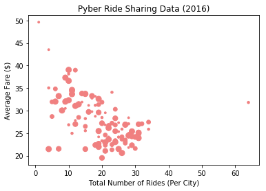
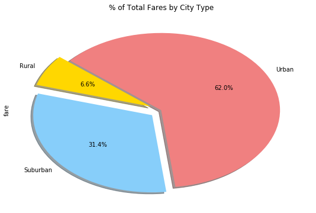
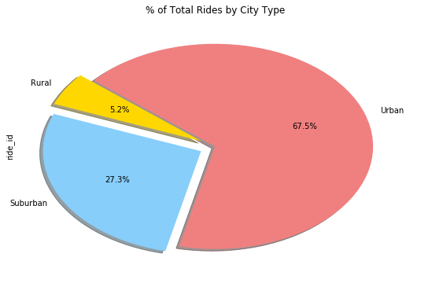
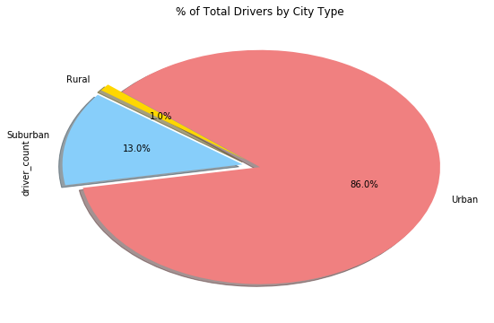

# Pyber Ride Sharing
- Observed Trend 1: As expected, most of the rides and drivers are concentrated in Urban cities.
- Observed Trend 2: The total fares are hence generated more in Urban cities, exceeding Suburban & Rural combined. 
- Observed Trend 3: However, average fare per ride is higher in Suburb and Rural cities than it is in Urban.


```python
import matplotlib.pyplot as plt
import numpy as np
import pandas as pd
import os
```


```python
csvpath1 = os.path.join("raw_data", "city_data.csv")
csvpath2 = os.path.join("raw_data", "ride_data.csv")
pyber_df1 = pd.read_csv(csvpath1)
pyber_df2 = pd.read_csv(csvpath2)
totalmerge_df = pd.merge(pyber_df1, pyber_df2, on="city")
sample_df = pyber_df2.sample(5)
samplemerge_df = pd.merge(sample_df, pyber_df1, on="city")
samplemerge_df
```


<div>
<style>
    .dataframe thead tr:only-child th {
        text-align: right;
    }

    .dataframe thead th {
        text-align: left;
    }

    .dataframe tbody tr th {
        vertical-align: top;
    }
</style>
<table border="1" class="dataframe">
  <thead>
    <tr style="text-align: right;">
      <th></th>
      <th>city</th>
      <th>date</th>
      <th>fare</th>
      <th>ride_id</th>
      <th>driver_count</th>
      <th>type</th>
    </tr>
  </thead>
  <tbody>
    <tr>
      <th>0</th>
      <td>Lake Jeffreyland</td>
      <td>2016-05-29 13:39:18</td>
      <td>16.00</td>
      <td>9147017027284</td>
      <td>15</td>
      <td>Urban</td>
    </tr>
    <tr>
      <th>1</th>
      <td>West Tony</td>
      <td>2016-01-05 08:35:08</td>
      <td>15.72</td>
      <td>9708629466047</td>
      <td>17</td>
      <td>Suburban</td>
    </tr>
    <tr>
      <th>2</th>
      <td>Williamshire</td>
      <td>2016-01-19 13:24:50</td>
      <td>28.73</td>
      <td>3631350485185</td>
      <td>70</td>
      <td>Urban</td>
    </tr>
    <tr>
      <th>3</th>
      <td>New Aaron</td>
      <td>2016-03-08 03:33:45</td>
      <td>21.76</td>
      <td>860822115609</td>
      <td>60</td>
      <td>Urban</td>
    </tr>
    <tr>
      <th>4</th>
      <td>Yolandafurt</td>
      <td>2016-04-27 10:08:30</td>
      <td>41.96</td>
      <td>963387807320</td>
      <td>7</td>
      <td>Urban</td>
    </tr>
  </tbody>
</table>
</div>


# Bubble Plot of Ride Sharing Data


```python
grouped_data = totalmerge_df.groupby(["city"])
averagefare = grouped_data["fare"].mean().apply("{:,.2f}".format)
totalrides = grouped_data["ride_id"].count()
combined = pd.concat([totalrides, averagefare], axis =1)
combined.columns = ["Total Rides", "Average Fare"]
combined['Total Rides'] = pd.to_numeric(combined['Total Rides'])
combined['Average Fare'] = pd.to_numeric(combined['Average Fare'])

combined.plot(kind="scatter", x="Total Rides", y="Average Fare", s=totalmerge_df['driver_count'], color='lightcoral')

plt.title("Pyber Ride Sharing Data (2016)")
plt.xlabel("Total Number of Rides (Per City)")
plt.ylabel("Average Fare ($)")

plt.show()
```





# Total Fares by City Type


```python
groupedbytype = totalmerge_df.groupby(["type"])
totalfares = groupedbytype["fare"].sum()
totalfares_chart = totalfares.plot(kind='pie', colors=['gold','lightskyblue','lightcoral'], explode = [0.1, 0.1, 0],
                                   autopct="{0:1.1f}%".format, shadow=True, startangle=140, figsize=(9, 6))
plt.title("% of Total Fares by City Type")
plt.show()
```





# Total Rides by City Type


```python
groupedbytype = totalmerge_df.groupby(["type"])
totalrides = groupedbytype["ride_id"].count()
totalrides_chart = totalrides.plot(kind='pie', colors=['gold','lightskyblue','lightcoral'], explode = [0.1, 0.1, 0],
                                   autopct="{0:1.1f}%".format, shadow=True, startangle=140, figsize=(9, 6))
plt.title("% of Total Rides by City Type")
plt.show()
```





# Total Drivers by City Type


```python
groupedbytype = totalmerge_df.groupby(["type"])
totaldrivers = groupedbytype["driver_count"].sum()
totaldrivers_chart = totaldrivers.plot(kind='pie', colors=['gold','lightskyblue','lightcoral'], explode = [0.1, 0.1, 0],
                                   autopct="{0:1.1f}%".format, shadow=True, startangle=140, figsize=(9, 6))
plt.title("% of Total Drivers by City Type")
plt.show()
```





```python

```
