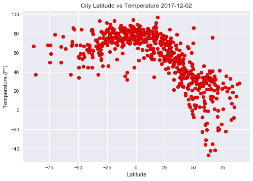
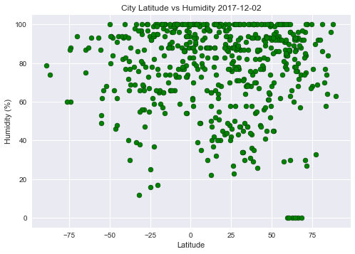
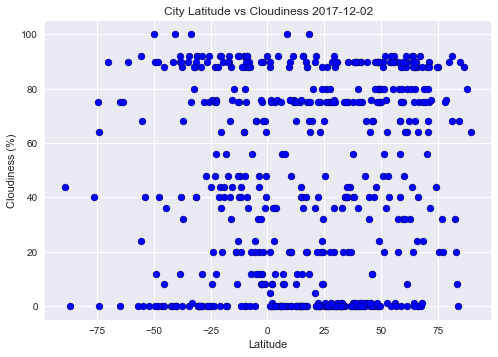
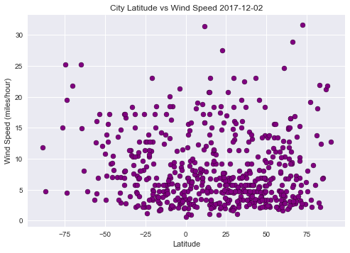

# WeatherPy
### Analysis
- Observed Trend 1: The temperatures are indeed higher in places near the equator than those farther away
- Observed Trend 2: No apparent correlations between latitude and other categories (humidity, cloudiness, wind speed).
- Observed Trend 3: Based on the dot density in all graphs, there are more cities in the northern atmosphere than the southern part.

### (Random Selection of Coordinates)


```python
import numpy as np
import pandas as pd
import matplotlib.pyplot as plt
import seaborn as sns
import requests as req
import json
import apikeys

from random import uniform

def coordinate():
    return uniform(-90, 90), uniform(-180,180)

points = []
for i in range(1500):
    points.append(coordinate())

cities_pd = pd.DataFrame(points)
cities_pd.columns = ["Lat", "Lng"]
cities_pd["City"] = ''
cities_pd["Country"] = ''
cities_pd = cities_pd[["City", "Country", "Lat", "Lng"]]
# cities_pd.head()
```

## Generate List of Cities


```python
from citipy import citipy

for index, row in cities_pd.iterrows():
    city = citipy.nearest_city(row["Lat"], row["Lng"])
    
    cities_pd.set_value(index, "City", city.city_name)
    cities_pd.set_value(index, "Country", city.country_code.upper())
    
cities_df = cities_pd.iloc[:, 0:2].drop_duplicates()
len(cities_df)
```


    652


## Perform API Calls


```python
cities_pd["Max Temp"] = ''
cities_pd["Humidity"] = ''
cities_pd["Date"] = ''
cities_pd["Cloudiness"] = ''
cities_pd["Wind Speed"] = ''


url = "http://api.openweathermap.org/data/2.5/weather"
parameters = {'appid': apikeys.OWM_KEY,
              'q': '',
              'units': 'imperial'}


for index, row in cities_df.iterrows():
    print('Now retrieving city: ', row['City'])
    print(url + "&APPID=YOUR-KEY-GOES-HERE"+"&q"+ row['City'])

#     cities_data = []
    parameters['q'] = row['City']
    response = req.get(url, params=parameters).json()
#     cities_data.append(response)

    try:
        maxtemp_data = response['main']['temp_max']
        humid_data = response['main']['humidity']
        date_data = response['dt']
        cloud_data = response['clouds']['all']
        wind_data = response['wind']['speed']
        
        cities_pd.set_value(index, "Max Temp", maxtemp_data)
        cities_pd.set_value(index, "Humidity", humid_data)
        cities_pd.set_value(index, "Date", date_data)
        cities_pd.set_value(index, "Cloudiness", cloud_data)
        cities_pd.set_value(index, "Wind Speed", wind_data)

    except KeyError:
        print(f"Data Error for `{row['City']}` ... skipping.")

```

    Now retrieving city:  shagonar
    http://api.openweathermap.org/data/2.5/weather&APPID=YOUR-KEY-GOES-HERE&qshagonar
    Now retrieving city:  butaritari
    http://api.openweathermap.org/data/2.5/weather&APPID=YOUR-KEY-GOES-HERE&qbutaritari
    Now retrieving city:  illoqqortoormiut
    http://api.openweathermap.org/data/2.5/weather&APPID=YOUR-KEY-GOES-HERE&qilloqqortoormiut
    Data Error for `illoqqortoormiut` ... skipping.
    Now retrieving city:  jahrom
    http://api.openweathermap.org/data/2.5/weather&APPID=YOUR-KEY-GOES-HERE&qjahrom
    Data Error for `jahrom` ... skipping.
    Now retrieving city:  punta arenas
    http://api.openweathermap.org/data/2.5/weather&APPID=YOUR-KEY-GOES-HERE&qpunta arenas
    Now retrieving city:  tanete
    http://api.openweathermap.org/data/2.5/weather&APPID=YOUR-KEY-GOES-HERE&qtanete
    Data Error for `tanete` ... skipping.
    Now retrieving city:  albany
    http://api.openweathermap.org/data/2.5/weather&APPID=YOUR-KEY-GOES-HERE&qalbany
    Now retrieving city:  williamsburg
    http://api.openweathermap.org/data/2.5/weather&APPID=YOUR-KEY-GOES-HERE&qwilliamsburg
    Now retrieving city:  ahipara
    http://api.openweathermap.org/data/2.5/weather&APPID=YOUR-KEY-GOES-HERE&qahipara
    Now retrieving city:  sitka
    http://api.openweathermap.org/data/2.5/weather&APPID=YOUR-KEY-GOES-HERE&qsitka
    Now retrieving city:  kodiak
    http://api.openweathermap.org/data/2.5/weather&APPID=YOUR-KEY-GOES-HERE&qkodiak
    Now retrieving city:  busselton
    http://api.openweathermap.org/data/2.5/weather&APPID=YOUR-KEY-GOES-HERE&qbusselton
    Now retrieving city:  hobart
    http://api.openweathermap.org/data/2.5/weather&APPID=YOUR-KEY-GOES-HERE&qhobart
    Now retrieving city:  clyde river
    http://api.openweathermap.org/data/2.5/weather&APPID=YOUR-KEY-GOES-HERE&qclyde river
    Now retrieving city:  mataura
    http://api.openweathermap.org/data/2.5/weather&APPID=YOUR-KEY-GOES-HERE&qmataura
    Data Error for `mataura` ... skipping.
    Now retrieving city:  sarh
    http://api.openweathermap.org/data/2.5/weather&APPID=YOUR-KEY-GOES-HERE&qsarh
    Data Error for `sarh` ... skipping.
    Now retrieving city:  barrow
    http://api.openweathermap.org/data/2.5/weather&APPID=YOUR-KEY-GOES-HERE&qbarrow
    Now retrieving city:  heishan
    http://api.openweathermap.org/data/2.5/weather&APPID=YOUR-KEY-GOES-HERE&qheishan
    Now retrieving city:  nadym
    http://api.openweathermap.org/data/2.5/weather&APPID=YOUR-KEY-GOES-HERE&qnadym
    Now retrieving city:  chepareria
    http://api.openweathermap.org/data/2.5/weather&APPID=YOUR-KEY-GOES-HERE&qchepareria
    Now retrieving city:  bosaso
    http://api.openweathermap.org/data/2.5/weather&APPID=YOUR-KEY-GOES-HERE&qbosaso
    Data Error for `bosaso` ... skipping.
    Now retrieving city:  ushuaia
    http://api.openweathermap.org/data/2.5/weather&APPID=YOUR-KEY-GOES-HERE&qushuaia
    Now retrieving city:  moose factory
    http://api.openweathermap.org/data/2.5/weather&APPID=YOUR-KEY-GOES-HERE&qmoose factory
    Data Error for `moose factory` ... skipping.
    Now retrieving city:  attawapiskat
    http://api.openweathermap.org/data/2.5/weather&APPID=YOUR-KEY-GOES-HERE&qattawapiskat
    Data Error for `attawapiskat` ... skipping.
    Now retrieving city:  balaipungut
    http://api.openweathermap.org/data/2.5/weather&APPID=YOUR-KEY-GOES-HERE&qbalaipungut
    Now retrieving city:  port elizabeth
    http://api.openweathermap.org/data/2.5/weather&APPID=YOUR-KEY-GOES-HERE&qport elizabeth
    Now retrieving city:  avarua
    http://api.openweathermap.org/data/2.5/weather&APPID=YOUR-KEY-GOES-HERE&qavarua
    Now retrieving city:  saint anthony
    http://api.openweathermap.org/data/2.5/weather&APPID=YOUR-KEY-GOES-HERE&qsaint anthony
    Now retrieving city:  poyarkovo
    http://api.openweathermap.org/data/2.5/weather&APPID=YOUR-KEY-GOES-HERE&qpoyarkovo
    Now retrieving city:  los llanos de aridane
    http://api.openweathermap.org/data/2.5/weather&APPID=YOUR-KEY-GOES-HERE&qlos llanos de aridane
    Now retrieving city:  saint george
    http://api.openweathermap.org/data/2.5/weather&APPID=YOUR-KEY-GOES-HERE&qsaint george
    Now retrieving city:  cherskiy
    http://api.openweathermap.org/data/2.5/weather&APPID=YOUR-KEY-GOES-HERE&qcherskiy
    Now retrieving city:  atuona
    http://api.openweathermap.org/data/2.5/weather&APPID=YOUR-KEY-GOES-HERE&qatuona
    Now retrieving city:  dikson
    http://api.openweathermap.org/data/2.5/weather&APPID=YOUR-KEY-GOES-HERE&qdikson
    Now retrieving city:  obo
    http://api.openweathermap.org/data/2.5/weather&APPID=YOUR-KEY-GOES-HERE&qobo
    Now retrieving city:  amderma
    http://api.openweathermap.org/data/2.5/weather&APPID=YOUR-KEY-GOES-HERE&qamderma
    Data Error for `amderma` ... skipping.
    Now retrieving city:  mantua
    http://api.openweathermap.org/data/2.5/weather&APPID=YOUR-KEY-GOES-HERE&qmantua
    Now retrieving city:  rawson
    http://api.openweathermap.org/data/2.5/weather&APPID=YOUR-KEY-GOES-HERE&qrawson
    Now retrieving city:  yinchuan
    http://api.openweathermap.org/data/2.5/weather&APPID=YOUR-KEY-GOES-HERE&qyinchuan
    Now retrieving city:  viransehir
    http://api.openweathermap.org/data/2.5/weather&APPID=YOUR-KEY-GOES-HERE&qviransehir
    Now retrieving city:  nome
    http://api.openweathermap.org/data/2.5/weather&APPID=YOUR-KEY-GOES-HERE&qnome
    Now retrieving city:  grand gaube
    http://api.openweathermap.org/data/2.5/weather&APPID=YOUR-KEY-GOES-HERE&qgrand gaube
    Now retrieving city:  vaini
    http://api.openweathermap.org/data/2.5/weather&APPID=YOUR-KEY-GOES-HERE&qvaini
    Now retrieving city:  saint-malo
    http://api.openweathermap.org/data/2.5/weather&APPID=YOUR-KEY-GOES-HERE&qsaint-malo
    Now retrieving city:  guerrero negro
    http://api.openweathermap.org/data/2.5/weather&APPID=YOUR-KEY-GOES-HERE&qguerrero negro
    Now retrieving city:  ust-tsilma
    http://api.openweathermap.org/data/2.5/weather&APPID=YOUR-KEY-GOES-HERE&qust-tsilma
    Now retrieving city:  east london
    http://api.openweathermap.org/data/2.5/weather&APPID=YOUR-KEY-GOES-HERE&qeast london
    Now retrieving city:  tasiilaq
    http://api.openweathermap.org/data/2.5/weather&APPID=YOUR-KEY-GOES-HERE&qtasiilaq
    Now retrieving city:  tuktoyaktuk
    http://api.openweathermap.org/data/2.5/weather&APPID=YOUR-KEY-GOES-HERE&qtuktoyaktuk
    Now retrieving city:  bengkulu
    http://api.openweathermap.org/data/2.5/weather&APPID=YOUR-KEY-GOES-HERE&qbengkulu
    Now retrieving city:  camopi
    http://api.openweathermap.org/data/2.5/weather&APPID=YOUR-KEY-GOES-HERE&qcamopi
    Now retrieving city:  hilo
    http://api.openweathermap.org/data/2.5/weather&APPID=YOUR-KEY-GOES-HERE&qhilo
    Now retrieving city:  pogar
    http://api.openweathermap.org/data/2.5/weather&APPID=YOUR-KEY-GOES-HERE&qpogar
    Now retrieving city:  port lincoln
    http://api.openweathermap.org/data/2.5/weather&APPID=YOUR-KEY-GOES-HERE&qport lincoln
    Now retrieving city:  rikitea
    http://api.openweathermap.org/data/2.5/weather&APPID=YOUR-KEY-GOES-HERE&qrikitea
    Now retrieving city:  avera
    http://api.openweathermap.org/data/2.5/weather&APPID=YOUR-KEY-GOES-HERE&qavera
    Data Error for `avera` ... skipping.
    Now retrieving city:  sakakah
    http://api.openweathermap.org/data/2.5/weather&APPID=YOUR-KEY-GOES-HERE&qsakakah
    Data Error for `sakakah` ... skipping.
    Now retrieving city:  port hawkesbury
    http://api.openweathermap.org/data/2.5/weather&APPID=YOUR-KEY-GOES-HERE&qport hawkesbury
    Now retrieving city:  gisborne
    http://api.openweathermap.org/data/2.5/weather&APPID=YOUR-KEY-GOES-HERE&qgisborne
    Now retrieving city:  changli
    http://api.openweathermap.org/data/2.5/weather&APPID=YOUR-KEY-GOES-HERE&qchangli
    Now retrieving city:  hermanus
    http://api.openweathermap.org/data/2.5/weather&APPID=YOUR-KEY-GOES-HERE&qhermanus
    Now retrieving city:  eureka
    http://api.openweathermap.org/data/2.5/weather&APPID=YOUR-KEY-GOES-HERE&qeureka
    Now retrieving city:  vaitupu
    http://api.openweathermap.org/data/2.5/weather&APPID=YOUR-KEY-GOES-HERE&qvaitupu
    Data Error for `vaitupu` ... skipping.
    Now retrieving city:  kapaa
    http://api.openweathermap.org/data/2.5/weather&APPID=YOUR-KEY-GOES-HERE&qkapaa
    Now retrieving city:  sola
    http://api.openweathermap.org/data/2.5/weather&APPID=YOUR-KEY-GOES-HERE&qsola
    Now retrieving city:  san francisco
    http://api.openweathermap.org/data/2.5/weather&APPID=YOUR-KEY-GOES-HERE&qsan francisco
    Now retrieving city:  abong mbang
    http://api.openweathermap.org/data/2.5/weather&APPID=YOUR-KEY-GOES-HERE&qabong mbang
    Now retrieving city:  lubango
    http://api.openweathermap.org/data/2.5/weather&APPID=YOUR-KEY-GOES-HERE&qlubango
    Now retrieving city:  cape town
    http://api.openweathermap.org/data/2.5/weather&APPID=YOUR-KEY-GOES-HERE&qcape town
    Now retrieving city:  tura
    http://api.openweathermap.org/data/2.5/weather&APPID=YOUR-KEY-GOES-HERE&qtura
    Now retrieving city:  yellowknife
    http://api.openweathermap.org/data/2.5/weather&APPID=YOUR-KEY-GOES-HERE&qyellowknife
    Now retrieving city:  jamestown
    http://api.openweathermap.org/data/2.5/weather&APPID=YOUR-KEY-GOES-HERE&qjamestown
    Now retrieving city:  coihaique
    http://api.openweathermap.org/data/2.5/weather&APPID=YOUR-KEY-GOES-HERE&qcoihaique
    Now retrieving city:  taolanaro
    http://api.openweathermap.org/data/2.5/weather&APPID=YOUR-KEY-GOES-HERE&qtaolanaro
    Data Error for `taolanaro` ... skipping.
    Now retrieving city:  marcona
    http://api.openweathermap.org/data/2.5/weather&APPID=YOUR-KEY-GOES-HERE&qmarcona
    Data Error for `marcona` ... skipping.
    Now retrieving city:  acarau
    http://api.openweathermap.org/data/2.5/weather&APPID=YOUR-KEY-GOES-HERE&qacarau
    Now retrieving city:  yulara
    http://api.openweathermap.org/data/2.5/weather&APPID=YOUR-KEY-GOES-HERE&qyulara
    Now retrieving city:  khatanga
    http://api.openweathermap.org/data/2.5/weather&APPID=YOUR-KEY-GOES-HERE&qkhatanga
    Now retrieving city:  champerico
    http://api.openweathermap.org/data/2.5/weather&APPID=YOUR-KEY-GOES-HERE&qchamperico
    Now retrieving city:  kenai
    http://api.openweathermap.org/data/2.5/weather&APPID=YOUR-KEY-GOES-HERE&qkenai
    Now retrieving city:  san patricio
    http://api.openweathermap.org/data/2.5/weather&APPID=YOUR-KEY-GOES-HERE&qsan patricio
    Now retrieving city:  upernavik
    http://api.openweathermap.org/data/2.5/weather&APPID=YOUR-KEY-GOES-HERE&qupernavik
    Now retrieving city:  louisbourg
    http://api.openweathermap.org/data/2.5/weather&APPID=YOUR-KEY-GOES-HERE&qlouisbourg
    Data Error for `louisbourg` ... skipping.
    Now retrieving city:  makakilo city
    http://api.openweathermap.org/data/2.5/weather&APPID=YOUR-KEY-GOES-HERE&qmakakilo city
    Now retrieving city:  necochea
    http://api.openweathermap.org/data/2.5/weather&APPID=YOUR-KEY-GOES-HERE&qnecochea
    Now retrieving city:  bryan
    http://api.openweathermap.org/data/2.5/weather&APPID=YOUR-KEY-GOES-HERE&qbryan
    Now retrieving city:  nizhneyansk
    http://api.openweathermap.org/data/2.5/weather&APPID=YOUR-KEY-GOES-HERE&qnizhneyansk
    Data Error for `nizhneyansk` ... skipping.
    Now retrieving city:  sug-aksy
    http://api.openweathermap.org/data/2.5/weather&APPID=YOUR-KEY-GOES-HERE&qsug-aksy
    Data Error for `sug-aksy` ... skipping.
    Now retrieving city:  dabakala
    http://api.openweathermap.org/data/2.5/weather&APPID=YOUR-KEY-GOES-HERE&qdabakala
    Now retrieving city:  asau
    http://api.openweathermap.org/data/2.5/weather&APPID=YOUR-KEY-GOES-HERE&qasau
    Now retrieving city:  maloshuyka
    http://api.openweathermap.org/data/2.5/weather&APPID=YOUR-KEY-GOES-HERE&qmaloshuyka
    Data Error for `maloshuyka` ... skipping.
    Now retrieving city:  sobolevo
    http://api.openweathermap.org/data/2.5/weather&APPID=YOUR-KEY-GOES-HERE&qsobolevo
    Data Error for `sobolevo` ... skipping.
    Now retrieving city:  liverpool
    http://api.openweathermap.org/data/2.5/weather&APPID=YOUR-KEY-GOES-HERE&qliverpool
    Now retrieving city:  viedma
    http://api.openweathermap.org/data/2.5/weather&APPID=YOUR-KEY-GOES-HERE&qviedma
    Now retrieving city:  alcains
    http://api.openweathermap.org/data/2.5/weather&APPID=YOUR-KEY-GOES-HERE&qalcains
    Now retrieving city:  new norfolk
    http://api.openweathermap.org/data/2.5/weather&APPID=YOUR-KEY-GOES-HERE&qnew norfolk
    Now retrieving city:  bluff
    http://api.openweathermap.org/data/2.5/weather&APPID=YOUR-KEY-GOES-HERE&qbluff
    Now retrieving city:  klaksvik
    http://api.openweathermap.org/data/2.5/weather&APPID=YOUR-KEY-GOES-HERE&qklaksvik
    Now retrieving city:  arraial do cabo
    http://api.openweathermap.org/data/2.5/weather&APPID=YOUR-KEY-GOES-HERE&qarraial do cabo
    Now retrieving city:  ostrovnoy
    http://api.openweathermap.org/data/2.5/weather&APPID=YOUR-KEY-GOES-HERE&qostrovnoy
    Now retrieving city:  sao paulo de olivenca
    http://api.openweathermap.org/data/2.5/weather&APPID=YOUR-KEY-GOES-HERE&qsao paulo de olivenca
    Now retrieving city:  alamos
    http://api.openweathermap.org/data/2.5/weather&APPID=YOUR-KEY-GOES-HERE&qalamos
    Now retrieving city:  huallanca
    http://api.openweathermap.org/data/2.5/weather&APPID=YOUR-KEY-GOES-HERE&qhuallanca
    Data Error for `huallanca` ... skipping.
    Now retrieving city:  panaba
    http://api.openweathermap.org/data/2.5/weather&APPID=YOUR-KEY-GOES-HERE&qpanaba
    Now retrieving city:  iranshahr
    http://api.openweathermap.org/data/2.5/weather&APPID=YOUR-KEY-GOES-HERE&qiranshahr
    Now retrieving city:  lagoa
    http://api.openweathermap.org/data/2.5/weather&APPID=YOUR-KEY-GOES-HERE&qlagoa
    Now retrieving city:  la plata
    http://api.openweathermap.org/data/2.5/weather&APPID=YOUR-KEY-GOES-HERE&qla plata
    Now retrieving city:  joaima
    http://api.openweathermap.org/data/2.5/weather&APPID=YOUR-KEY-GOES-HERE&qjoaima
    Now retrieving city:  kaitangata
    http://api.openweathermap.org/data/2.5/weather&APPID=YOUR-KEY-GOES-HERE&qkaitangata
    Data Error for `kaitangata` ... skipping.
    Now retrieving city:  luwuk
    http://api.openweathermap.org/data/2.5/weather&APPID=YOUR-KEY-GOES-HERE&qluwuk
    Now retrieving city:  georgetown
    http://api.openweathermap.org/data/2.5/weather&APPID=YOUR-KEY-GOES-HERE&qgeorgetown
    Now retrieving city:  puerto ayora
    http://api.openweathermap.org/data/2.5/weather&APPID=YOUR-KEY-GOES-HERE&qpuerto ayora
    Now retrieving city:  sterling
    http://api.openweathermap.org/data/2.5/weather&APPID=YOUR-KEY-GOES-HERE&qsterling
    Now retrieving city:  saldanha
    http://api.openweathermap.org/data/2.5/weather&APPID=YOUR-KEY-GOES-HERE&qsaldanha
    Now retrieving city:  fuyu
    http://api.openweathermap.org/data/2.5/weather&APPID=YOUR-KEY-GOES-HERE&qfuyu
    Now retrieving city:  hithadhoo
    http://api.openweathermap.org/data/2.5/weather&APPID=YOUR-KEY-GOES-HERE&qhithadhoo
    Now retrieving city:  souillac
    http://api.openweathermap.org/data/2.5/weather&APPID=YOUR-KEY-GOES-HERE&qsouillac
    Now retrieving city:  belushya guba
    http://api.openweathermap.org/data/2.5/weather&APPID=YOUR-KEY-GOES-HERE&qbelushya guba
    Data Error for `belushya guba` ... skipping.
    Now retrieving city:  sao felix do xingu
    http://api.openweathermap.org/data/2.5/weather&APPID=YOUR-KEY-GOES-HERE&qsao felix do xingu
    Now retrieving city:  leningradskiy
    http://api.openweathermap.org/data/2.5/weather&APPID=YOUR-KEY-GOES-HERE&qleningradskiy
    Now retrieving city:  khorramshahr
    http://api.openweathermap.org/data/2.5/weather&APPID=YOUR-KEY-GOES-HERE&qkhorramshahr
    Now retrieving city:  tuatapere
    http://api.openweathermap.org/data/2.5/weather&APPID=YOUR-KEY-GOES-HERE&qtuatapere
    Now retrieving city:  maine-soroa
    http://api.openweathermap.org/data/2.5/weather&APPID=YOUR-KEY-GOES-HERE&qmaine-soroa
    Now retrieving city:  bredasdorp
    http://api.openweathermap.org/data/2.5/weather&APPID=YOUR-KEY-GOES-HERE&qbredasdorp
    Now retrieving city:  ayagoz
    http://api.openweathermap.org/data/2.5/weather&APPID=YOUR-KEY-GOES-HERE&qayagoz
    Now retrieving city:  trujillo
    http://api.openweathermap.org/data/2.5/weather&APPID=YOUR-KEY-GOES-HERE&qtrujillo
    Now retrieving city:  oksfjord
    http://api.openweathermap.org/data/2.5/weather&APPID=YOUR-KEY-GOES-HERE&qoksfjord
    Now retrieving city:  henties bay
    http://api.openweathermap.org/data/2.5/weather&APPID=YOUR-KEY-GOES-HERE&qhenties bay
    Data Error for `henties bay` ... skipping.
    Now retrieving city:  juneau
    http://api.openweathermap.org/data/2.5/weather&APPID=YOUR-KEY-GOES-HERE&qjuneau
    Now retrieving city:  kruisfontein
    http://api.openweathermap.org/data/2.5/weather&APPID=YOUR-KEY-GOES-HERE&qkruisfontein
    Now retrieving city:  yuzhno-kurilsk
    http://api.openweathermap.org/data/2.5/weather&APPID=YOUR-KEY-GOES-HERE&qyuzhno-kurilsk
    Now retrieving city:  ribeira grande
    http://api.openweathermap.org/data/2.5/weather&APPID=YOUR-KEY-GOES-HERE&qribeira grande
    Now retrieving city:  namibe
    http://api.openweathermap.org/data/2.5/weather&APPID=YOUR-KEY-GOES-HERE&qnamibe
    Now retrieving city:  half moon bay
    http://api.openweathermap.org/data/2.5/weather&APPID=YOUR-KEY-GOES-HERE&qhalf moon bay
    Now retrieving city:  sorland
    http://api.openweathermap.org/data/2.5/weather&APPID=YOUR-KEY-GOES-HERE&qsorland
    Now retrieving city:  araouane
    http://api.openweathermap.org/data/2.5/weather&APPID=YOUR-KEY-GOES-HERE&qaraouane
    Now retrieving city:  salalah
    http://api.openweathermap.org/data/2.5/weather&APPID=YOUR-KEY-GOES-HERE&qsalalah
    Now retrieving city:  kitui
    http://api.openweathermap.org/data/2.5/weather&APPID=YOUR-KEY-GOES-HERE&qkitui
    Now retrieving city:  vardo
    http://api.openweathermap.org/data/2.5/weather&APPID=YOUR-KEY-GOES-HERE&qvardo
    Now retrieving city:  lebu
    http://api.openweathermap.org/data/2.5/weather&APPID=YOUR-KEY-GOES-HERE&qlebu
    Now retrieving city:  katsuura
    http://api.openweathermap.org/data/2.5/weather&APPID=YOUR-KEY-GOES-HERE&qkatsuura
    Now retrieving city:  kavaratti
    http://api.openweathermap.org/data/2.5/weather&APPID=YOUR-KEY-GOES-HERE&qkavaratti
    Now retrieving city:  port keats
    http://api.openweathermap.org/data/2.5/weather&APPID=YOUR-KEY-GOES-HERE&qport keats
    Now retrieving city:  iqaluit
    http://api.openweathermap.org/data/2.5/weather&APPID=YOUR-KEY-GOES-HERE&qiqaluit
    Now retrieving city:  san jeronimo
    http://api.openweathermap.org/data/2.5/weather&APPID=YOUR-KEY-GOES-HERE&qsan jeronimo
    Now retrieving city:  almenara
    http://api.openweathermap.org/data/2.5/weather&APPID=YOUR-KEY-GOES-HERE&qalmenara
    Now retrieving city:  vanavara
    http://api.openweathermap.org/data/2.5/weather&APPID=YOUR-KEY-GOES-HERE&qvanavara
    Now retrieving city:  changtu
    http://api.openweathermap.org/data/2.5/weather&APPID=YOUR-KEY-GOES-HERE&qchangtu
    Now retrieving city:  barentsburg
    http://api.openweathermap.org/data/2.5/weather&APPID=YOUR-KEY-GOES-HERE&qbarentsburg
    Data Error for `barentsburg` ... skipping.
    Now retrieving city:  ormara
    http://api.openweathermap.org/data/2.5/weather&APPID=YOUR-KEY-GOES-HERE&qormara
    Now retrieving city:  undory
    http://api.openweathermap.org/data/2.5/weather&APPID=YOUR-KEY-GOES-HERE&qundory
    Now retrieving city:  ambanja
    http://api.openweathermap.org/data/2.5/weather&APPID=YOUR-KEY-GOES-HERE&qambanja
    Now retrieving city:  tadine
    http://api.openweathermap.org/data/2.5/weather&APPID=YOUR-KEY-GOES-HERE&qtadine
    Now retrieving city:  sao desiderio
    http://api.openweathermap.org/data/2.5/weather&APPID=YOUR-KEY-GOES-HERE&qsao desiderio
    Now retrieving city:  aklavik
    http://api.openweathermap.org/data/2.5/weather&APPID=YOUR-KEY-GOES-HERE&qaklavik
    Now retrieving city:  bereda
    http://api.openweathermap.org/data/2.5/weather&APPID=YOUR-KEY-GOES-HERE&qbereda
    Data Error for `bereda` ... skipping.
    Now retrieving city:  mar del plata
    http://api.openweathermap.org/data/2.5/weather&APPID=YOUR-KEY-GOES-HERE&qmar del plata
    Now retrieving city:  rawannawi
    http://api.openweathermap.org/data/2.5/weather&APPID=YOUR-KEY-GOES-HERE&qrawannawi
    Data Error for `rawannawi` ... skipping.
    Now retrieving city:  spearfish
    http://api.openweathermap.org/data/2.5/weather&APPID=YOUR-KEY-GOES-HERE&qspearfish
    Now retrieving city:  hualmay
    http://api.openweathermap.org/data/2.5/weather&APPID=YOUR-KEY-GOES-HERE&qhualmay
    Now retrieving city:  leshukonskoye
    http://api.openweathermap.org/data/2.5/weather&APPID=YOUR-KEY-GOES-HERE&qleshukonskoye
    Now retrieving city:  okhotsk
    http://api.openweathermap.org/data/2.5/weather&APPID=YOUR-KEY-GOES-HERE&qokhotsk
    Now retrieving city:  coahuayana
    http://api.openweathermap.org/data/2.5/weather&APPID=YOUR-KEY-GOES-HERE&qcoahuayana
    Now retrieving city:  thompson
    http://api.openweathermap.org/data/2.5/weather&APPID=YOUR-KEY-GOES-HERE&qthompson
    Now retrieving city:  zharkovskiy
    http://api.openweathermap.org/data/2.5/weather&APPID=YOUR-KEY-GOES-HERE&qzharkovskiy
    Now retrieving city:  provideniya
    http://api.openweathermap.org/data/2.5/weather&APPID=YOUR-KEY-GOES-HERE&qprovideniya
    Now retrieving city:  pathein
    http://api.openweathermap.org/data/2.5/weather&APPID=YOUR-KEY-GOES-HERE&qpathein
    Now retrieving city:  yaan
    http://api.openweathermap.org/data/2.5/weather&APPID=YOUR-KEY-GOES-HERE&qyaan
    Data Error for `yaan` ... skipping.
    Now retrieving city:  mwanza
    http://api.openweathermap.org/data/2.5/weather&APPID=YOUR-KEY-GOES-HERE&qmwanza
    Now retrieving city:  guider
    http://api.openweathermap.org/data/2.5/weather&APPID=YOUR-KEY-GOES-HERE&qguider
    Now retrieving city:  halifax
    http://api.openweathermap.org/data/2.5/weather&APPID=YOUR-KEY-GOES-HERE&qhalifax
    Now retrieving city:  ejura
    http://api.openweathermap.org/data/2.5/weather&APPID=YOUR-KEY-GOES-HERE&qejura
    Now retrieving city:  labutta
    http://api.openweathermap.org/data/2.5/weather&APPID=YOUR-KEY-GOES-HERE&qlabutta
    Data Error for `labutta` ... skipping.
    Now retrieving city:  chuy
    http://api.openweathermap.org/data/2.5/weather&APPID=YOUR-KEY-GOES-HERE&qchuy
    Now retrieving city:  ust-maya
    http://api.openweathermap.org/data/2.5/weather&APPID=YOUR-KEY-GOES-HERE&qust-maya
    Now retrieving city:  mandurah
    http://api.openweathermap.org/data/2.5/weather&APPID=YOUR-KEY-GOES-HERE&qmandurah
    Now retrieving city:  sile
    http://api.openweathermap.org/data/2.5/weather&APPID=YOUR-KEY-GOES-HERE&qsile
    Now retrieving city:  praia
    http://api.openweathermap.org/data/2.5/weather&APPID=YOUR-KEY-GOES-HERE&qpraia
    Now retrieving city:  sistranda
    http://api.openweathermap.org/data/2.5/weather&APPID=YOUR-KEY-GOES-HERE&qsistranda
    Now retrieving city:  moron
    http://api.openweathermap.org/data/2.5/weather&APPID=YOUR-KEY-GOES-HERE&qmoron
    Now retrieving city:  nhulunbuy
    http://api.openweathermap.org/data/2.5/weather&APPID=YOUR-KEY-GOES-HERE&qnhulunbuy
    Now retrieving city:  vasudevanallur
    http://api.openweathermap.org/data/2.5/weather&APPID=YOUR-KEY-GOES-HERE&qvasudevanallur
    Now retrieving city:  velikie luki
    http://api.openweathermap.org/data/2.5/weather&APPID=YOUR-KEY-GOES-HERE&qvelikie luki
    Data Error for `velikie luki` ... skipping.
    Now retrieving city:  semnan
    http://api.openweathermap.org/data/2.5/weather&APPID=YOUR-KEY-GOES-HERE&qsemnan
    Now retrieving city:  dunedin
    http://api.openweathermap.org/data/2.5/weather&APPID=YOUR-KEY-GOES-HERE&qdunedin
    Now retrieving city:  lorengau
    http://api.openweathermap.org/data/2.5/weather&APPID=YOUR-KEY-GOES-HERE&qlorengau
    Now retrieving city:  touros
    http://api.openweathermap.org/data/2.5/weather&APPID=YOUR-KEY-GOES-HERE&qtouros
    Now retrieving city:  san pedro
    http://api.openweathermap.org/data/2.5/weather&APPID=YOUR-KEY-GOES-HERE&qsan pedro
    Now retrieving city:  banda aceh
    http://api.openweathermap.org/data/2.5/weather&APPID=YOUR-KEY-GOES-HERE&qbanda aceh
    Now retrieving city:  taltal
    http://api.openweathermap.org/data/2.5/weather&APPID=YOUR-KEY-GOES-HERE&qtaltal
    Now retrieving city:  turukhansk
    http://api.openweathermap.org/data/2.5/weather&APPID=YOUR-KEY-GOES-HERE&qturukhansk
    Now retrieving city:  saskylakh
    http://api.openweathermap.org/data/2.5/weather&APPID=YOUR-KEY-GOES-HERE&qsaskylakh
    Now retrieving city:  castro
    http://api.openweathermap.org/data/2.5/weather&APPID=YOUR-KEY-GOES-HERE&qcastro
    Now retrieving city:  gondanglegi
    http://api.openweathermap.org/data/2.5/weather&APPID=YOUR-KEY-GOES-HERE&qgondanglegi
    Data Error for `gondanglegi` ... skipping.
    Now retrieving city:  mzimba
    http://api.openweathermap.org/data/2.5/weather&APPID=YOUR-KEY-GOES-HERE&qmzimba
    Now retrieving city:  gat
    http://api.openweathermap.org/data/2.5/weather&APPID=YOUR-KEY-GOES-HERE&qgat
    Data Error for `gat` ... skipping.
    Now retrieving city:  portland
    http://api.openweathermap.org/data/2.5/weather&APPID=YOUR-KEY-GOES-HERE&qportland
    Now retrieving city:  thinadhoo
    http://api.openweathermap.org/data/2.5/weather&APPID=YOUR-KEY-GOES-HERE&qthinadhoo
    Now retrieving city:  isangel
    http://api.openweathermap.org/data/2.5/weather&APPID=YOUR-KEY-GOES-HERE&qisangel
    Now retrieving city:  burica
    http://api.openweathermap.org/data/2.5/weather&APPID=YOUR-KEY-GOES-HERE&qburica
    Data Error for `burica` ... skipping.
    Now retrieving city:  kautokeino
    http://api.openweathermap.org/data/2.5/weather&APPID=YOUR-KEY-GOES-HERE&qkautokeino
    Now retrieving city:  port alfred
    http://api.openweathermap.org/data/2.5/weather&APPID=YOUR-KEY-GOES-HERE&qport alfred
    Now retrieving city:  port macquarie
    http://api.openweathermap.org/data/2.5/weather&APPID=YOUR-KEY-GOES-HERE&qport macquarie
    Now retrieving city:  alofi
    http://api.openweathermap.org/data/2.5/weather&APPID=YOUR-KEY-GOES-HERE&qalofi
    Now retrieving city:  lagos
    http://api.openweathermap.org/data/2.5/weather&APPID=YOUR-KEY-GOES-HERE&qlagos
    Now retrieving city:  pahrump
    http://api.openweathermap.org/data/2.5/weather&APPID=YOUR-KEY-GOES-HERE&qpahrump
    Now retrieving city:  bathsheba
    http://api.openweathermap.org/data/2.5/weather&APPID=YOUR-KEY-GOES-HERE&qbathsheba
    Now retrieving city:  mehamn
    http://api.openweathermap.org/data/2.5/weather&APPID=YOUR-KEY-GOES-HERE&qmehamn
    Now retrieving city:  victoria
    http://api.openweathermap.org/data/2.5/weather&APPID=YOUR-KEY-GOES-HERE&qvictoria
    Now retrieving city:  carnarvon
    http://api.openweathermap.org/data/2.5/weather&APPID=YOUR-KEY-GOES-HERE&qcarnarvon
    Now retrieving city:  nikolskoye
    http://api.openweathermap.org/data/2.5/weather&APPID=YOUR-KEY-GOES-HERE&qnikolskoye
    Data Error for `nikolskoye` ... skipping.
    Now retrieving city:  poronaysk
    http://api.openweathermap.org/data/2.5/weather&APPID=YOUR-KEY-GOES-HERE&qporonaysk
    Now retrieving city:  ierapetra
    http://api.openweathermap.org/data/2.5/weather&APPID=YOUR-KEY-GOES-HERE&qierapetra
    Now retrieving city:  marsa matruh
    http://api.openweathermap.org/data/2.5/weather&APPID=YOUR-KEY-GOES-HERE&qmarsa matruh
    Now retrieving city:  vila do maio
    http://api.openweathermap.org/data/2.5/weather&APPID=YOUR-KEY-GOES-HERE&qvila do maio
    Now retrieving city:  berlevag
    http://api.openweathermap.org/data/2.5/weather&APPID=YOUR-KEY-GOES-HERE&qberlevag
    Now retrieving city:  mlonggo
    http://api.openweathermap.org/data/2.5/weather&APPID=YOUR-KEY-GOES-HERE&qmlonggo
    Now retrieving city:  tsihombe
    http://api.openweathermap.org/data/2.5/weather&APPID=YOUR-KEY-GOES-HERE&qtsihombe
    Data Error for `tsihombe` ... skipping.
    Now retrieving city:  esperance
    http://api.openweathermap.org/data/2.5/weather&APPID=YOUR-KEY-GOES-HERE&qesperance
    Now retrieving city:  qaanaaq
    http://api.openweathermap.org/data/2.5/weather&APPID=YOUR-KEY-GOES-HERE&qqaanaaq
    Now retrieving city:  abu samrah
    http://api.openweathermap.org/data/2.5/weather&APPID=YOUR-KEY-GOES-HERE&qabu samrah
    Data Error for `abu samrah` ... skipping.
    Now retrieving city:  port-gentil
    http://api.openweathermap.org/data/2.5/weather&APPID=YOUR-KEY-GOES-HERE&qport-gentil
    Now retrieving city:  vega de alatorre
    http://api.openweathermap.org/data/2.5/weather&APPID=YOUR-KEY-GOES-HERE&qvega de alatorre
    Now retrieving city:  kamennogorsk
    http://api.openweathermap.org/data/2.5/weather&APPID=YOUR-KEY-GOES-HERE&qkamennogorsk
    Now retrieving city:  ilulissat
    http://api.openweathermap.org/data/2.5/weather&APPID=YOUR-KEY-GOES-HERE&qilulissat
    Now retrieving city:  niimi
    http://api.openweathermap.org/data/2.5/weather&APPID=YOUR-KEY-GOES-HERE&qniimi
    Now retrieving city:  uk
    http://api.openweathermap.org/data/2.5/weather&APPID=YOUR-KEY-GOES-HERE&quk
    Data Error for `uk` ... skipping.
    Now retrieving city:  kingisepp
    http://api.openweathermap.org/data/2.5/weather&APPID=YOUR-KEY-GOES-HERE&qkingisepp
    Now retrieving city:  kaeo
    http://api.openweathermap.org/data/2.5/weather&APPID=YOUR-KEY-GOES-HERE&qkaeo
    Now retrieving city:  shalyhyne
    http://api.openweathermap.org/data/2.5/weather&APPID=YOUR-KEY-GOES-HERE&qshalyhyne
    Now retrieving city:  bambous virieux
    http://api.openweathermap.org/data/2.5/weather&APPID=YOUR-KEY-GOES-HERE&qbambous virieux
    Now retrieving city:  mogadishu
    http://api.openweathermap.org/data/2.5/weather&APPID=YOUR-KEY-GOES-HERE&qmogadishu
    Now retrieving city:  breytovo
    http://api.openweathermap.org/data/2.5/weather&APPID=YOUR-KEY-GOES-HERE&qbreytovo
    Now retrieving city:  lompoc
    http://api.openweathermap.org/data/2.5/weather&APPID=YOUR-KEY-GOES-HERE&qlompoc
    Now retrieving city:  loei
    http://api.openweathermap.org/data/2.5/weather&APPID=YOUR-KEY-GOES-HERE&qloei
    Now retrieving city:  chochola
    http://api.openweathermap.org/data/2.5/weather&APPID=YOUR-KEY-GOES-HERE&qchochola
    Now retrieving city:  leiyang
    http://api.openweathermap.org/data/2.5/weather&APPID=YOUR-KEY-GOES-HERE&qleiyang
    Now retrieving city:  keti bandar
    http://api.openweathermap.org/data/2.5/weather&APPID=YOUR-KEY-GOES-HERE&qketi bandar
    Now retrieving city:  yenagoa
    http://api.openweathermap.org/data/2.5/weather&APPID=YOUR-KEY-GOES-HERE&qyenagoa
    Now retrieving city:  nizhnekamsk
    http://api.openweathermap.org/data/2.5/weather&APPID=YOUR-KEY-GOES-HERE&qnizhnekamsk
    Now retrieving city:  ahuimanu
    http://api.openweathermap.org/data/2.5/weather&APPID=YOUR-KEY-GOES-HERE&qahuimanu
    Now retrieving city:  quang ngai
    http://api.openweathermap.org/data/2.5/weather&APPID=YOUR-KEY-GOES-HERE&qquang ngai
    Now retrieving city:  surt
    http://api.openweathermap.org/data/2.5/weather&APPID=YOUR-KEY-GOES-HERE&qsurt
    Now retrieving city:  ambilobe
    http://api.openweathermap.org/data/2.5/weather&APPID=YOUR-KEY-GOES-HERE&qambilobe
    Now retrieving city:  greymouth
    http://api.openweathermap.org/data/2.5/weather&APPID=YOUR-KEY-GOES-HERE&qgreymouth
    Now retrieving city:  taoudenni
    http://api.openweathermap.org/data/2.5/weather&APPID=YOUR-KEY-GOES-HERE&qtaoudenni
    Now retrieving city:  saint-philippe
    http://api.openweathermap.org/data/2.5/weather&APPID=YOUR-KEY-GOES-HERE&qsaint-philippe
    Now retrieving city:  ostrovskoye
    http://api.openweathermap.org/data/2.5/weather&APPID=YOUR-KEY-GOES-HERE&qostrovskoye
    Now retrieving city:  raudeberg
    http://api.openweathermap.org/data/2.5/weather&APPID=YOUR-KEY-GOES-HERE&qraudeberg
    Data Error for `raudeberg` ... skipping.
    Now retrieving city:  pokhara
    http://api.openweathermap.org/data/2.5/weather&APPID=YOUR-KEY-GOES-HERE&qpokhara
    Now retrieving city:  nancha
    http://api.openweathermap.org/data/2.5/weather&APPID=YOUR-KEY-GOES-HERE&qnancha
    Now retrieving city:  kovdor
    http://api.openweathermap.org/data/2.5/weather&APPID=YOUR-KEY-GOES-HERE&qkovdor
    Now retrieving city:  xudat
    http://api.openweathermap.org/data/2.5/weather&APPID=YOUR-KEY-GOES-HERE&qxudat
    Now retrieving city:  saint-joseph
    http://api.openweathermap.org/data/2.5/weather&APPID=YOUR-KEY-GOES-HERE&qsaint-joseph
    Now retrieving city:  carballo
    http://api.openweathermap.org/data/2.5/weather&APPID=YOUR-KEY-GOES-HERE&qcarballo
    Now retrieving city:  along
    http://api.openweathermap.org/data/2.5/weather&APPID=YOUR-KEY-GOES-HERE&qalong
    Now retrieving city:  hirara
    http://api.openweathermap.org/data/2.5/weather&APPID=YOUR-KEY-GOES-HERE&qhirara
    Now retrieving city:  verkhoyansk
    http://api.openweathermap.org/data/2.5/weather&APPID=YOUR-KEY-GOES-HERE&qverkhoyansk
    Now retrieving city:  pangody
    http://api.openweathermap.org/data/2.5/weather&APPID=YOUR-KEY-GOES-HERE&qpangody
    Now retrieving city:  sainte-marie
    http://api.openweathermap.org/data/2.5/weather&APPID=YOUR-KEY-GOES-HERE&qsainte-marie
    Now retrieving city:  el wasta
    http://api.openweathermap.org/data/2.5/weather&APPID=YOUR-KEY-GOES-HERE&qel wasta
    Data Error for `el wasta` ... skipping.
    Now retrieving city:  faanui
    http://api.openweathermap.org/data/2.5/weather&APPID=YOUR-KEY-GOES-HERE&qfaanui
    Now retrieving city:  wa
    http://api.openweathermap.org/data/2.5/weather&APPID=YOUR-KEY-GOES-HERE&qwa
    Data Error for `wa` ... skipping.
    Now retrieving city:  beyneu
    http://api.openweathermap.org/data/2.5/weather&APPID=YOUR-KEY-GOES-HERE&qbeyneu
    Now retrieving city:  dakar
    http://api.openweathermap.org/data/2.5/weather&APPID=YOUR-KEY-GOES-HERE&qdakar
    Now retrieving city:  sao miguel do araguaia
    http://api.openweathermap.org/data/2.5/weather&APPID=YOUR-KEY-GOES-HERE&qsao miguel do araguaia
    Now retrieving city:  deer lake
    http://api.openweathermap.org/data/2.5/weather&APPID=YOUR-KEY-GOES-HERE&qdeer lake
    Now retrieving city:  bonito
    http://api.openweathermap.org/data/2.5/weather&APPID=YOUR-KEY-GOES-HERE&qbonito
    Now retrieving city:  san cristobal
    http://api.openweathermap.org/data/2.5/weather&APPID=YOUR-KEY-GOES-HERE&qsan cristobal
    Now retrieving city:  pevek
    http://api.openweathermap.org/data/2.5/weather&APPID=YOUR-KEY-GOES-HERE&qpevek
    Now retrieving city:  mangan
    http://api.openweathermap.org/data/2.5/weather&APPID=YOUR-KEY-GOES-HERE&qmangan
    Now retrieving city:  yar-sale
    http://api.openweathermap.org/data/2.5/weather&APPID=YOUR-KEY-GOES-HERE&qyar-sale
    Now retrieving city:  mathathane
    http://api.openweathermap.org/data/2.5/weather&APPID=YOUR-KEY-GOES-HERE&qmathathane
    Now retrieving city:  sao joao da barra
    http://api.openweathermap.org/data/2.5/weather&APPID=YOUR-KEY-GOES-HERE&qsao joao da barra
    Now retrieving city:  abu zabad
    http://api.openweathermap.org/data/2.5/weather&APPID=YOUR-KEY-GOES-HERE&qabu zabad
    Now retrieving city:  mahebourg
    http://api.openweathermap.org/data/2.5/weather&APPID=YOUR-KEY-GOES-HERE&qmahebourg
    Now retrieving city:  petropavlovsk-kamchatskiy
    http://api.openweathermap.org/data/2.5/weather&APPID=YOUR-KEY-GOES-HERE&qpetropavlovsk-kamchatskiy
    Now retrieving city:  ulety
    http://api.openweathermap.org/data/2.5/weather&APPID=YOUR-KEY-GOES-HERE&qulety
    Now retrieving city:  kahului
    http://api.openweathermap.org/data/2.5/weather&APPID=YOUR-KEY-GOES-HERE&qkahului
    Now retrieving city:  tsuyama
    http://api.openweathermap.org/data/2.5/weather&APPID=YOUR-KEY-GOES-HERE&qtsuyama
    Now retrieving city:  inhambane
    http://api.openweathermap.org/data/2.5/weather&APPID=YOUR-KEY-GOES-HERE&qinhambane
    Now retrieving city:  beloha
    http://api.openweathermap.org/data/2.5/weather&APPID=YOUR-KEY-GOES-HERE&qbeloha
    Now retrieving city:  manta
    http://api.openweathermap.org/data/2.5/weather&APPID=YOUR-KEY-GOES-HERE&qmanta
    Now retrieving city:  khomeynishahr
    http://api.openweathermap.org/data/2.5/weather&APPID=YOUR-KEY-GOES-HERE&qkhomeynishahr
    Data Error for `khomeynishahr` ... skipping.
    Now retrieving city:  aksu
    http://api.openweathermap.org/data/2.5/weather&APPID=YOUR-KEY-GOES-HERE&qaksu
    Now retrieving city:  lerwick
    http://api.openweathermap.org/data/2.5/weather&APPID=YOUR-KEY-GOES-HERE&qlerwick
    Now retrieving city:  iisalmi
    http://api.openweathermap.org/data/2.5/weather&APPID=YOUR-KEY-GOES-HERE&qiisalmi
    Now retrieving city:  nelson bay
    http://api.openweathermap.org/data/2.5/weather&APPID=YOUR-KEY-GOES-HERE&qnelson bay
    Now retrieving city:  calamar
    http://api.openweathermap.org/data/2.5/weather&APPID=YOUR-KEY-GOES-HERE&qcalamar
    Now retrieving city:  odweyne
    http://api.openweathermap.org/data/2.5/weather&APPID=YOUR-KEY-GOES-HERE&qodweyne
    Data Error for `odweyne` ... skipping.
    Now retrieving city:  muzhi
    http://api.openweathermap.org/data/2.5/weather&APPID=YOUR-KEY-GOES-HERE&qmuzhi
    Now retrieving city:  ixtapa
    http://api.openweathermap.org/data/2.5/weather&APPID=YOUR-KEY-GOES-HERE&qixtapa
    Now retrieving city:  san pedro
    http://api.openweathermap.org/data/2.5/weather&APPID=YOUR-KEY-GOES-HERE&qsan pedro
    Now retrieving city:  fort nelson
    http://api.openweathermap.org/data/2.5/weather&APPID=YOUR-KEY-GOES-HERE&qfort nelson
    Now retrieving city:  tirumullaivasal
    http://api.openweathermap.org/data/2.5/weather&APPID=YOUR-KEY-GOES-HERE&qtirumullaivasal
    Now retrieving city:  sheridan
    http://api.openweathermap.org/data/2.5/weather&APPID=YOUR-KEY-GOES-HERE&qsheridan
    Now retrieving city:  hasaki
    http://api.openweathermap.org/data/2.5/weather&APPID=YOUR-KEY-GOES-HERE&qhasaki
    Now retrieving city:  kirakira
    http://api.openweathermap.org/data/2.5/weather&APPID=YOUR-KEY-GOES-HERE&qkirakira
    Now retrieving city:  chokurdakh
    http://api.openweathermap.org/data/2.5/weather&APPID=YOUR-KEY-GOES-HERE&qchokurdakh
    Now retrieving city:  roald
    http://api.openweathermap.org/data/2.5/weather&APPID=YOUR-KEY-GOES-HERE&qroald
    Now retrieving city:  trapani
    http://api.openweathermap.org/data/2.5/weather&APPID=YOUR-KEY-GOES-HERE&qtrapani
    Now retrieving city:  bilibino
    http://api.openweathermap.org/data/2.5/weather&APPID=YOUR-KEY-GOES-HERE&qbilibino
    Now retrieving city:  ambulu
    http://api.openweathermap.org/data/2.5/weather&APPID=YOUR-KEY-GOES-HERE&qambulu
    Data Error for `ambulu` ... skipping.
    Now retrieving city:  formosa
    http://api.openweathermap.org/data/2.5/weather&APPID=YOUR-KEY-GOES-HERE&qformosa
    Now retrieving city:  port moresby
    http://api.openweathermap.org/data/2.5/weather&APPID=YOUR-KEY-GOES-HERE&qport moresby
    Now retrieving city:  batemans bay
    http://api.openweathermap.org/data/2.5/weather&APPID=YOUR-KEY-GOES-HERE&qbatemans bay
    Now retrieving city:  zhezkazgan
    http://api.openweathermap.org/data/2.5/weather&APPID=YOUR-KEY-GOES-HERE&qzhezkazgan
    Data Error for `zhezkazgan` ... skipping.
    Now retrieving city:  tautira
    http://api.openweathermap.org/data/2.5/weather&APPID=YOUR-KEY-GOES-HERE&qtautira
    Now retrieving city:  bud
    http://api.openweathermap.org/data/2.5/weather&APPID=YOUR-KEY-GOES-HERE&qbud
    Now retrieving city:  pangnirtung
    http://api.openweathermap.org/data/2.5/weather&APPID=YOUR-KEY-GOES-HERE&qpangnirtung
    Now retrieving city:  chagda
    http://api.openweathermap.org/data/2.5/weather&APPID=YOUR-KEY-GOES-HERE&qchagda
    Data Error for `chagda` ... skipping.
    Now retrieving city:  porto novo
    http://api.openweathermap.org/data/2.5/weather&APPID=YOUR-KEY-GOES-HERE&qporto novo
    Now retrieving city:  nemuro
    http://api.openweathermap.org/data/2.5/weather&APPID=YOUR-KEY-GOES-HERE&qnemuro
    Now retrieving city:  cabedelo
    http://api.openweathermap.org/data/2.5/weather&APPID=YOUR-KEY-GOES-HERE&qcabedelo
    Now retrieving city:  egvekinot
    http://api.openweathermap.org/data/2.5/weather&APPID=YOUR-KEY-GOES-HERE&qegvekinot
    Now retrieving city:  bethel
    http://api.openweathermap.org/data/2.5/weather&APPID=YOUR-KEY-GOES-HERE&qbethel
    Now retrieving city:  buala
    http://api.openweathermap.org/data/2.5/weather&APPID=YOUR-KEY-GOES-HERE&qbuala
    Now retrieving city:  arawa
    http://api.openweathermap.org/data/2.5/weather&APPID=YOUR-KEY-GOES-HERE&qarawa
    Now retrieving city:  hofn
    http://api.openweathermap.org/data/2.5/weather&APPID=YOUR-KEY-GOES-HERE&qhofn
    Now retrieving city:  ponta do sol
    http://api.openweathermap.org/data/2.5/weather&APPID=YOUR-KEY-GOES-HERE&qponta do sol
    Now retrieving city:  fukue
    http://api.openweathermap.org/data/2.5/weather&APPID=YOUR-KEY-GOES-HERE&qfukue
    Now retrieving city:  wilmington
    http://api.openweathermap.org/data/2.5/weather&APPID=YOUR-KEY-GOES-HERE&qwilmington
    Now retrieving city:  parana
    http://api.openweathermap.org/data/2.5/weather&APPID=YOUR-KEY-GOES-HERE&qparana
    Now retrieving city:  nanortalik
    http://api.openweathermap.org/data/2.5/weather&APPID=YOUR-KEY-GOES-HERE&qnanortalik
    Now retrieving city:  le vauclin
    http://api.openweathermap.org/data/2.5/weather&APPID=YOUR-KEY-GOES-HERE&qle vauclin
    Now retrieving city:  young
    http://api.openweathermap.org/data/2.5/weather&APPID=YOUR-KEY-GOES-HERE&qyoung
    Now retrieving city:  tabiauea
    http://api.openweathermap.org/data/2.5/weather&APPID=YOUR-KEY-GOES-HERE&qtabiauea
    Data Error for `tabiauea` ... skipping.
    Now retrieving city:  wawa
    http://api.openweathermap.org/data/2.5/weather&APPID=YOUR-KEY-GOES-HERE&qwawa
    Now retrieving city:  pisco
    http://api.openweathermap.org/data/2.5/weather&APPID=YOUR-KEY-GOES-HERE&qpisco
    Now retrieving city:  quelimane
    http://api.openweathermap.org/data/2.5/weather&APPID=YOUR-KEY-GOES-HERE&qquelimane
    Now retrieving city:  rongcheng
    http://api.openweathermap.org/data/2.5/weather&APPID=YOUR-KEY-GOES-HERE&qrongcheng
    Now retrieving city:  skoghall
    http://api.openweathermap.org/data/2.5/weather&APPID=YOUR-KEY-GOES-HERE&qskoghall
    Now retrieving city:  puerto escondido
    http://api.openweathermap.org/data/2.5/weather&APPID=YOUR-KEY-GOES-HERE&qpuerto escondido
    Now retrieving city:  balikpapan
    http://api.openweathermap.org/data/2.5/weather&APPID=YOUR-KEY-GOES-HERE&qbalikpapan
    Now retrieving city:  mayor pablo lagerenza
    http://api.openweathermap.org/data/2.5/weather&APPID=YOUR-KEY-GOES-HERE&qmayor pablo lagerenza
    Data Error for `mayor pablo lagerenza` ... skipping.
    Now retrieving city:  torbay
    http://api.openweathermap.org/data/2.5/weather&APPID=YOUR-KEY-GOES-HERE&qtorbay
    Now retrieving city:  san quintin
    http://api.openweathermap.org/data/2.5/weather&APPID=YOUR-KEY-GOES-HERE&qsan quintin
    Now retrieving city:  tiksi
    http://api.openweathermap.org/data/2.5/weather&APPID=YOUR-KEY-GOES-HERE&qtiksi
    Now retrieving city:  barkly west
    http://api.openweathermap.org/data/2.5/weather&APPID=YOUR-KEY-GOES-HERE&qbarkly west
    Now retrieving city:  nouakchott
    http://api.openweathermap.org/data/2.5/weather&APPID=YOUR-KEY-GOES-HERE&qnouakchott
    Now retrieving city:  sayyan
    http://api.openweathermap.org/data/2.5/weather&APPID=YOUR-KEY-GOES-HERE&qsayyan
    Now retrieving city:  naze
    http://api.openweathermap.org/data/2.5/weather&APPID=YOUR-KEY-GOES-HERE&qnaze
    Now retrieving city:  sao gabriel da cachoeira
    http://api.openweathermap.org/data/2.5/weather&APPID=YOUR-KEY-GOES-HERE&qsao gabriel da cachoeira
    Now retrieving city:  cabo san lucas
    http://api.openweathermap.org/data/2.5/weather&APPID=YOUR-KEY-GOES-HERE&qcabo san lucas
    Now retrieving city:  saint-augustin
    http://api.openweathermap.org/data/2.5/weather&APPID=YOUR-KEY-GOES-HERE&qsaint-augustin
    Now retrieving city:  hambantota
    http://api.openweathermap.org/data/2.5/weather&APPID=YOUR-KEY-GOES-HERE&qhambantota
    Now retrieving city:  sao filipe
    http://api.openweathermap.org/data/2.5/weather&APPID=YOUR-KEY-GOES-HERE&qsao filipe
    Now retrieving city:  yumen
    http://api.openweathermap.org/data/2.5/weather&APPID=YOUR-KEY-GOES-HERE&qyumen
    Now retrieving city:  chaihe
    http://api.openweathermap.org/data/2.5/weather&APPID=YOUR-KEY-GOES-HERE&qchaihe
    Now retrieving city:  hokitika
    http://api.openweathermap.org/data/2.5/weather&APPID=YOUR-KEY-GOES-HERE&qhokitika
    Now retrieving city:  labuhan
    http://api.openweathermap.org/data/2.5/weather&APPID=YOUR-KEY-GOES-HERE&qlabuhan
    Now retrieving city:  floriano
    http://api.openweathermap.org/data/2.5/weather&APPID=YOUR-KEY-GOES-HERE&qfloriano
    Now retrieving city:  turhal
    http://api.openweathermap.org/data/2.5/weather&APPID=YOUR-KEY-GOES-HERE&qturhal
    Now retrieving city:  kedrovyy
    http://api.openweathermap.org/data/2.5/weather&APPID=YOUR-KEY-GOES-HERE&qkedrovyy
    Now retrieving city:  saurimo
    http://api.openweathermap.org/data/2.5/weather&APPID=YOUR-KEY-GOES-HERE&qsaurimo
    Now retrieving city:  poum
    http://api.openweathermap.org/data/2.5/weather&APPID=YOUR-KEY-GOES-HERE&qpoum
    Now retrieving city:  wufeng
    http://api.openweathermap.org/data/2.5/weather&APPID=YOUR-KEY-GOES-HERE&qwufeng
    Now retrieving city:  ereymentau
    http://api.openweathermap.org/data/2.5/weather&APPID=YOUR-KEY-GOES-HERE&qereymentau
    Data Error for `ereymentau` ... skipping.
    Now retrieving city:  foshan
    http://api.openweathermap.org/data/2.5/weather&APPID=YOUR-KEY-GOES-HERE&qfoshan
    Now retrieving city:  ponta delgada
    http://api.openweathermap.org/data/2.5/weather&APPID=YOUR-KEY-GOES-HERE&qponta delgada
    Now retrieving city:  laibin
    http://api.openweathermap.org/data/2.5/weather&APPID=YOUR-KEY-GOES-HERE&qlaibin
    Now retrieving city:  kuche
    http://api.openweathermap.org/data/2.5/weather&APPID=YOUR-KEY-GOES-HERE&qkuche
    Data Error for `kuche` ... skipping.
    Now retrieving city:  matay
    http://api.openweathermap.org/data/2.5/weather&APPID=YOUR-KEY-GOES-HERE&qmatay
    Now retrieving city:  garowe
    http://api.openweathermap.org/data/2.5/weather&APPID=YOUR-KEY-GOES-HERE&qgarowe
    Data Error for `garowe` ... skipping.
    Now retrieving city:  bubaque
    http://api.openweathermap.org/data/2.5/weather&APPID=YOUR-KEY-GOES-HERE&qbubaque
    Now retrieving city:  teavaro
    http://api.openweathermap.org/data/2.5/weather&APPID=YOUR-KEY-GOES-HERE&qteavaro
    Now retrieving city:  mykolayiv
    http://api.openweathermap.org/data/2.5/weather&APPID=YOUR-KEY-GOES-HERE&qmykolayiv
    Now retrieving city:  warragul
    http://api.openweathermap.org/data/2.5/weather&APPID=YOUR-KEY-GOES-HERE&qwarragul
    Now retrieving city:  callaway
    http://api.openweathermap.org/data/2.5/weather&APPID=YOUR-KEY-GOES-HERE&qcallaway
    Now retrieving city:  qaqortoq
    http://api.openweathermap.org/data/2.5/weather&APPID=YOUR-KEY-GOES-HERE&qqaqortoq
    Now retrieving city:  talitsa
    http://api.openweathermap.org/data/2.5/weather&APPID=YOUR-KEY-GOES-HERE&qtalitsa
    Now retrieving city:  whitehorse
    http://api.openweathermap.org/data/2.5/weather&APPID=YOUR-KEY-GOES-HERE&qwhitehorse
    Now retrieving city:  alpena
    http://api.openweathermap.org/data/2.5/weather&APPID=YOUR-KEY-GOES-HERE&qalpena
    Now retrieving city:  kutum
    http://api.openweathermap.org/data/2.5/weather&APPID=YOUR-KEY-GOES-HERE&qkutum
    Now retrieving city:  bayan
    http://api.openweathermap.org/data/2.5/weather&APPID=YOUR-KEY-GOES-HERE&qbayan
    Now retrieving city:  sentyabrskiy
    http://api.openweathermap.org/data/2.5/weather&APPID=YOUR-KEY-GOES-HERE&qsentyabrskiy
    Data Error for `sentyabrskiy` ... skipping.
    Now retrieving city:  brewster
    http://api.openweathermap.org/data/2.5/weather&APPID=YOUR-KEY-GOES-HERE&qbrewster
    Now retrieving city:  moron
    http://api.openweathermap.org/data/2.5/weather&APPID=YOUR-KEY-GOES-HERE&qmoron
    Now retrieving city:  basoko
    http://api.openweathermap.org/data/2.5/weather&APPID=YOUR-KEY-GOES-HERE&qbasoko
    Now retrieving city:  pithiviers
    http://api.openweathermap.org/data/2.5/weather&APPID=YOUR-KEY-GOES-HERE&qpithiviers
    Now retrieving city:  lolua
    http://api.openweathermap.org/data/2.5/weather&APPID=YOUR-KEY-GOES-HERE&qlolua
    Data Error for `lolua` ... skipping.
    Now retrieving city:  mayo
    http://api.openweathermap.org/data/2.5/weather&APPID=YOUR-KEY-GOES-HERE&qmayo
    Now retrieving city:  maningrida
    http://api.openweathermap.org/data/2.5/weather&APPID=YOUR-KEY-GOES-HERE&qmaningrida
    Now retrieving city:  rock springs
    http://api.openweathermap.org/data/2.5/weather&APPID=YOUR-KEY-GOES-HERE&qrock springs
    Now retrieving city:  lazaro cardenas
    http://api.openweathermap.org/data/2.5/weather&APPID=YOUR-KEY-GOES-HERE&qlazaro cardenas
    Now retrieving city:  yeniseysk
    http://api.openweathermap.org/data/2.5/weather&APPID=YOUR-KEY-GOES-HERE&qyeniseysk
    Now retrieving city:  airai
    http://api.openweathermap.org/data/2.5/weather&APPID=YOUR-KEY-GOES-HERE&qairai
    Data Error for `airai` ... skipping.
    Now retrieving city:  san francisco
    http://api.openweathermap.org/data/2.5/weather&APPID=YOUR-KEY-GOES-HERE&qsan francisco
    Now retrieving city:  linhares
    http://api.openweathermap.org/data/2.5/weather&APPID=YOUR-KEY-GOES-HERE&qlinhares
    Now retrieving city:  margate
    http://api.openweathermap.org/data/2.5/weather&APPID=YOUR-KEY-GOES-HERE&qmargate
    Now retrieving city:  iquitos
    http://api.openweathermap.org/data/2.5/weather&APPID=YOUR-KEY-GOES-HERE&qiquitos
    Now retrieving city:  ust-nera
    http://api.openweathermap.org/data/2.5/weather&APPID=YOUR-KEY-GOES-HERE&qust-nera
    Now retrieving city:  meyungs
    http://api.openweathermap.org/data/2.5/weather&APPID=YOUR-KEY-GOES-HERE&qmeyungs
    Data Error for `meyungs` ... skipping.
    Now retrieving city:  hami
    http://api.openweathermap.org/data/2.5/weather&APPID=YOUR-KEY-GOES-HERE&qhami
    Now retrieving city:  emerald
    http://api.openweathermap.org/data/2.5/weather&APPID=YOUR-KEY-GOES-HERE&qemerald
    Now retrieving city:  hobyo
    http://api.openweathermap.org/data/2.5/weather&APPID=YOUR-KEY-GOES-HERE&qhobyo
    Now retrieving city:  kudahuvadhoo
    http://api.openweathermap.org/data/2.5/weather&APPID=YOUR-KEY-GOES-HERE&qkudahuvadhoo
    Now retrieving city:  barra patuca
    http://api.openweathermap.org/data/2.5/weather&APPID=YOUR-KEY-GOES-HERE&qbarra patuca
    Now retrieving city:  jacmel
    http://api.openweathermap.org/data/2.5/weather&APPID=YOUR-KEY-GOES-HERE&qjacmel
    Now retrieving city:  olafsvik
    http://api.openweathermap.org/data/2.5/weather&APPID=YOUR-KEY-GOES-HERE&qolafsvik
    Data Error for `olafsvik` ... skipping.
    Now retrieving city:  kangaba
    http://api.openweathermap.org/data/2.5/weather&APPID=YOUR-KEY-GOES-HERE&qkangaba
    Now retrieving city:  alice springs
    http://api.openweathermap.org/data/2.5/weather&APPID=YOUR-KEY-GOES-HERE&qalice springs
    Now retrieving city:  haines junction
    http://api.openweathermap.org/data/2.5/weather&APPID=YOUR-KEY-GOES-HERE&qhaines junction
    Now retrieving city:  severo-kurilsk
    http://api.openweathermap.org/data/2.5/weather&APPID=YOUR-KEY-GOES-HERE&qsevero-kurilsk
    Now retrieving city:  lavrentiya
    http://api.openweathermap.org/data/2.5/weather&APPID=YOUR-KEY-GOES-HERE&qlavrentiya
    Now retrieving city:  tres lagoas
    http://api.openweathermap.org/data/2.5/weather&APPID=YOUR-KEY-GOES-HERE&qtres lagoas
    Now retrieving city:  kaduqli
    http://api.openweathermap.org/data/2.5/weather&APPID=YOUR-KEY-GOES-HERE&qkaduqli
    Data Error for `kaduqli` ... skipping.
    Now retrieving city:  ust-kuyga
    http://api.openweathermap.org/data/2.5/weather&APPID=YOUR-KEY-GOES-HERE&qust-kuyga
    Now retrieving city:  ulaanbaatar
    http://api.openweathermap.org/data/2.5/weather&APPID=YOUR-KEY-GOES-HERE&qulaanbaatar
    Now retrieving city:  mys shmidta
    http://api.openweathermap.org/data/2.5/weather&APPID=YOUR-KEY-GOES-HERE&qmys shmidta
    Data Error for `mys shmidta` ... skipping.
    Now retrieving city:  santa barbara
    http://api.openweathermap.org/data/2.5/weather&APPID=YOUR-KEY-GOES-HERE&qsanta barbara
    Now retrieving city:  cidreira
    http://api.openweathermap.org/data/2.5/weather&APPID=YOUR-KEY-GOES-HERE&qcidreira
    Now retrieving city:  luanda
    http://api.openweathermap.org/data/2.5/weather&APPID=YOUR-KEY-GOES-HERE&qluanda
    Now retrieving city:  codrington
    http://api.openweathermap.org/data/2.5/weather&APPID=YOUR-KEY-GOES-HERE&qcodrington
    Now retrieving city:  te anau
    http://api.openweathermap.org/data/2.5/weather&APPID=YOUR-KEY-GOES-HERE&qte anau
    Now retrieving city:  lasa
    http://api.openweathermap.org/data/2.5/weather&APPID=YOUR-KEY-GOES-HERE&qlasa
    Now retrieving city:  kolaras
    http://api.openweathermap.org/data/2.5/weather&APPID=YOUR-KEY-GOES-HERE&qkolaras
    Now retrieving city:  shingu
    http://api.openweathermap.org/data/2.5/weather&APPID=YOUR-KEY-GOES-HERE&qshingu
    Now retrieving city:  lakselv
    http://api.openweathermap.org/data/2.5/weather&APPID=YOUR-KEY-GOES-HERE&qlakselv
    Now retrieving city:  matara
    http://api.openweathermap.org/data/2.5/weather&APPID=YOUR-KEY-GOES-HERE&qmatara
    Now retrieving city:  tessalit
    http://api.openweathermap.org/data/2.5/weather&APPID=YOUR-KEY-GOES-HERE&qtessalit
    Now retrieving city:  cairns
    http://api.openweathermap.org/data/2.5/weather&APPID=YOUR-KEY-GOES-HERE&qcairns
    Now retrieving city:  pekan
    http://api.openweathermap.org/data/2.5/weather&APPID=YOUR-KEY-GOES-HERE&qpekan
    Now retrieving city:  sangar
    http://api.openweathermap.org/data/2.5/weather&APPID=YOUR-KEY-GOES-HERE&qsangar
    Now retrieving city:  kavieng
    http://api.openweathermap.org/data/2.5/weather&APPID=YOUR-KEY-GOES-HERE&qkavieng
    Now retrieving city:  narkevychi
    http://api.openweathermap.org/data/2.5/weather&APPID=YOUR-KEY-GOES-HERE&qnarkevychi
    Now retrieving city:  mrirt
    http://api.openweathermap.org/data/2.5/weather&APPID=YOUR-KEY-GOES-HERE&qmrirt
    Data Error for `mrirt` ... skipping.
    Now retrieving city:  jizan
    http://api.openweathermap.org/data/2.5/weather&APPID=YOUR-KEY-GOES-HERE&qjizan
    Now retrieving city:  tecoanapa
    http://api.openweathermap.org/data/2.5/weather&APPID=YOUR-KEY-GOES-HERE&qtecoanapa
    Now retrieving city:  port hedland
    http://api.openweathermap.org/data/2.5/weather&APPID=YOUR-KEY-GOES-HERE&qport hedland
    Now retrieving city:  price
    http://api.openweathermap.org/data/2.5/weather&APPID=YOUR-KEY-GOES-HERE&qprice
    Now retrieving city:  dhidhdhoo
    http://api.openweathermap.org/data/2.5/weather&APPID=YOUR-KEY-GOES-HERE&qdhidhdhoo
    Now retrieving city:  katokhi
    http://api.openweathermap.org/data/2.5/weather&APPID=YOUR-KEY-GOES-HERE&qkatokhi
    Data Error for `katokhi` ... skipping.
    Now retrieving city:  murmino
    http://api.openweathermap.org/data/2.5/weather&APPID=YOUR-KEY-GOES-HERE&qmurmino
    Now retrieving city:  coulihaut
    http://api.openweathermap.org/data/2.5/weather&APPID=YOUR-KEY-GOES-HERE&qcoulihaut
    Data Error for `coulihaut` ... skipping.
    Now retrieving city:  vila velha
    http://api.openweathermap.org/data/2.5/weather&APPID=YOUR-KEY-GOES-HERE&qvila velha
    Now retrieving city:  nkhotakota
    http://api.openweathermap.org/data/2.5/weather&APPID=YOUR-KEY-GOES-HERE&qnkhotakota
    Now retrieving city:  barawe
    http://api.openweathermap.org/data/2.5/weather&APPID=YOUR-KEY-GOES-HERE&qbarawe
    Data Error for `barawe` ... skipping.
    Now retrieving city:  rio gallegos
    http://api.openweathermap.org/data/2.5/weather&APPID=YOUR-KEY-GOES-HERE&qrio gallegos
    Now retrieving city:  lata
    http://api.openweathermap.org/data/2.5/weather&APPID=YOUR-KEY-GOES-HERE&qlata
    Now retrieving city:  cape elizabeth
    http://api.openweathermap.org/data/2.5/weather&APPID=YOUR-KEY-GOES-HERE&qcape elizabeth
    Data Error for `cape elizabeth` ... skipping.
    Now retrieving city:  broome
    http://api.openweathermap.org/data/2.5/weather&APPID=YOUR-KEY-GOES-HERE&qbroome
    Now retrieving city:  bargal
    http://api.openweathermap.org/data/2.5/weather&APPID=YOUR-KEY-GOES-HERE&qbargal
    Data Error for `bargal` ... skipping.
    Now retrieving city:  suez
    http://api.openweathermap.org/data/2.5/weather&APPID=YOUR-KEY-GOES-HERE&qsuez
    Now retrieving city:  nacala
    http://api.openweathermap.org/data/2.5/weather&APPID=YOUR-KEY-GOES-HERE&qnacala
    Data Error for `nacala` ... skipping.
    Now retrieving city:  laguna
    http://api.openweathermap.org/data/2.5/weather&APPID=YOUR-KEY-GOES-HERE&qlaguna
    Now retrieving city:  rundu
    http://api.openweathermap.org/data/2.5/weather&APPID=YOUR-KEY-GOES-HERE&qrundu
    Now retrieving city:  orlik
    http://api.openweathermap.org/data/2.5/weather&APPID=YOUR-KEY-GOES-HERE&qorlik
    Now retrieving city:  conde
    http://api.openweathermap.org/data/2.5/weather&APPID=YOUR-KEY-GOES-HERE&qconde
    Now retrieving city:  nago
    http://api.openweathermap.org/data/2.5/weather&APPID=YOUR-KEY-GOES-HERE&qnago
    Now retrieving city:  fortuna
    http://api.openweathermap.org/data/2.5/weather&APPID=YOUR-KEY-GOES-HERE&qfortuna
    Now retrieving city:  luderitz
    http://api.openweathermap.org/data/2.5/weather&APPID=YOUR-KEY-GOES-HERE&qluderitz
    Now retrieving city:  sumbawa
    http://api.openweathermap.org/data/2.5/weather&APPID=YOUR-KEY-GOES-HERE&qsumbawa
    Data Error for `sumbawa` ... skipping.
    Now retrieving city:  nador
    http://api.openweathermap.org/data/2.5/weather&APPID=YOUR-KEY-GOES-HERE&qnador
    Now retrieving city:  husavik
    http://api.openweathermap.org/data/2.5/weather&APPID=YOUR-KEY-GOES-HERE&qhusavik
    Now retrieving city:  freeport
    http://api.openweathermap.org/data/2.5/weather&APPID=YOUR-KEY-GOES-HERE&qfreeport
    Now retrieving city:  cockburn town
    http://api.openweathermap.org/data/2.5/weather&APPID=YOUR-KEY-GOES-HERE&qcockburn town
    Now retrieving city:  ningbo
    http://api.openweathermap.org/data/2.5/weather&APPID=YOUR-KEY-GOES-HERE&qningbo
    Now retrieving city:  batagay
    http://api.openweathermap.org/data/2.5/weather&APPID=YOUR-KEY-GOES-HERE&qbatagay
    Now retrieving city:  nguiu
    http://api.openweathermap.org/data/2.5/weather&APPID=YOUR-KEY-GOES-HERE&qnguiu
    Data Error for `nguiu` ... skipping.
    Now retrieving city:  russell
    http://api.openweathermap.org/data/2.5/weather&APPID=YOUR-KEY-GOES-HERE&qrussell
    Now retrieving city:  tabas
    http://api.openweathermap.org/data/2.5/weather&APPID=YOUR-KEY-GOES-HERE&qtabas
    Now retrieving city:  baiao
    http://api.openweathermap.org/data/2.5/weather&APPID=YOUR-KEY-GOES-HERE&qbaiao
    Now retrieving city:  shonguy
    http://api.openweathermap.org/data/2.5/weather&APPID=YOUR-KEY-GOES-HERE&qshonguy
    Now retrieving city:  port barton
    http://api.openweathermap.org/data/2.5/weather&APPID=YOUR-KEY-GOES-HERE&qport barton
    Now retrieving city:  paamiut
    http://api.openweathermap.org/data/2.5/weather&APPID=YOUR-KEY-GOES-HERE&qpaamiut
    Now retrieving city:  oranjemund
    http://api.openweathermap.org/data/2.5/weather&APPID=YOUR-KEY-GOES-HERE&qoranjemund
    Now retrieving city:  rohnert park
    http://api.openweathermap.org/data/2.5/weather&APPID=YOUR-KEY-GOES-HERE&qrohnert park
    Now retrieving city:  south lake tahoe
    http://api.openweathermap.org/data/2.5/weather&APPID=YOUR-KEY-GOES-HERE&qsouth lake tahoe
    Now retrieving city:  boyolangu
    http://api.openweathermap.org/data/2.5/weather&APPID=YOUR-KEY-GOES-HERE&qboyolangu
    Now retrieving city:  atambua
    http://api.openweathermap.org/data/2.5/weather&APPID=YOUR-KEY-GOES-HERE&qatambua
    Now retrieving city:  solnechnyy
    http://api.openweathermap.org/data/2.5/weather&APPID=YOUR-KEY-GOES-HERE&qsolnechnyy
    Now retrieving city:  yerkoy
    http://api.openweathermap.org/data/2.5/weather&APPID=YOUR-KEY-GOES-HERE&qyerkoy
    Now retrieving city:  sakaiminato
    http://api.openweathermap.org/data/2.5/weather&APPID=YOUR-KEY-GOES-HERE&qsakaiminato
    Now retrieving city:  saquarema
    http://api.openweathermap.org/data/2.5/weather&APPID=YOUR-KEY-GOES-HERE&qsaquarema
    Now retrieving city:  galveston
    http://api.openweathermap.org/data/2.5/weather&APPID=YOUR-KEY-GOES-HERE&qgalveston
    Now retrieving city:  borba
    http://api.openweathermap.org/data/2.5/weather&APPID=YOUR-KEY-GOES-HERE&qborba
    Now retrieving city:  the valley
    http://api.openweathermap.org/data/2.5/weather&APPID=YOUR-KEY-GOES-HERE&qthe valley
    Now retrieving city:  nizhniy odes
    http://api.openweathermap.org/data/2.5/weather&APPID=YOUR-KEY-GOES-HERE&qnizhniy odes
    Now retrieving city:  quthing
    http://api.openweathermap.org/data/2.5/weather&APPID=YOUR-KEY-GOES-HERE&qquthing
    Now retrieving city:  ewa beach
    http://api.openweathermap.org/data/2.5/weather&APPID=YOUR-KEY-GOES-HERE&qewa beach
    Now retrieving city:  owando
    http://api.openweathermap.org/data/2.5/weather&APPID=YOUR-KEY-GOES-HERE&qowando
    Now retrieving city:  formosa do rio preto
    http://api.openweathermap.org/data/2.5/weather&APPID=YOUR-KEY-GOES-HERE&qformosa do rio preto
    Now retrieving city:  stepnyak
    http://api.openweathermap.org/data/2.5/weather&APPID=YOUR-KEY-GOES-HERE&qstepnyak
    Now retrieving city:  nijar
    http://api.openweathermap.org/data/2.5/weather&APPID=YOUR-KEY-GOES-HERE&qnijar
    Now retrieving city:  uruzgan
    http://api.openweathermap.org/data/2.5/weather&APPID=YOUR-KEY-GOES-HERE&quruzgan
    Now retrieving city:  faya
    http://api.openweathermap.org/data/2.5/weather&APPID=YOUR-KEY-GOES-HERE&qfaya
    Data Error for `faya` ... skipping.
    Now retrieving city:  ampanihy
    http://api.openweathermap.org/data/2.5/weather&APPID=YOUR-KEY-GOES-HERE&qampanihy
    Now retrieving city:  chara
    http://api.openweathermap.org/data/2.5/weather&APPID=YOUR-KEY-GOES-HERE&qchara
    Now retrieving city:  palmer
    http://api.openweathermap.org/data/2.5/weather&APPID=YOUR-KEY-GOES-HERE&qpalmer
    Now retrieving city:  nagapattinam
    http://api.openweathermap.org/data/2.5/weather&APPID=YOUR-KEY-GOES-HERE&qnagapattinam
    Data Error for `nagapattinam` ... skipping.
    Now retrieving city:  gizo
    http://api.openweathermap.org/data/2.5/weather&APPID=YOUR-KEY-GOES-HERE&qgizo
    Now retrieving city:  bonfim
    http://api.openweathermap.org/data/2.5/weather&APPID=YOUR-KEY-GOES-HERE&qbonfim
    Now retrieving city:  virginia beach
    http://api.openweathermap.org/data/2.5/weather&APPID=YOUR-KEY-GOES-HERE&qvirginia beach
    Now retrieving city:  grand river south east
    http://api.openweathermap.org/data/2.5/weather&APPID=YOUR-KEY-GOES-HERE&qgrand river south east
    Data Error for `grand river south east` ... skipping.
    Now retrieving city:  maniitsoq
    http://api.openweathermap.org/data/2.5/weather&APPID=YOUR-KEY-GOES-HERE&qmaniitsoq
    Now retrieving city:  magaria
    http://api.openweathermap.org/data/2.5/weather&APPID=YOUR-KEY-GOES-HERE&qmagaria
    Now retrieving city:  yatou
    http://api.openweathermap.org/data/2.5/weather&APPID=YOUR-KEY-GOES-HERE&qyatou
    Now retrieving city:  grand-santi
    http://api.openweathermap.org/data/2.5/weather&APPID=YOUR-KEY-GOES-HERE&qgrand-santi
    Now retrieving city:  moerai
    http://api.openweathermap.org/data/2.5/weather&APPID=YOUR-KEY-GOES-HERE&qmoerai
    Now retrieving city:  marinette
    http://api.openweathermap.org/data/2.5/weather&APPID=YOUR-KEY-GOES-HERE&qmarinette
    Now retrieving city:  tucupita
    http://api.openweathermap.org/data/2.5/weather&APPID=YOUR-KEY-GOES-HERE&qtucupita
    Now retrieving city:  yeletskiy
    http://api.openweathermap.org/data/2.5/weather&APPID=YOUR-KEY-GOES-HERE&qyeletskiy
    Data Error for `yeletskiy` ... skipping.
    Now retrieving city:  tabou
    http://api.openweathermap.org/data/2.5/weather&APPID=YOUR-KEY-GOES-HERE&qtabou
    Now retrieving city:  bandar-e lengeh
    http://api.openweathermap.org/data/2.5/weather&APPID=YOUR-KEY-GOES-HERE&qbandar-e lengeh
    Now retrieving city:  amapa
    http://api.openweathermap.org/data/2.5/weather&APPID=YOUR-KEY-GOES-HERE&qamapa
    Data Error for `amapa` ... skipping.
    Now retrieving city:  agva
    http://api.openweathermap.org/data/2.5/weather&APPID=YOUR-KEY-GOES-HERE&qagva
    Data Error for `agva` ... skipping.
    Now retrieving city:  dingle
    http://api.openweathermap.org/data/2.5/weather&APPID=YOUR-KEY-GOES-HERE&qdingle
    Now retrieving city:  ravar
    http://api.openweathermap.org/data/2.5/weather&APPID=YOUR-KEY-GOES-HERE&qravar
    Now retrieving city:  xuddur
    http://api.openweathermap.org/data/2.5/weather&APPID=YOUR-KEY-GOES-HERE&qxuddur
    Now retrieving city:  bogande
    http://api.openweathermap.org/data/2.5/weather&APPID=YOUR-KEY-GOES-HERE&qbogande
    Now retrieving city:  bethanien
    http://api.openweathermap.org/data/2.5/weather&APPID=YOUR-KEY-GOES-HERE&qbethanien
    Data Error for `bethanien` ... skipping.
    Now retrieving city:  nipawin
    http://api.openweathermap.org/data/2.5/weather&APPID=YOUR-KEY-GOES-HERE&qnipawin
    Now retrieving city:  ambovombe
    http://api.openweathermap.org/data/2.5/weather&APPID=YOUR-KEY-GOES-HERE&qambovombe
    Now retrieving city:  anadyr
    http://api.openweathermap.org/data/2.5/weather&APPID=YOUR-KEY-GOES-HERE&qanadyr
    Now retrieving city:  north ogden
    http://api.openweathermap.org/data/2.5/weather&APPID=YOUR-KEY-GOES-HERE&qnorth ogden
    Now retrieving city:  bela
    http://api.openweathermap.org/data/2.5/weather&APPID=YOUR-KEY-GOES-HERE&qbela
    Now retrieving city:  cururupu
    http://api.openweathermap.org/data/2.5/weather&APPID=YOUR-KEY-GOES-HERE&qcururupu
    Now retrieving city:  moyale
    http://api.openweathermap.org/data/2.5/weather&APPID=YOUR-KEY-GOES-HERE&qmoyale
    Now retrieving city:  kimbe
    http://api.openweathermap.org/data/2.5/weather&APPID=YOUR-KEY-GOES-HERE&qkimbe
    Now retrieving city:  xichang
    http://api.openweathermap.org/data/2.5/weather&APPID=YOUR-KEY-GOES-HERE&qxichang
    Now retrieving city:  cap malheureux
    http://api.openweathermap.org/data/2.5/weather&APPID=YOUR-KEY-GOES-HERE&qcap malheureux
    Now retrieving city:  karpathos
    http://api.openweathermap.org/data/2.5/weather&APPID=YOUR-KEY-GOES-HERE&qkarpathos
    Now retrieving city:  bulungu
    http://api.openweathermap.org/data/2.5/weather&APPID=YOUR-KEY-GOES-HERE&qbulungu
    Now retrieving city:  devgarh
    http://api.openweathermap.org/data/2.5/weather&APPID=YOUR-KEY-GOES-HERE&qdevgarh
    Now retrieving city:  antalaha
    http://api.openweathermap.org/data/2.5/weather&APPID=YOUR-KEY-GOES-HERE&qantalaha
    Now retrieving city:  northam
    http://api.openweathermap.org/data/2.5/weather&APPID=YOUR-KEY-GOES-HERE&qnortham
    Now retrieving city:  barabai
    http://api.openweathermap.org/data/2.5/weather&APPID=YOUR-KEY-GOES-HERE&qbarabai
    Now retrieving city:  antofagasta
    http://api.openweathermap.org/data/2.5/weather&APPID=YOUR-KEY-GOES-HERE&qantofagasta
    Now retrieving city:  gibara
    http://api.openweathermap.org/data/2.5/weather&APPID=YOUR-KEY-GOES-HERE&qgibara
    Now retrieving city:  aguilas
    http://api.openweathermap.org/data/2.5/weather&APPID=YOUR-KEY-GOES-HERE&qaguilas
    Now retrieving city:  gawler
    http://api.openweathermap.org/data/2.5/weather&APPID=YOUR-KEY-GOES-HERE&qgawler
    Now retrieving city:  vilyuysk
    http://api.openweathermap.org/data/2.5/weather&APPID=YOUR-KEY-GOES-HERE&qvilyuysk
    Now retrieving city:  karaul
    http://api.openweathermap.org/data/2.5/weather&APPID=YOUR-KEY-GOES-HERE&qkaraul
    Data Error for `karaul` ... skipping.
    Now retrieving city:  mandleshwar
    http://api.openweathermap.org/data/2.5/weather&APPID=YOUR-KEY-GOES-HERE&qmandleshwar
    Now retrieving city:  aflu
    http://api.openweathermap.org/data/2.5/weather&APPID=YOUR-KEY-GOES-HERE&qaflu
    Data Error for `aflu` ... skipping.
    Now retrieving city:  vanimo
    http://api.openweathermap.org/data/2.5/weather&APPID=YOUR-KEY-GOES-HERE&qvanimo
    Now retrieving city:  huadian
    http://api.openweathermap.org/data/2.5/weather&APPID=YOUR-KEY-GOES-HERE&qhuadian
    Now retrieving city:  saint-paul
    http://api.openweathermap.org/data/2.5/weather&APPID=YOUR-KEY-GOES-HERE&qsaint-paul
    Now retrieving city:  grindavik
    http://api.openweathermap.org/data/2.5/weather&APPID=YOUR-KEY-GOES-HERE&qgrindavik
    Now retrieving city:  kapoeta
    http://api.openweathermap.org/data/2.5/weather&APPID=YOUR-KEY-GOES-HERE&qkapoeta
    Now retrieving city:  stoyba
    http://api.openweathermap.org/data/2.5/weather&APPID=YOUR-KEY-GOES-HERE&qstoyba
    Data Error for `stoyba` ... skipping.
    Now retrieving city:  slatyne
    http://api.openweathermap.org/data/2.5/weather&APPID=YOUR-KEY-GOES-HERE&qslatyne
    Data Error for `slatyne` ... skipping.
    Now retrieving city:  camacha
    http://api.openweathermap.org/data/2.5/weather&APPID=YOUR-KEY-GOES-HERE&qcamacha
    Now retrieving city:  carauari
    http://api.openweathermap.org/data/2.5/weather&APPID=YOUR-KEY-GOES-HERE&qcarauari
    Now retrieving city:  scottsburgh
    http://api.openweathermap.org/data/2.5/weather&APPID=YOUR-KEY-GOES-HERE&qscottsburgh
    Data Error for `scottsburgh` ... skipping.
    Now retrieving city:  kilindoni
    http://api.openweathermap.org/data/2.5/weather&APPID=YOUR-KEY-GOES-HERE&qkilindoni
    Now retrieving city:  itoman
    http://api.openweathermap.org/data/2.5/weather&APPID=YOUR-KEY-GOES-HERE&qitoman
    Now retrieving city:  belaya gora
    http://api.openweathermap.org/data/2.5/weather&APPID=YOUR-KEY-GOES-HERE&qbelaya gora
    Now retrieving city:  chulakivka
    http://api.openweathermap.org/data/2.5/weather&APPID=YOUR-KEY-GOES-HERE&qchulakivka
    Now retrieving city:  kattivakkam
    http://api.openweathermap.org/data/2.5/weather&APPID=YOUR-KEY-GOES-HERE&qkattivakkam
    Now retrieving city:  tezu
    http://api.openweathermap.org/data/2.5/weather&APPID=YOUR-KEY-GOES-HERE&qtezu
    Now retrieving city:  savannah bight
    http://api.openweathermap.org/data/2.5/weather&APPID=YOUR-KEY-GOES-HERE&qsavannah bight
    Now retrieving city:  harper
    http://api.openweathermap.org/data/2.5/weather&APPID=YOUR-KEY-GOES-HERE&qharper
    Now retrieving city:  nadvoitsy
    http://api.openweathermap.org/data/2.5/weather&APPID=YOUR-KEY-GOES-HERE&qnadvoitsy
    Now retrieving city:  seddon
    http://api.openweathermap.org/data/2.5/weather&APPID=YOUR-KEY-GOES-HERE&qseddon
    Data Error for `seddon` ... skipping.
    Now retrieving city:  constitucion
    http://api.openweathermap.org/data/2.5/weather&APPID=YOUR-KEY-GOES-HERE&qconstitucion
    Now retrieving city:  melo
    http://api.openweathermap.org/data/2.5/weather&APPID=YOUR-KEY-GOES-HERE&qmelo
    Now retrieving city:  polson
    http://api.openweathermap.org/data/2.5/weather&APPID=YOUR-KEY-GOES-HERE&qpolson
    Now retrieving city:  grand forks
    http://api.openweathermap.org/data/2.5/weather&APPID=YOUR-KEY-GOES-HERE&qgrand forks
    Now retrieving city:  samalaeulu
    http://api.openweathermap.org/data/2.5/weather&APPID=YOUR-KEY-GOES-HERE&qsamalaeulu
    Data Error for `samalaeulu` ... skipping.
    Now retrieving city:  krasnovishersk
    http://api.openweathermap.org/data/2.5/weather&APPID=YOUR-KEY-GOES-HERE&qkrasnovishersk
    Now retrieving city:  martapura
    http://api.openweathermap.org/data/2.5/weather&APPID=YOUR-KEY-GOES-HERE&qmartapura
    Now retrieving city:  san isidro
    http://api.openweathermap.org/data/2.5/weather&APPID=YOUR-KEY-GOES-HERE&qsan isidro
    Now retrieving city:  tawkar
    http://api.openweathermap.org/data/2.5/weather&APPID=YOUR-KEY-GOES-HERE&qtawkar
    Data Error for `tawkar` ... skipping.
    Now retrieving city:  alekseyevka
    http://api.openweathermap.org/data/2.5/weather&APPID=YOUR-KEY-GOES-HERE&qalekseyevka
    Now retrieving city:  acari
    http://api.openweathermap.org/data/2.5/weather&APPID=YOUR-KEY-GOES-HERE&qacari
    Now retrieving city:  sarangani
    http://api.openweathermap.org/data/2.5/weather&APPID=YOUR-KEY-GOES-HERE&qsarangani
    Now retrieving city:  bagula
    http://api.openweathermap.org/data/2.5/weather&APPID=YOUR-KEY-GOES-HERE&qbagula
    Now retrieving city:  la reforma
    http://api.openweathermap.org/data/2.5/weather&APPID=YOUR-KEY-GOES-HERE&qla reforma
    Now retrieving city:  mount pleasant
    http://api.openweathermap.org/data/2.5/weather&APPID=YOUR-KEY-GOES-HERE&qmount pleasant
    Now retrieving city:  toliary
    http://api.openweathermap.org/data/2.5/weather&APPID=YOUR-KEY-GOES-HERE&qtoliary
    Data Error for `toliary` ... skipping.
    Now retrieving city:  say
    http://api.openweathermap.org/data/2.5/weather&APPID=YOUR-KEY-GOES-HERE&qsay
    Now retrieving city:  byron bay
    http://api.openweathermap.org/data/2.5/weather&APPID=YOUR-KEY-GOES-HERE&qbyron bay
    Now retrieving city:  aquidauana
    http://api.openweathermap.org/data/2.5/weather&APPID=YOUR-KEY-GOES-HERE&qaquidauana
    Now retrieving city:  katima mulilo
    http://api.openweathermap.org/data/2.5/weather&APPID=YOUR-KEY-GOES-HERE&qkatima mulilo
    Now retrieving city:  kuala terengganu
    http://api.openweathermap.org/data/2.5/weather&APPID=YOUR-KEY-GOES-HERE&qkuala terengganu
    Now retrieving city:  brigantine
    http://api.openweathermap.org/data/2.5/weather&APPID=YOUR-KEY-GOES-HERE&qbrigantine
    Now retrieving city:  utinga
    http://api.openweathermap.org/data/2.5/weather&APPID=YOUR-KEY-GOES-HERE&qutinga
    Data Error for `utinga` ... skipping.
    Now retrieving city:  cesky brod
    http://api.openweathermap.org/data/2.5/weather&APPID=YOUR-KEY-GOES-HERE&qcesky brod
    Now retrieving city:  jalu
    http://api.openweathermap.org/data/2.5/weather&APPID=YOUR-KEY-GOES-HERE&qjalu
    Data Error for `jalu` ... skipping.
    Now retrieving city:  itarema
    http://api.openweathermap.org/data/2.5/weather&APPID=YOUR-KEY-GOES-HERE&qitarema
    Data Error for `itarema` ... skipping.
    Now retrieving city:  harrismith
    http://api.openweathermap.org/data/2.5/weather&APPID=YOUR-KEY-GOES-HERE&qharrismith
    Now retrieving city:  manavgat
    http://api.openweathermap.org/data/2.5/weather&APPID=YOUR-KEY-GOES-HERE&qmanavgat
    Now retrieving city:  dubbo
    http://api.openweathermap.org/data/2.5/weather&APPID=YOUR-KEY-GOES-HERE&qdubbo
    Now retrieving city:  sinnamary
    http://api.openweathermap.org/data/2.5/weather&APPID=YOUR-KEY-GOES-HERE&qsinnamary
    Now retrieving city:  newark
    http://api.openweathermap.org/data/2.5/weather&APPID=YOUR-KEY-GOES-HERE&qnewark
    Now retrieving city:  deputatskiy
    http://api.openweathermap.org/data/2.5/weather&APPID=YOUR-KEY-GOES-HERE&qdeputatskiy
    Now retrieving city:  polewali
    http://api.openweathermap.org/data/2.5/weather&APPID=YOUR-KEY-GOES-HERE&qpolewali
    Now retrieving city:  fairbanks
    http://api.openweathermap.org/data/2.5/weather&APPID=YOUR-KEY-GOES-HERE&qfairbanks
    Now retrieving city:  hendek
    http://api.openweathermap.org/data/2.5/weather&APPID=YOUR-KEY-GOES-HERE&qhendek
    Now retrieving city:  vidim
    http://api.openweathermap.org/data/2.5/weather&APPID=YOUR-KEY-GOES-HERE&qvidim
    Now retrieving city:  dungarpur
    http://api.openweathermap.org/data/2.5/weather&APPID=YOUR-KEY-GOES-HERE&qdungarpur
    Now retrieving city:  shieli
    http://api.openweathermap.org/data/2.5/weather&APPID=YOUR-KEY-GOES-HERE&qshieli
    Now retrieving city:  foxton
    http://api.openweathermap.org/data/2.5/weather&APPID=YOUR-KEY-GOES-HERE&qfoxton
    Now retrieving city:  svetlogorsk
    http://api.openweathermap.org/data/2.5/weather&APPID=YOUR-KEY-GOES-HERE&qsvetlogorsk
    Now retrieving city:  mansa
    http://api.openweathermap.org/data/2.5/weather&APPID=YOUR-KEY-GOES-HERE&qmansa
    Now retrieving city:  saleaula
    http://api.openweathermap.org/data/2.5/weather&APPID=YOUR-KEY-GOES-HERE&qsaleaula
    Data Error for `saleaula` ... skipping.
    Now retrieving city:  plouzane
    http://api.openweathermap.org/data/2.5/weather&APPID=YOUR-KEY-GOES-HERE&qplouzane
    Now retrieving city:  baijiantan
    http://api.openweathermap.org/data/2.5/weather&APPID=YOUR-KEY-GOES-HERE&qbaijiantan
    Now retrieving city:  namatanai
    http://api.openweathermap.org/data/2.5/weather&APPID=YOUR-KEY-GOES-HERE&qnamatanai
    Now retrieving city:  baillif
    http://api.openweathermap.org/data/2.5/weather&APPID=YOUR-KEY-GOES-HERE&qbaillif
    Now retrieving city:  luba
    http://api.openweathermap.org/data/2.5/weather&APPID=YOUR-KEY-GOES-HERE&qluba
    Now retrieving city:  tumannyy
    http://api.openweathermap.org/data/2.5/weather&APPID=YOUR-KEY-GOES-HERE&qtumannyy
    Data Error for `tumannyy` ... skipping.
    Now retrieving city:  sao jose de piranhas
    http://api.openweathermap.org/data/2.5/weather&APPID=YOUR-KEY-GOES-HERE&qsao jose de piranhas
    Now retrieving city:  alibag
    http://api.openweathermap.org/data/2.5/weather&APPID=YOUR-KEY-GOES-HERE&qalibag
    Now retrieving city:  ndioum
    http://api.openweathermap.org/data/2.5/weather&APPID=YOUR-KEY-GOES-HERE&qndioum
    Now retrieving city:  beringovskiy
    http://api.openweathermap.org/data/2.5/weather&APPID=YOUR-KEY-GOES-HERE&qberingovskiy
    Now retrieving city:  inongo
    http://api.openweathermap.org/data/2.5/weather&APPID=YOUR-KEY-GOES-HERE&qinongo
    Now retrieving city:  khaniotis
    http://api.openweathermap.org/data/2.5/weather&APPID=YOUR-KEY-GOES-HERE&qkhaniotis
    Now retrieving city:  tripoli
    http://api.openweathermap.org/data/2.5/weather&APPID=YOUR-KEY-GOES-HERE&qtripoli
    Now retrieving city:  smithers
    http://api.openweathermap.org/data/2.5/weather&APPID=YOUR-KEY-GOES-HERE&qsmithers
    Now retrieving city:  black river
    http://api.openweathermap.org/data/2.5/weather&APPID=YOUR-KEY-GOES-HERE&qblack river
    Now retrieving city:  amga
    http://api.openweathermap.org/data/2.5/weather&APPID=YOUR-KEY-GOES-HERE&qamga
    Now retrieving city:  coquimbo
    http://api.openweathermap.org/data/2.5/weather&APPID=YOUR-KEY-GOES-HERE&qcoquimbo
    Now retrieving city:  jabiru
    http://api.openweathermap.org/data/2.5/weather&APPID=YOUR-KEY-GOES-HERE&qjabiru
    Data Error for `jabiru` ... skipping.
    Now retrieving city:  cache creek
    http://api.openweathermap.org/data/2.5/weather&APPID=YOUR-KEY-GOES-HERE&qcache creek
    Now retrieving city:  cartagena
    http://api.openweathermap.org/data/2.5/weather&APPID=YOUR-KEY-GOES-HERE&qcartagena
    Now retrieving city:  yomitan
    http://api.openweathermap.org/data/2.5/weather&APPID=YOUR-KEY-GOES-HERE&qyomitan
    Data Error for `yomitan` ... skipping.
    Now retrieving city:  stropkov
    http://api.openweathermap.org/data/2.5/weather&APPID=YOUR-KEY-GOES-HERE&qstropkov
    Now retrieving city:  thaba-tseka
    http://api.openweathermap.org/data/2.5/weather&APPID=YOUR-KEY-GOES-HERE&qthaba-tseka
    Now retrieving city:  nantes
    http://api.openweathermap.org/data/2.5/weather&APPID=YOUR-KEY-GOES-HERE&qnantes
    Now retrieving city:  mount gambier
    http://api.openweathermap.org/data/2.5/weather&APPID=YOUR-KEY-GOES-HERE&qmount gambier
    Now retrieving city:  sebastian
    http://api.openweathermap.org/data/2.5/weather&APPID=YOUR-KEY-GOES-HERE&qsebastian
    Now retrieving city:  sur
    http://api.openweathermap.org/data/2.5/weather&APPID=YOUR-KEY-GOES-HERE&qsur
    Now retrieving city:  umm kaddadah
    http://api.openweathermap.org/data/2.5/weather&APPID=YOUR-KEY-GOES-HERE&qumm kaddadah
    Now retrieving city:  chanika
    http://api.openweathermap.org/data/2.5/weather&APPID=YOUR-KEY-GOES-HERE&qchanika
    Now retrieving city:  grao mogol
    http://api.openweathermap.org/data/2.5/weather&APPID=YOUR-KEY-GOES-HERE&qgrao mogol
    Data Error for `grao mogol` ... skipping.
    Now retrieving city:  kawalu
    http://api.openweathermap.org/data/2.5/weather&APPID=YOUR-KEY-GOES-HERE&qkawalu
    Now retrieving city:  hay river
    http://api.openweathermap.org/data/2.5/weather&APPID=YOUR-KEY-GOES-HERE&qhay river
    Now retrieving city:  tevriz
    http://api.openweathermap.org/data/2.5/weather&APPID=YOUR-KEY-GOES-HERE&qtevriz
    Now retrieving city:  olginskaya
    http://api.openweathermap.org/data/2.5/weather&APPID=YOUR-KEY-GOES-HERE&qolginskaya
    Now retrieving city:  uyemskiy
    http://api.openweathermap.org/data/2.5/weather&APPID=YOUR-KEY-GOES-HERE&quyemskiy
    Now retrieving city:  rungata
    http://api.openweathermap.org/data/2.5/weather&APPID=YOUR-KEY-GOES-HERE&qrungata
    Data Error for `rungata` ... skipping.
    Now retrieving city:  osakarovka
    http://api.openweathermap.org/data/2.5/weather&APPID=YOUR-KEY-GOES-HERE&qosakarovka
    Now retrieving city:  anito
    http://api.openweathermap.org/data/2.5/weather&APPID=YOUR-KEY-GOES-HERE&qanito
    Now retrieving city:  santa isabel
    http://api.openweathermap.org/data/2.5/weather&APPID=YOUR-KEY-GOES-HERE&qsanta isabel
    Now retrieving city:  pedernales
    http://api.openweathermap.org/data/2.5/weather&APPID=YOUR-KEY-GOES-HERE&qpedernales
    Now retrieving city:  alekseyevskoye
    http://api.openweathermap.org/data/2.5/weather&APPID=YOUR-KEY-GOES-HERE&qalekseyevskoye
    Now retrieving city:  jishou
    http://api.openweathermap.org/data/2.5/weather&APPID=YOUR-KEY-GOES-HERE&qjishou
    Now retrieving city:  sibolga
    http://api.openweathermap.org/data/2.5/weather&APPID=YOUR-KEY-GOES-HERE&qsibolga
    Now retrieving city:  vryburg
    http://api.openweathermap.org/data/2.5/weather&APPID=YOUR-KEY-GOES-HERE&qvryburg
    Now retrieving city:  geraldton
    http://api.openweathermap.org/data/2.5/weather&APPID=YOUR-KEY-GOES-HERE&qgeraldton
    Now retrieving city:  gushi
    http://api.openweathermap.org/data/2.5/weather&APPID=YOUR-KEY-GOES-HERE&qgushi
    Now retrieving city:  slavutych
    http://api.openweathermap.org/data/2.5/weather&APPID=YOUR-KEY-GOES-HERE&qslavutych
    Data Error for `slavutych` ... skipping.
    Now retrieving city:  beba
    http://api.openweathermap.org/data/2.5/weather&APPID=YOUR-KEY-GOES-HERE&qbeba
    Data Error for `beba` ... skipping.
    Now retrieving city:  kuldur
    http://api.openweathermap.org/data/2.5/weather&APPID=YOUR-KEY-GOES-HERE&qkuldur
    Now retrieving city:  aranos
    http://api.openweathermap.org/data/2.5/weather&APPID=YOUR-KEY-GOES-HERE&qaranos
    Now retrieving city:  flinders
    http://api.openweathermap.org/data/2.5/weather&APPID=YOUR-KEY-GOES-HERE&qflinders
    Now retrieving city:  shenjiamen
    http://api.openweathermap.org/data/2.5/weather&APPID=YOUR-KEY-GOES-HERE&qshenjiamen
    Now retrieving city:  nagod
    http://api.openweathermap.org/data/2.5/weather&APPID=YOUR-KEY-GOES-HERE&qnagod
    Now retrieving city:  ko samui
    http://api.openweathermap.org/data/2.5/weather&APPID=YOUR-KEY-GOES-HERE&qko samui


```python
cities_pd['Max Temp'] = pd.to_numeric(cities_pd['Max Temp']) 
cities_pd['Humidity'] = pd.to_numeric(cities_pd['Humidity']) 
cities_pd['Date'] = pd.to_numeric(cities_pd['Date'])
cities_pd['Cloudiness'] = pd.to_numeric(cities_pd['Cloudiness']) 
cities_pd['Wind Speed'] = pd.to_numeric(cities_pd['Wind Speed']) 
number_count = cities_pd['Max Temp'].count()
print("City count with valid data: " + str(number_count))
print(cities_pd.dtypes)
cities_pd.head()
```

    City count with valid data: 560
    City           object
    Country        object
    Lat           float64
    Lng           float64
    Max Temp      float64
    Humidity      float64
    Date            int64
    Cloudiness    float64
    Wind Speed    float64
    dtype: object


<div>
<style>
    .dataframe thead tr:only-child th {
        text-align: right;
    }

    .dataframe thead th {
        text-align: left;
    }

    .dataframe tbody tr th {
        vertical-align: top;
    }
</style>
<table border="1" class="dataframe">
  <thead>
    <tr style="text-align: right;">
      <th></th>
      <th>City</th>
      <th>Country</th>
      <th>Lat</th>
      <th>Lng</th>
      <th>Max Temp</th>
      <th>Humidity</th>
      <th>Date</th>
      <th>Cloudiness</th>
      <th>Wind Speed</th>
    </tr>
  </thead>
  <tbody>
    <tr>
      <th>0</th>
      <td>shagonar</td>
      <td>RU</td>
      <td>52.288952</td>
      <td>93.082042</td>
      <td>4.91</td>
      <td>93.0</td>
      <td>1512285881</td>
      <td>76.0</td>
      <td>2.17</td>
    </tr>
    <tr>
      <th>1</th>
      <td>butaritari</td>
      <td>KI</td>
      <td>29.309116</td>
      <td>171.670459</td>
      <td>84.11</td>
      <td>100.0</td>
      <td>1512285883</td>
      <td>76.0</td>
      <td>14.81</td>
    </tr>
    <tr>
      <th>2</th>
      <td>illoqqortoormiut</td>
      <td>GL</td>
      <td>87.328132</td>
      <td>-32.068643</td>
      <td>NaN</td>
      <td>NaN</td>
      <td>-9223372036854775808</td>
      <td>NaN</td>
      <td>NaN</td>
    </tr>
    <tr>
      <th>3</th>
      <td>jahrom</td>
      <td>IR</td>
      <td>28.743389</td>
      <td>53.270455</td>
      <td>NaN</td>
      <td>NaN</td>
      <td>-9223372036854775808</td>
      <td>NaN</td>
      <td>NaN</td>
    </tr>
    <tr>
      <th>4</th>
      <td>punta arenas</td>
      <td>CL</td>
      <td>-56.843615</td>
      <td>-74.975789</td>
      <td>37.40</td>
      <td>93.0</td>
      <td>1512280800</td>
      <td>0.0</td>
      <td>3.36</td>
    </tr>
  </tbody>
</table>
</div>


```python
import datetime

run_date = datetime.datetime.fromtimestamp(
        int(cities_pd["Date"][0])
    ).strftime('%Y-%m-%d')
print(run_date)
```

    2017-12-02


### Latitude vs Temperature Plot


```python
plt.scatter(cities_pd["Lat"], cities_pd["Max Temp"], marker="o", color='r', edgecolor = 'black')
plt.title("City Latitude vs Temperature " + run_date)
plt.ylabel("Temperature (F°)")
plt.xlabel("Latitude")
plt.grid(True)

plt.show()
```





### Latitude vs. Humidity Plot


```python
plt.scatter(cities_pd["Lat"], cities_pd["Humidity"], marker="o", color='g', edgecolor = 'black')
plt.title("City Latitude vs Humidity " + run_date)
plt.ylabel("Humidity (%)")
plt.xlabel("Latitude")
plt.grid(True)

plt.show()
```





### Latitude vs. Cloudiness Plot


```python
plt.scatter(cities_pd["Lat"], cities_pd["Cloudiness"], marker="o", color='b', edgecolor = 'black')
plt.title("City Latitude vs Cloudiness " + run_date)
plt.ylabel("Cloudiness (%)")
plt.xlabel("Latitude")
plt.grid(True)

plt.show()
```





### Latitude vs. Wind Speed Plot


```python
plt.scatter(cities_pd["Lat"], cities_pd["Wind Speed"], marker="o", color='purple', edgecolor = 'black')
plt.title("City Latitude vs Wind Speed " + run_date)
plt.ylabel("Wind Speed (miles/hour)")
plt.xlabel("Latitude")
plt.grid(True)

plt.show()
```





```python
cities_pd.to_csv("worldcities_output.csv")
```


```python

```
