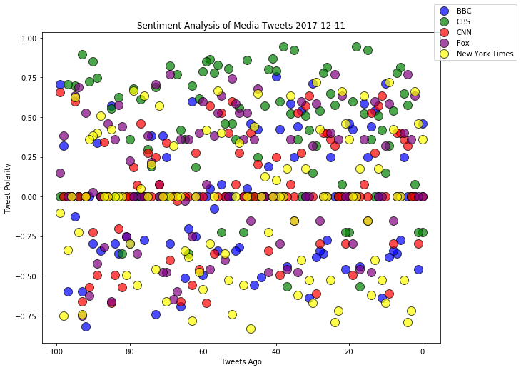
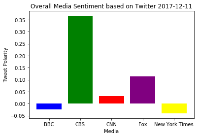

# News Mood Analysis
- Observed Trend: Based on sentiment analysis, all media sources appear to maintain high degree of being 'Neutral' (> 0.80)
- Observed Trend: Both BBC and New York Times have negative compound scores
- Observed Trend: Both CBS and Fox News have higher 'Positive' scores than other media outlets


```python
import tweepy
# import json
import numpy as np
import matplotlib.pyplot as plt
import pandas as pd
import apikeys

from vaderSentiment.vaderSentiment import SentimentIntensityAnalyzer
analyzer = SentimentIntensityAnalyzer()

# Twitter API Keys
consumer_key = apikeys.TWITTER_CONSUMER_KEY
consumer_secret = apikeys.TWITTER_CONSUMER_SECRET
access_token = apikeys.TWITTER_ACCESS_TOKEN
access_token_secret = apikeys.TWITTER_ACCESS_TOKEN_SECRET

# Tweepy API Authentication
auth = tweepy.OAuthHandler(consumer_key, consumer_secret)
auth.set_access_token(access_token, access_token_secret)
api = tweepy.API(auth, parser=tweepy.parsers.JSONParser())
```


```python
# Target users:
users = ('@BBCNews','@CBS', '@CNN', '@FoxNews', '@nytimes')

# set dictionary of lists:
users_sentiment = {}

for target_user in users:
    
    sentiment = []

    for page in range(5):

        # Get all tweets from home feed
        public_tweets = api.user_timeline(target_user, page=page)

        # Loop through all tweets
        for tweet in public_tweets:

            text = tweet['text']
            
            # Run Vader Analysis on each tweet
            scores = analyzer.polarity_scores(text)
            compound = scores['compound']
            pos = scores['pos']
            neu = scores['neu']
            neg = scores['neg']

            # Add sentiments for each tweet into `sentiments` list
            sentiment.append({"Date": tweet["created_at"], 
                           "Compound": compound,
                           "Positive": pos,
                           "Negative": neu,
                           "Neutral": neg})
    
    users_sentiment.update({target_user: sentiment})
    
print(users_sentiment)
            
#     print('User: %s' % target_user, sentiment)
#     multiple_dicts = {target_user: sentiment}
#     print(multiple_dicts)
```

    {'@BBCNews': [{'Date': 'Mon Dec 11 08:38:06 +0000 2017', 'Compound': 0.4588, 'Positive': 0.115, 'Negative': 0.885, 'Neutral': 0.0}, {'Date': 'Mon Dec 11 07:48:17 +0000 2017', 'Compound': -0.4588, 'Positive': 0.0, 'Negative': 0.875, 'Neutral': 0.125}, {'Date': 'Mon Dec 11 07:34:54 +0000 2017', 'Compound': 0.0, 'Positive': 0.0, 'Negative': 1.0, 'Neutral': 0.0}, {'Date': 'Mon Dec 11 07:34:10 +0000 2017', 'Compound': 0.0, 'Positive': 0.0, 'Negative': 1.0, 'Neutral': 0.0}, {'Date': 'Mon Dec 11 07:03:48 +0000 2017', 'Compound': 0.0, 'Positive': 0.0, 'Negative': 1.0, 'Neutral': 0.0}, {'Date': 'Mon Dec 11 06:05:17 +0000 2017', 'Compound': 0.25, 'Positive': 0.241, 'Negative': 0.593, 'Neutral': 0.167}, {'Date': 'Mon Dec 11 04:43:55 +0000 2017', 'Compound': -0.2732, 'Positive': 0.0, 'Negative': 0.769, 'Neutral': 0.231}, {'Date': 'Mon Dec 11 04:30:42 +0000 2017', 'Compound': -0.3612, 'Positive': 0.0, 'Negative': 0.878, 'Neutral': 0.122}, {'Date': 'Mon Dec 11 02:42:52 +0000 2017', 'Compound': -0.34, 'Positive': 0.0, 'Negative': 0.769, 'Neutral': 0.231}, {'Date': 'Mon Dec 11 02:11:01 +0000 2017', 'Compound': -0.3818, 'Positive': 0.0, 'Negative': 0.698, 'Neutral': 0.302}, {'Date': 'Mon Dec 11 02:07:49 +0000 2017', 'Compound': 0.7096, 'Positive': 0.424, 'Negative': 0.576, 'Neutral': 0.0}, {'Date': 'Mon Dec 11 01:23:29 +0000 2017', 'Compound': -0.6369, 'Positive': 0.0, 'Negative': 0.656, 'Neutral': 0.344}, {'Date': 'Mon Dec 11 01:23:27 +0000 2017', 'Compound': 0.0, 'Positive': 0.0, 'Negative': 1.0, 'Neutral': 0.0}, {'Date': 'Mon Dec 11 00:52:12 +0000 2017', 'Compound': 0.5423, 'Positive': 0.259, 'Negative': 0.741, 'Neutral': 0.0}, {'Date': 'Mon Dec 11 00:45:58 +0000 2017', 'Compound': 0.4404, 'Positive': 0.293, 'Negative': 0.707, 'Neutral': 0.0}, {'Date': 'Sun Dec 10 23:50:38 +0000 2017', 'Compound': 0.25, 'Positive': 0.243, 'Negative': 0.588, 'Neutral': 0.169}, {'Date': 'Sun Dec 10 22:58:54 +0000 2017', 'Compound': 0.5859, 'Positive': 0.432, 'Negative': 0.568, 'Neutral': 0.0}, {'Date': 'Sun Dec 10 22:39:35 +0000 2017', 'Compound': -0.4404, 'Positive': 0.0, 'Negative': 0.734, 'Neutral': 0.266}, {'Date': 'Sun Dec 10 19:44:08 +0000 2017', 'Compound': 0.0, 'Positive': 0.0, 'Negative': 1.0, 'Neutral': 0.0}, {'Date': 'Sun Dec 10 18:43:18 +0000 2017', 'Compound': 0.4215, 'Positive': 0.359, 'Negative': 0.641, 'Neutral': 0.0}, {'Date': 'Mon Dec 11 08:38:06 +0000 2017', 'Compound': 0.4588, 'Positive': 0.115, 'Negative': 0.885, 'Neutral': 0.0}, {'Date': 'Mon Dec 11 07:48:17 +0000 2017', 'Compound': -0.4588, 'Positive': 0.0, 'Negative': 0.875, 'Neutral': 0.125}, {'Date': 'Mon Dec 11 07:34:54 +0000 2017', 'Compound': 0.0, 'Positive': 0.0, 'Negative': 1.0, 'Neutral': 0.0}, {'Date': 'Mon Dec 11 07:34:10 +0000 2017', 'Compound': 0.0, 'Positive': 0.0, 'Negative': 1.0, 'Neutral': 0.0}, {'Date': 'Mon Dec 11 07:03:48 +0000 2017', 'Compound': 0.0, 'Positive': 0.0, 'Negative': 1.0, 'Neutral': 0.0}, {'Date': 'Mon Dec 11 06:05:17 +0000 2017', 'Compound': 0.25, 'Positive': 0.241, 'Negative': 0.593, 'Neutral': 0.167}, {'Date': 'Mon Dec 11 04:43:55 +0000 2017', 'Compound': -0.2732, 'Positive': 0.0, 'Negative': 0.769, 'Neutral': 0.231}, {'Date': 'Mon Dec 11 04:30:42 +0000 2017', 'Compound': -0.3612, 'Positive': 0.0, 'Negative': 0.878, 'Neutral': 0.122}, {'Date': 'Mon Dec 11 02:42:52 +0000 2017', 'Compound': -0.34, 'Positive': 0.0, 'Negative': 0.769, 'Neutral': 0.231}, {'Date': 'Mon Dec 11 02:11:01 +0000 2017', 'Compound': -0.3818, 'Positive': 0.0, 'Negative': 0.698, 'Neutral': 0.302}, {'Date': 'Mon Dec 11 02:07:49 +0000 2017', 'Compound': 0.7096, 'Positive': 0.424, 'Negative': 0.576, 'Neutral': 0.0}, {'Date': 'Mon Dec 11 01:23:29 +0000 2017', 'Compound': -0.6369, 'Positive': 0.0, 'Negative': 0.656, 'Neutral': 0.344}, {'Date': 'Mon Dec 11 01:23:27 +0000 2017', 'Compound': 0.0, 'Positive': 0.0, 'Negative': 1.0, 'Neutral': 0.0}, {'Date': 'Mon Dec 11 00:52:12 +0000 2017', 'Compound': 0.5423, 'Positive': 0.259, 'Negative': 0.741, 'Neutral': 0.0}, {'Date': 'Mon Dec 11 00:45:58 +0000 2017', 'Compound': 0.4404, 'Positive': 0.293, 'Negative': 0.707, 'Neutral': 0.0}, {'Date': 'Sun Dec 10 23:50:38 +0000 2017', 'Compound': 0.25, 'Positive': 0.243, 'Negative': 0.588, 'Neutral': 0.169}, {'Date': 'Sun Dec 10 22:58:54 +0000 2017', 'Compound': 0.5859, 'Positive': 0.432, 'Negative': 0.568, 'Neutral': 0.0}, {'Date': 'Sun Dec 10 22:39:35 +0000 2017', 'Compound': -0.4404, 'Positive': 0.0, 'Negative': 0.734, 'Neutral': 0.266}, {'Date': 'Sun Dec 10 19:44:08 +0000 2017', 'Compound': 0.0, 'Positive': 0.0, 'Negative': 1.0, 'Neutral': 0.0}, {'Date': 'Sun Dec 10 18:43:18 +0000 2017', 'Compound': 0.4215, 'Positive': 0.359, 'Negative': 0.641, 'Neutral': 0.0}, {'Date': 'Sun Dec 10 18:31:52 +0000 2017', 'Compound': 0.7574, 'Positive': 0.273, 'Negative': 0.727, 'Neutral': 0.0}, {'Date': 'Sun Dec 10 18:19:46 +0000 2017', 'Compound': 0.0, 'Positive': 0.0, 'Negative': 1.0, 'Neutral': 0.0}, {'Date': 'Sun Dec 10 17:15:39 +0000 2017', 'Compound': 0.1901, 'Positive': 0.077, 'Negative': 0.923, 'Neutral': 0.0}, {'Date': 'Sun Dec 10 16:48:25 +0000 2017', 'Compound': 0.0, 'Positive': 0.0, 'Negative': 1.0, 'Neutral': 0.0}, {'Date': 'Sun Dec 10 16:11:48 +0000 2017', 'Compound': -0.5093, 'Positive': 0.0, 'Negative': 0.838, 'Neutral': 0.162}, {'Date': 'Sun Dec 10 15:31:58 +0000 2017', 'Compound': 0.4215, 'Positive': 0.117, 'Negative': 0.828, 'Neutral': 0.055}, {'Date': 'Sun Dec 10 15:28:05 +0000 2017', 'Compound': -0.5574, 'Positive': 0.0, 'Negative': 0.795, 'Neutral': 0.205}, {'Date': 'Sun Dec 10 14:32:56 +0000 2017', 'Compound': 0.4588, 'Positive': 0.375, 'Negative': 0.625, 'Neutral': 0.0}, {'Date': 'Sun Dec 10 14:26:37 +0000 2017', 'Compound': 0.0516, 'Positive': 0.17, 'Negative': 0.67, 'Neutral': 0.16}, {'Date': 'Sun Dec 10 14:19:05 +0000 2017', 'Compound': 0.0, 'Positive': 0.0, 'Negative': 1.0, 'Neutral': 0.0}, {'Date': 'Sun Dec 10 14:19:05 +0000 2017', 'Compound': -0.3182, 'Positive': 0.129, 'Negative': 0.647, 'Neutral': 0.223}, {'Date': 'Sun Dec 10 14:11:03 +0000 2017', 'Compound': -0.34, 'Positive': 0.0, 'Negative': 0.806, 'Neutral': 0.194}, {'Date': 'Sun Dec 10 14:00:41 +0000 2017', 'Compound': 0.0, 'Positive': 0.0, 'Negative': 1.0, 'Neutral': 0.0}, {'Date': 'Sun Dec 10 13:49:56 +0000 2017', 'Compound': 0.0, 'Positive': 0.0, 'Negative': 1.0, 'Neutral': 0.0}, {'Date': 'Sun Dec 10 13:49:41 +0000 2017', 'Compound': 0.0, 'Positive': 0.0, 'Negative': 1.0, 'Neutral': 0.0}, {'Date': 'Sun Dec 10 13:29:16 +0000 2017', 'Compound': 0.0762, 'Positive': 0.056, 'Negative': 0.944, 'Neutral': 0.0}, {'Date': 'Sun Dec 10 13:20:52 +0000 2017', 'Compound': -0.34, 'Positive': 0.0, 'Negative': 0.789, 'Neutral': 0.211}, {'Date': 'Sun Dec 10 13:05:37 +0000 2017', 'Compound': -0.0772, 'Positive': 0.072, 'Negative': 0.843, 'Neutral': 0.084}, {'Date': 'Sun Dec 10 13:03:49 +0000 2017', 'Compound': 0.0516, 'Positive': 0.059, 'Negative': 0.941, 'Neutral': 0.0}, {'Date': 'Sun Dec 10 12:52:01 +0000 2017', 'Compound': 0.0, 'Positive': 0.0, 'Negative': 1.0, 'Neutral': 0.0}, {'Date': 'Sun Dec 10 12:35:53 +0000 2017', 'Compound': -0.4939, 'Positive': 0.0, 'Negative': 0.652, 'Neutral': 0.348}, {'Date': 'Sun Dec 10 12:26:19 +0000 2017', 'Compound': 0.0, 'Positive': 0.0, 'Negative': 1.0, 'Neutral': 0.0}, {'Date': 'Sun Dec 10 12:17:59 +0000 2017', 'Compound': -0.25, 'Positive': 0.0, 'Negative': 0.778, 'Neutral': 0.222}, {'Date': 'Sun Dec 10 11:29:23 +0000 2017', 'Compound': 0.5994, 'Positive': 0.219, 'Negative': 0.781, 'Neutral': 0.0}, {'Date': 'Sun Dec 10 11:29:05 +0000 2017', 'Compound': -0.2003, 'Positive': 0.091, 'Negative': 0.744, 'Neutral': 0.165}, {'Date': 'Sun Dec 10 10:55:17 +0000 2017', 'Compound': -0.5106, 'Positive': 0.067, 'Negative': 0.717, 'Neutral': 0.215}, {'Date': 'Sun Dec 10 10:36:07 +0000 2017', 'Compound': -0.6908, 'Positive': 0.0, 'Negative': 0.787, 'Neutral': 0.213}, {'Date': 'Sun Dec 10 10:36:00 +0000 2017', 'Compound': 0.0, 'Positive': 0.0, 'Negative': 1.0, 'Neutral': 0.0}, {'Date': 'Sun Dec 10 10:32:15 +0000 2017', 'Compound': 0.0, 'Positive': 0.0, 'Negative': 1.0, 'Neutral': 0.0}, {'Date': 'Sun Dec 10 10:12:58 +0000 2017', 'Compound': -0.296, 'Positive': 0.0, 'Negative': 0.872, 'Neutral': 0.128}, {'Date': 'Sun Dec 10 10:10:19 +0000 2017', 'Compound': 0.25, 'Positive': 0.095, 'Negative': 0.905, 'Neutral': 0.0}, {'Date': 'Sun Dec 10 10:01:07 +0000 2017', 'Compound': 0.3818, 'Positive': 0.106, 'Negative': 0.894, 'Neutral': 0.0}, {'Date': 'Sun Dec 10 09:49:46 +0000 2017', 'Compound': 0.0772, 'Positive': 0.061, 'Negative': 0.939, 'Neutral': 0.0}, {'Date': 'Sun Dec 10 09:45:53 +0000 2017', 'Compound': -0.743, 'Positive': 0.0, 'Negative': 0.442, 'Neutral': 0.558}, {'Date': 'Sun Dec 10 09:44:15 +0000 2017', 'Compound': 0.3818, 'Positive': 0.11, 'Negative': 0.89, 'Neutral': 0.0}, {'Date': 'Sun Dec 10 09:40:17 +0000 2017', 'Compound': 0.0, 'Positive': 0.0, 'Negative': 1.0, 'Neutral': 0.0}, {'Date': 'Sun Dec 10 09:39:07 +0000 2017', 'Compound': -0.2732, 'Positive': 0.051, 'Negative': 0.856, 'Neutral': 0.093}, {'Date': 'Sun Dec 10 09:36:43 +0000 2017', 'Compound': 0.0, 'Positive': 0.0, 'Negative': 1.0, 'Neutral': 0.0}, {'Date': 'Sun Dec 10 09:36:22 +0000 2017', 'Compound': 0.0, 'Positive': 0.0, 'Negative': 1.0, 'Neutral': 0.0}, {'Date': 'Sun Dec 10 09:07:01 +0000 2017', 'Compound': 0.0, 'Positive': 0.0, 'Negative': 1.0, 'Neutral': 0.0}, {'Date': 'Sun Dec 10 08:54:08 +0000 2017', 'Compound': -0.296, 'Positive': 0.0, 'Negative': 0.901, 'Neutral': 0.099}, {'Date': 'Sun Dec 10 08:51:26 +0000 2017', 'Compound': -0.25, 'Positive': 0.0, 'Negative': 0.913, 'Neutral': 0.087}, {'Date': 'Sun Dec 10 08:30:42 +0000 2017', 'Compound': 0.0, 'Positive': 0.0, 'Negative': 1.0, 'Neutral': 0.0}, {'Date': 'Sun Dec 10 08:04:41 +0000 2017', 'Compound': -0.3612, 'Positive': 0.153, 'Negative': 0.584, 'Neutral': 0.263}, {'Date': 'Sun Dec 10 07:55:22 +0000 2017', 'Compound': -0.296, 'Positive': 0.0, 'Negative': 0.732, 'Neutral': 0.268}, {'Date': 'Sun Dec 10 05:40:34 +0000 2017', 'Compound': 0.5719, 'Positive': 0.291, 'Negative': 0.709, 'Neutral': 0.0}, {'Date': 'Sun Dec 10 05:09:14 +0000 2017', 'Compound': 0.0, 'Positive': 0.0, 'Negative': 1.0, 'Neutral': 0.0}, {'Date': 'Sun Dec 10 03:58:29 +0000 2017', 'Compound': 0.0, 'Positive': 0.0, 'Negative': 1.0, 'Neutral': 0.0}, {'Date': 'Sun Dec 10 02:28:42 +0000 2017', 'Compound': -0.34, 'Positive': 0.0, 'Negative': 0.769, 'Neutral': 0.231}, {'Date': 'Sun Dec 10 02:04:13 +0000 2017', 'Compound': 0.34, 'Positive': 0.231, 'Negative': 0.769, 'Neutral': 0.0}, {'Date': 'Sun Dec 10 01:49:20 +0000 2017', 'Compound': -0.296, 'Positive': 0.0, 'Negative': 0.732, 'Neutral': 0.268}, {'Date': 'Sun Dec 10 01:05:39 +0000 2017', 'Compound': 0.0, 'Positive': 0.0, 'Negative': 1.0, 'Neutral': 0.0}, {'Date': 'Sun Dec 10 00:19:52 +0000 2017', 'Compound': -0.8201, 'Positive': 0.0, 'Negative': 0.681, 'Neutral': 0.319}, {'Date': 'Sat Dec 09 17:15:19 +0000 2017', 'Compound': -0.5994, 'Positive': 0.0, 'Negative': 0.811, 'Neutral': 0.189}, {'Date': 'Sat Dec 09 16:49:14 +0000 2017', 'Compound': 0.0, 'Positive': 0.0, 'Negative': 1.0, 'Neutral': 0.0}, {'Date': 'Sat Dec 09 16:48:45 +0000 2017', 'Compound': -0.126, 'Positive': 0.119, 'Negative': 0.741, 'Neutral': 0.14}, {'Date': 'Sat Dec 09 16:42:02 +0000 2017', 'Compound': 0.0, 'Positive': 0.0, 'Negative': 1.0, 'Neutral': 0.0}, {'Date': 'Sat Dec 09 16:29:26 +0000 2017', 'Compound': -0.5994, 'Positive': 0.0, 'Negative': 0.755, 'Neutral': 0.245}, {'Date': 'Sat Dec 09 16:12:10 +0000 2017', 'Compound': 0.3182, 'Positive': 0.099, 'Negative': 0.901, 'Neutral': 0.0}, {'Date': 'Sat Dec 09 15:33:25 +0000 2017', 'Compound': 0.7088, 'Positive': 0.237, 'Negative': 0.763, 'Neutral': 0.0}], '@CBS': [{'Date': 'Mon Dec 11 00:26:50 +0000 2017', 'Compound': -0.2263, 'Positive': 0.0, 'Negative': 0.917, 'Neutral': 0.083}, {'Date': 'Mon Dec 11 00:25:54 +0000 2017', 'Compound': -0.2263, 'Positive': 0.0, 'Negative': 0.913, 'Neutral': 0.087}, {'Date': 'Sun Dec 10 22:49:02 +0000 2017', 'Compound': 0.0772, 'Positive': 0.064, 'Negative': 0.936, 'Neutral': 0.0}, {'Date': 'Sun Dec 10 22:48:46 +0000 2017', 'Compound': 0.0, 'Positive': 0.0, 'Negative': 1.0, 'Neutral': 0.0}, {'Date': 'Sat Dec 09 18:24:37 +0000 2017', 'Compound': 0.5754, 'Positive': 0.189, 'Negative': 0.742, 'Neutral': 0.07}, {'Date': 'Sat Dec 09 01:11:51 +0000 2017', 'Compound': 0.6476, 'Positive': 0.209, 'Negative': 0.791, 'Neutral': 0.0}, {'Date': 'Fri Dec 08 23:35:41 +0000 2017', 'Compound': 0.8126, 'Positive': 0.303, 'Negative': 0.697, 'Neutral': 0.0}, {'Date': 'Thu Dec 07 18:23:03 +0000 2017', 'Compound': 0.7777, 'Positive': 0.254, 'Negative': 0.746, 'Neutral': 0.0}, {'Date': 'Thu Dec 07 12:07:06 +0000 2017', 'Compound': 0.5423, 'Positive': 0.137, 'Negative': 0.863, 'Neutral': 0.0}, {'Date': 'Wed Dec 06 17:32:28 +0000 2017', 'Compound': 0.3182, 'Positive': 0.126, 'Negative': 0.874, 'Neutral': 0.0}, {'Date': 'Tue Dec 05 19:21:31 +0000 2017', 'Compound': 0.1511, 'Positive': 0.09, 'Negative': 0.91, 'Neutral': 0.0}, {'Date': 'Tue Dec 05 19:14:00 +0000 2017', 'Compound': 0.4199, 'Positive': 0.117, 'Negative': 0.883, 'Neutral': 0.0}, {'Date': 'Tue Dec 05 00:54:16 +0000 2017', 'Compound': 0.5106, 'Positive': 0.163, 'Negative': 0.837, 'Neutral': 0.0}, {'Date': 'Tue Dec 05 00:03:06 +0000 2017', 'Compound': 0.0, 'Positive': 0.0, 'Negative': 1.0, 'Neutral': 0.0}, {'Date': 'Mon Dec 04 20:52:31 +0000 2017', 'Compound': 0.3612, 'Positive': 0.106, 'Negative': 0.894, 'Neutral': 0.0}, {'Date': 'Mon Dec 04 19:22:07 +0000 2017', 'Compound': 0.9217, 'Positive': 0.504, 'Negative': 0.496, 'Neutral': 0.0}, {'Date': 'Mon Dec 04 07:14:06 +0000 2017', 'Compound': 0.5213, 'Positive': 0.187, 'Negative': 0.813, 'Neutral': 0.0}, {'Date': 'Mon Dec 04 03:02:00 +0000 2017', 'Compound': -0.5655, 'Positive': 0.0, 'Negative': 0.823, 'Neutral': 0.177}, {'Date': 'Mon Dec 04 03:01:09 +0000 2017', 'Compound': 0.9466, 'Positive': 0.672, 'Negative': 0.328, 'Neutral': 0.0}, {'Date': 'Mon Dec 04 02:51:35 +0000 2017', 'Compound': 0.5994, 'Positive': 0.281, 'Negative': 0.719, 'Neutral': 0.0}, {'Date': 'Mon Dec 11 00:26:50 +0000 2017', 'Compound': -0.2263, 'Positive': 0.0, 'Negative': 0.917, 'Neutral': 0.083}, {'Date': 'Mon Dec 11 00:25:54 +0000 2017', 'Compound': -0.2263, 'Positive': 0.0, 'Negative': 0.913, 'Neutral': 0.087}, {'Date': 'Sun Dec 10 22:49:02 +0000 2017', 'Compound': 0.0772, 'Positive': 0.064, 'Negative': 0.936, 'Neutral': 0.0}, {'Date': 'Sun Dec 10 22:48:46 +0000 2017', 'Compound': 0.0, 'Positive': 0.0, 'Negative': 1.0, 'Neutral': 0.0}, {'Date': 'Sat Dec 09 18:24:37 +0000 2017', 'Compound': 0.5754, 'Positive': 0.189, 'Negative': 0.742, 'Neutral': 0.07}, {'Date': 'Sat Dec 09 01:11:51 +0000 2017', 'Compound': 0.6476, 'Positive': 0.209, 'Negative': 0.791, 'Neutral': 0.0}, {'Date': 'Fri Dec 08 23:35:41 +0000 2017', 'Compound': 0.8126, 'Positive': 0.303, 'Negative': 0.697, 'Neutral': 0.0}, {'Date': 'Thu Dec 07 18:23:03 +0000 2017', 'Compound': 0.7777, 'Positive': 0.254, 'Negative': 0.746, 'Neutral': 0.0}, {'Date': 'Thu Dec 07 12:07:06 +0000 2017', 'Compound': 0.5423, 'Positive': 0.137, 'Negative': 0.863, 'Neutral': 0.0}, {'Date': 'Wed Dec 06 17:32:28 +0000 2017', 'Compound': 0.3182, 'Positive': 0.126, 'Negative': 0.874, 'Neutral': 0.0}, {'Date': 'Tue Dec 05 19:21:31 +0000 2017', 'Compound': 0.1511, 'Positive': 0.09, 'Negative': 0.91, 'Neutral': 0.0}, {'Date': 'Tue Dec 05 19:14:00 +0000 2017', 'Compound': 0.4199, 'Positive': 0.117, 'Negative': 0.883, 'Neutral': 0.0}, {'Date': 'Tue Dec 05 00:54:16 +0000 2017', 'Compound': 0.5106, 'Positive': 0.163, 'Negative': 0.837, 'Neutral': 0.0}, {'Date': 'Tue Dec 05 00:03:06 +0000 2017', 'Compound': 0.0, 'Positive': 0.0, 'Negative': 1.0, 'Neutral': 0.0}, {'Date': 'Mon Dec 04 20:52:31 +0000 2017', 'Compound': 0.3612, 'Positive': 0.106, 'Negative': 0.894, 'Neutral': 0.0}, {'Date': 'Mon Dec 04 19:22:07 +0000 2017', 'Compound': 0.9217, 'Positive': 0.504, 'Negative': 0.496, 'Neutral': 0.0}, {'Date': 'Mon Dec 04 07:14:06 +0000 2017', 'Compound': 0.5213, 'Positive': 0.187, 'Negative': 0.813, 'Neutral': 0.0}, {'Date': 'Mon Dec 04 03:02:00 +0000 2017', 'Compound': -0.5655, 'Positive': 0.0, 'Negative': 0.823, 'Neutral': 0.177}, {'Date': 'Mon Dec 04 03:01:09 +0000 2017', 'Compound': 0.9466, 'Positive': 0.672, 'Negative': 0.328, 'Neutral': 0.0}, {'Date': 'Mon Dec 04 02:51:35 +0000 2017', 'Compound': 0.5994, 'Positive': 0.281, 'Negative': 0.719, 'Neutral': 0.0}, {'Date': 'Mon Dec 04 02:49:27 +0000 2017', 'Compound': 0.7906, 'Positive': 0.269, 'Negative': 0.731, 'Neutral': 0.0}, {'Date': 'Mon Dec 04 02:47:39 +0000 2017', 'Compound': 0.8689, 'Positive': 0.329, 'Negative': 0.671, 'Neutral': 0.0}, {'Date': 'Mon Dec 04 02:43:14 +0000 2017', 'Compound': 0.8016, 'Positive': 0.264, 'Negative': 0.736, 'Neutral': 0.0}, {'Date': 'Mon Dec 04 02:26:30 +0000 2017', 'Compound': 0.5719, 'Positive': 0.156, 'Negative': 0.844, 'Neutral': 0.0}, {'Date': 'Mon Dec 04 02:22:42 +0000 2017', 'Compound': 0.0, 'Positive': 0.0, 'Negative': 1.0, 'Neutral': 0.0}, {'Date': 'Mon Dec 04 02:12:59 +0000 2017', 'Compound': 0.25, 'Positive': 0.133, 'Negative': 0.867, 'Neutral': 0.0}, {'Date': 'Mon Dec 04 01:56:26 +0000 2017', 'Compound': 0.0, 'Positive': 0.0, 'Negative': 1.0, 'Neutral': 0.0}, {'Date': 'Mon Dec 04 01:55:44 +0000 2017', 'Compound': 0.0, 'Positive': 0.0, 'Negative': 1.0, 'Neutral': 0.0}, {'Date': 'Mon Dec 04 01:43:24 +0000 2017', 'Compound': 0.8591, 'Positive': 0.487, 'Negative': 0.513, 'Neutral': 0.0}, {'Date': 'Mon Dec 04 01:33:37 +0000 2017', 'Compound': -0.2263, 'Positive': 0.0, 'Negative': 0.924, 'Neutral': 0.076}, {'Date': 'Mon Dec 04 01:24:51 +0000 2017', 'Compound': 0.5574, 'Positive': 0.194, 'Negative': 0.806, 'Neutral': 0.0}, {'Date': 'Mon Dec 04 01:13:30 +0000 2017', 'Compound': 0.3612, 'Positive': 0.238, 'Negative': 0.762, 'Neutral': 0.0}, {'Date': 'Mon Dec 04 01:11:57 +0000 2017', 'Compound': 0.4588, 'Positive': 0.136, 'Negative': 0.864, 'Neutral': 0.0}, {'Date': 'Mon Dec 04 01:05:31 +0000 2017', 'Compound': 0.807, 'Positive': 0.356, 'Negative': 0.644, 'Neutral': 0.0}, {'Date': 'Mon Dec 04 01:00:09 +0000 2017', 'Compound': 0.4574, 'Positive': 0.13, 'Negative': 0.87, 'Neutral': 0.0}, {'Date': 'Mon Dec 04 00:25:16 +0000 2017', 'Compound': -0.2263, 'Positive': 0.0, 'Negative': 0.905, 'Neutral': 0.095}, {'Date': 'Sun Dec 03 20:00:02 +0000 2017', 'Compound': 0.8271, 'Positive': 0.352, 'Negative': 0.648, 'Neutral': 0.0}, {'Date': 'Sun Dec 03 18:44:14 +0000 2017', 'Compound': 0.7783, 'Positive': 0.286, 'Negative': 0.714, 'Neutral': 0.0}, {'Date': 'Sun Dec 03 17:32:01 +0000 2017', 'Compound': 0.8658, 'Positive': 0.386, 'Negative': 0.614, 'Neutral': 0.0}, {'Date': 'Sun Dec 03 13:00:04 +0000 2017', 'Compound': 0.8516, 'Positive': 0.353, 'Negative': 0.647, 'Neutral': 0.0}, {'Date': 'Sun Dec 03 12:00:01 +0000 2017', 'Compound': 0.7897, 'Positive': 0.28, 'Negative': 0.72, 'Neutral': 0.0}, {'Date': 'Sat Dec 02 15:55:39 +0000 2017', 'Compound': 0.6166, 'Positive': 0.175, 'Negative': 0.825, 'Neutral': 0.0}, {'Date': 'Sat Dec 02 14:30:03 +0000 2017', 'Compound': 0.1867, 'Positive': 0.098, 'Negative': 0.902, 'Neutral': 0.0}, {'Date': 'Sat Dec 02 13:00:07 +0000 2017', 'Compound': 0.6996, 'Positive': 0.179, 'Negative': 0.821, 'Neutral': 0.0}, {'Date': 'Sat Dec 02 12:00:03 +0000 2017', 'Compound': -0.3595, 'Positive': 0.0, 'Negative': 0.872, 'Neutral': 0.128}, {'Date': 'Fri Dec 01 22:43:05 +0000 2017', 'Compound': 0.3612, 'Positive': 0.116, 'Negative': 0.884, 'Neutral': 0.0}, {'Date': 'Fri Dec 01 22:15:28 +0000 2017', 'Compound': 0.4199, 'Positive': 0.134, 'Negative': 0.866, 'Neutral': 0.0}, {'Date': 'Fri Dec 01 21:00:12 +0000 2017', 'Compound': 0.7707, 'Positive': 0.282, 'Negative': 0.718, 'Neutral': 0.0}, {'Date': 'Fri Dec 01 20:17:18 +0000 2017', 'Compound': 0.0, 'Positive': 0.0, 'Negative': 1.0, 'Neutral': 0.0}, {'Date': 'Fri Dec 01 19:32:18 +0000 2017', 'Compound': 0.8221, 'Positive': 0.309, 'Negative': 0.691, 'Neutral': 0.0}, {'Date': 'Fri Dec 01 18:40:34 +0000 2017', 'Compound': 0.0, 'Positive': 0.0, 'Negative': 1.0, 'Neutral': 0.0}, {'Date': 'Fri Dec 01 18:16:37 +0000 2017', 'Compound': 0.0, 'Positive': 0.0, 'Negative': 1.0, 'Neutral': 0.0}, {'Date': 'Fri Dec 01 18:10:11 +0000 2017', 'Compound': 0.0, 'Positive': 0.0, 'Negative': 1.0, 'Neutral': 0.0}, {'Date': 'Fri Dec 01 14:00:04 +0000 2017', 'Compound': 0.6893, 'Positive': 0.251, 'Negative': 0.749, 'Neutral': 0.0}, {'Date': 'Fri Dec 01 12:00:03 +0000 2017', 'Compound': 0.1901, 'Positive': 0.093, 'Negative': 0.907, 'Neutral': 0.0}, {'Date': 'Fri Dec 01 01:31:30 +0000 2017', 'Compound': 0.296, 'Positive': 0.128, 'Negative': 0.872, 'Neutral': 0.0}, {'Date': 'Thu Nov 30 21:10:19 +0000 2017', 'Compound': 0.0, 'Positive': 0.0, 'Negative': 1.0, 'Neutral': 0.0}, {'Date': 'Thu Nov 30 20:54:39 +0000 2017', 'Compound': 0.6115, 'Positive': 0.227, 'Negative': 0.773, 'Neutral': 0.0}, {'Date': 'Thu Nov 30 17:40:02 +0000 2017', 'Compound': 0.0, 'Positive': 0.0, 'Negative': 1.0, 'Neutral': 0.0}, {'Date': 'Thu Nov 30 17:30:05 +0000 2017', 'Compound': 0.6808, 'Positive': 0.248, 'Negative': 0.752, 'Neutral': 0.0}, {'Date': 'Thu Nov 30 15:00:05 +0000 2017', 'Compound': 0.3612, 'Positive': 0.135, 'Negative': 0.865, 'Neutral': 0.0}, {'Date': 'Thu Nov 30 12:00:03 +0000 2017', 'Compound': 0.0, 'Positive': 0.0, 'Negative': 1.0, 'Neutral': 0.0}, {'Date': 'Thu Nov 30 07:52:09 +0000 2017', 'Compound': -0.3595, 'Positive': 0.0, 'Negative': 0.872, 'Neutral': 0.128}, {'Date': 'Thu Nov 30 04:09:55 +0000 2017', 'Compound': 0.6239, 'Positive': 0.45, 'Negative': 0.55, 'Neutral': 0.0}, {'Date': 'Thu Nov 30 04:00:27 +0000 2017', 'Compound': 0.0, 'Positive': 0.0, 'Negative': 1.0, 'Neutral': 0.0}, {'Date': 'Thu Nov 30 03:59:09 +0000 2017', 'Compound': 0.5542, 'Positive': 0.204, 'Negative': 0.796, 'Neutral': 0.0}, {'Date': 'Thu Nov 30 03:55:37 +0000 2017', 'Compound': 0.0, 'Positive': 0.0, 'Negative': 1.0, 'Neutral': 0.0}, {'Date': 'Thu Nov 30 03:51:38 +0000 2017', 'Compound': 0.0, 'Positive': 0.0, 'Negative': 1.0, 'Neutral': 0.0}, {'Date': 'Thu Nov 30 03:44:54 +0000 2017', 'Compound': 0.0, 'Positive': 0.0, 'Negative': 1.0, 'Neutral': 0.0}, {'Date': 'Thu Nov 30 03:37:13 +0000 2017', 'Compound': 0.7482, 'Positive': 0.434, 'Negative': 0.566, 'Neutral': 0.0}, {'Date': 'Thu Nov 30 03:35:13 +0000 2017', 'Compound': 0.8513, 'Positive': 0.542, 'Negative': 0.458, 'Neutral': 0.0}, {'Date': 'Thu Nov 30 03:33:32 +0000 2017', 'Compound': 0.7232, 'Positive': 0.302, 'Negative': 0.698, 'Neutral': 0.0}, {'Date': 'Thu Nov 30 03:23:03 +0000 2017', 'Compound': 0.0, 'Positive': 0.0, 'Negative': 1.0, 'Neutral': 0.0}, {'Date': 'Thu Nov 30 03:11:31 +0000 2017', 'Compound': 0.8979, 'Positive': 0.394, 'Negative': 0.557, 'Neutral': 0.049}, {'Date': 'Thu Nov 30 03:09:54 +0000 2017', 'Compound': 0.0, 'Positive': 0.0, 'Negative': 1.0, 'Neutral': 0.0}, {'Date': 'Thu Nov 30 03:07:20 +0000 2017', 'Compound': 0.6988, 'Positive': 0.452, 'Negative': 0.548, 'Neutral': 0.0}, {'Date': 'Thu Nov 30 03:06:38 +0000 2017', 'Compound': 0.0, 'Positive': 0.0, 'Negative': 1.0, 'Neutral': 0.0}, {'Date': 'Thu Nov 30 03:03:15 +0000 2017', 'Compound': 0.7067, 'Positive': 0.246, 'Negative': 0.754, 'Neutral': 0.0}, {'Date': 'Thu Nov 30 03:02:34 +0000 2017', 'Compound': 0.0, 'Positive': 0.0, 'Negative': 1.0, 'Neutral': 0.0}, {'Date': 'Thu Nov 30 02:59:59 +0000 2017', 'Compound': 0.0, 'Positive': 0.0, 'Negative': 1.0, 'Neutral': 0.0}], '@CNN': [{'Date': 'Mon Dec 11 08:49:02 +0000 2017', 'Compound': 0.0, 'Positive': 0.0, 'Negative': 1.0, 'Neutral': 0.0}, {'Date': 'Mon Dec 11 08:30:07 +0000 2017', 'Compound': -0.296, 'Positive': 0.0, 'Negative': 0.891, 'Neutral': 0.109}, {'Date': 'Mon Dec 11 08:14:16 +0000 2017', 'Compound': 0.0, 'Positive': 0.0, 'Negative': 1.0, 'Neutral': 0.0}, {'Date': 'Mon Dec 11 08:00:12 +0000 2017', 'Compound': 0.0, 'Positive': 0.0, 'Negative': 1.0, 'Neutral': 0.0}, {'Date': 'Mon Dec 11 07:56:04 +0000 2017', 'Compound': 0.3182, 'Positive': 0.126, 'Negative': 0.874, 'Neutral': 0.0}, {'Date': 'Mon Dec 11 07:30:09 +0000 2017', 'Compound': 0.3612, 'Positive': 0.116, 'Negative': 0.884, 'Neutral': 0.0}, {'Date': 'Mon Dec 11 07:23:05 +0000 2017', 'Compound': 0.4019, 'Positive': 0.137, 'Negative': 0.863, 'Neutral': 0.0}, {'Date': 'Mon Dec 11 07:12:52 +0000 2017', 'Compound': 0.4019, 'Positive': 0.119, 'Negative': 0.881, 'Neutral': 0.0}, {'Date': 'Mon Dec 11 07:02:35 +0000 2017', 'Compound': -0.296, 'Positive': 0.0, 'Negative': 0.879, 'Neutral': 0.121}, {'Date': 'Mon Dec 11 07:00:15 +0000 2017', 'Compound': -0.6124, 'Positive': 0.0, 'Negative': 0.722, 'Neutral': 0.278}, {'Date': 'Mon Dec 11 06:32:34 +0000 2017', 'Compound': 0.0, 'Positive': 0.0, 'Negative': 1.0, 'Neutral': 0.0}, {'Date': 'Mon Dec 11 06:27:40 +0000 2017', 'Compound': 0.6369, 'Positive': 0.208, 'Negative': 0.792, 'Neutral': 0.0}, {'Date': 'Mon Dec 11 06:14:18 +0000 2017', 'Compound': 0.5719, 'Positive': 0.217, 'Negative': 0.783, 'Neutral': 0.0}, {'Date': 'Mon Dec 11 06:00:18 +0000 2017', 'Compound': 0.2732, 'Positive': 0.095, 'Negative': 0.905, 'Neutral': 0.0}, {'Date': 'Mon Dec 11 05:54:56 +0000 2017', 'Compound': 0.5267, 'Positive': 0.326, 'Negative': 0.461, 'Neutral': 0.214}, {'Date': 'Mon Dec 11 05:31:55 +0000 2017', 'Compound': 0.0, 'Positive': 0.0, 'Negative': 1.0, 'Neutral': 0.0}, {'Date': 'Mon Dec 11 05:20:05 +0000 2017', 'Compound': 0.0772, 'Positive': 0.075, 'Negative': 0.925, 'Neutral': 0.0}, {'Date': 'Mon Dec 11 05:10:07 +0000 2017', 'Compound': 0.0, 'Positive': 0.0, 'Negative': 1.0, 'Neutral': 0.0}, {'Date': 'Mon Dec 11 05:00:07 +0000 2017', 'Compound': 0.0, 'Positive': 0.0, 'Negative': 1.0, 'Neutral': 0.0}, {'Date': 'Mon Dec 11 04:52:04 +0000 2017', 'Compound': -0.4939, 'Positive': 0.0, 'Negative': 0.842, 'Neutral': 0.158}, {'Date': 'Mon Dec 11 08:49:02 +0000 2017', 'Compound': 0.0, 'Positive': 0.0, 'Negative': 1.0, 'Neutral': 0.0}, {'Date': 'Mon Dec 11 08:30:07 +0000 2017', 'Compound': -0.296, 'Positive': 0.0, 'Negative': 0.891, 'Neutral': 0.109}, {'Date': 'Mon Dec 11 08:14:16 +0000 2017', 'Compound': 0.0, 'Positive': 0.0, 'Negative': 1.0, 'Neutral': 0.0}, {'Date': 'Mon Dec 11 08:00:12 +0000 2017', 'Compound': 0.0, 'Positive': 0.0, 'Negative': 1.0, 'Neutral': 0.0}, {'Date': 'Mon Dec 11 07:56:04 +0000 2017', 'Compound': 0.3182, 'Positive': 0.126, 'Negative': 0.874, 'Neutral': 0.0}, {'Date': 'Mon Dec 11 07:30:09 +0000 2017', 'Compound': 0.3612, 'Positive': 0.116, 'Negative': 0.884, 'Neutral': 0.0}, {'Date': 'Mon Dec 11 07:23:05 +0000 2017', 'Compound': 0.4019, 'Positive': 0.137, 'Negative': 0.863, 'Neutral': 0.0}, {'Date': 'Mon Dec 11 07:12:52 +0000 2017', 'Compound': 0.4019, 'Positive': 0.119, 'Negative': 0.881, 'Neutral': 0.0}, {'Date': 'Mon Dec 11 07:02:35 +0000 2017', 'Compound': -0.296, 'Positive': 0.0, 'Negative': 0.879, 'Neutral': 0.121}, {'Date': 'Mon Dec 11 07:00:15 +0000 2017', 'Compound': -0.6124, 'Positive': 0.0, 'Negative': 0.722, 'Neutral': 0.278}, {'Date': 'Mon Dec 11 06:32:34 +0000 2017', 'Compound': 0.0, 'Positive': 0.0, 'Negative': 1.0, 'Neutral': 0.0}, {'Date': 'Mon Dec 11 06:27:40 +0000 2017', 'Compound': 0.6369, 'Positive': 0.208, 'Negative': 0.792, 'Neutral': 0.0}, {'Date': 'Mon Dec 11 06:14:18 +0000 2017', 'Compound': 0.5719, 'Positive': 0.217, 'Negative': 0.783, 'Neutral': 0.0}, {'Date': 'Mon Dec 11 06:00:18 +0000 2017', 'Compound': 0.2732, 'Positive': 0.095, 'Negative': 0.905, 'Neutral': 0.0}, {'Date': 'Mon Dec 11 05:54:56 +0000 2017', 'Compound': 0.5267, 'Positive': 0.326, 'Negative': 0.461, 'Neutral': 0.214}, {'Date': 'Mon Dec 11 05:31:55 +0000 2017', 'Compound': 0.0, 'Positive': 0.0, 'Negative': 1.0, 'Neutral': 0.0}, {'Date': 'Mon Dec 11 05:20:05 +0000 2017', 'Compound': 0.0772, 'Positive': 0.075, 'Negative': 0.925, 'Neutral': 0.0}, {'Date': 'Mon Dec 11 05:10:07 +0000 2017', 'Compound': 0.0, 'Positive': 0.0, 'Negative': 1.0, 'Neutral': 0.0}, {'Date': 'Mon Dec 11 05:00:07 +0000 2017', 'Compound': 0.0, 'Positive': 0.0, 'Negative': 1.0, 'Neutral': 0.0}, {'Date': 'Mon Dec 11 04:52:04 +0000 2017', 'Compound': -0.4939, 'Positive': 0.0, 'Negative': 0.842, 'Neutral': 0.158}, {'Date': 'Mon Dec 11 04:45:09 +0000 2017', 'Compound': 0.25, 'Positive': 0.143, 'Negative': 0.857, 'Neutral': 0.0}, {'Date': 'Mon Dec 11 04:39:44 +0000 2017', 'Compound': 0.0, 'Positive': 0.0, 'Negative': 1.0, 'Neutral': 0.0}, {'Date': 'Mon Dec 11 04:31:50 +0000 2017', 'Compound': -0.34, 'Positive': 0.0, 'Negative': 0.876, 'Neutral': 0.124}, {'Date': 'Mon Dec 11 04:27:23 +0000 2017', 'Compound': 0.0, 'Positive': 0.0, 'Negative': 1.0, 'Neutral': 0.0}, {'Date': 'Mon Dec 11 04:17:59 +0000 2017', 'Compound': 0.0, 'Positive': 0.0, 'Negative': 1.0, 'Neutral': 0.0}, {'Date': 'Mon Dec 11 04:00:21 +0000 2017', 'Compound': 0.2023, 'Positive': 0.114, 'Negative': 0.886, 'Neutral': 0.0}, {'Date': 'Mon Dec 11 03:50:08 +0000 2017', 'Compound': 0.0, 'Positive': 0.0, 'Negative': 1.0, 'Neutral': 0.0}, {'Date': 'Mon Dec 11 03:40:30 +0000 2017', 'Compound': 0.4019, 'Positive': 0.119, 'Negative': 0.881, 'Neutral': 0.0}, {'Date': 'Mon Dec 11 03:30:12 +0000 2017', 'Compound': 0.0, 'Positive': 0.0, 'Negative': 1.0, 'Neutral': 0.0}, {'Date': 'Mon Dec 11 03:25:06 +0000 2017', 'Compound': 0.0, 'Positive': 0.0, 'Negative': 1.0, 'Neutral': 0.0}, {'Date': 'Mon Dec 11 03:17:04 +0000 2017', 'Compound': 0.2732, 'Positive': 0.11, 'Negative': 0.89, 'Neutral': 0.0}, {'Date': 'Mon Dec 11 03:05:48 +0000 2017', 'Compound': 0.0772, 'Positive': 0.064, 'Negative': 0.936, 'Neutral': 0.0}, {'Date': 'Mon Dec 11 03:01:13 +0000 2017', 'Compound': 0.5983, 'Positive': 0.178, 'Negative': 0.822, 'Neutral': 0.0}, {'Date': 'Mon Dec 11 02:56:52 +0000 2017', 'Compound': 0.4019, 'Positive': 0.137, 'Negative': 0.863, 'Neutral': 0.0}, {'Date': 'Mon Dec 11 02:47:04 +0000 2017', 'Compound': 0.0, 'Positive': 0.0, 'Negative': 1.0, 'Neutral': 0.0}, {'Date': 'Mon Dec 11 02:36:11 +0000 2017', 'Compound': 0.5267, 'Positive': 0.326, 'Negative': 0.461, 'Neutral': 0.214}, {'Date': 'Mon Dec 11 02:30:44 +0000 2017', 'Compound': 0.0, 'Positive': 0.0, 'Negative': 1.0, 'Neutral': 0.0}, {'Date': 'Mon Dec 11 02:17:37 +0000 2017', 'Compound': -0.3612, 'Positive': 0.0, 'Negative': 0.865, 'Neutral': 0.135}, {'Date': 'Mon Dec 11 02:14:06 +0000 2017', 'Compound': 0.5719, 'Positive': 0.217, 'Negative': 0.783, 'Neutral': 0.0}, {'Date': 'Mon Dec 11 02:00:23 +0000 2017', 'Compound': -0.6705, 'Positive': 0.0, 'Negative': 0.809, 'Neutral': 0.191}, {'Date': 'Mon Dec 11 01:51:58 +0000 2017', 'Compound': 0.0, 'Positive': 0.0, 'Negative': 1.0, 'Neutral': 0.0}, {'Date': 'Mon Dec 11 01:30:14 +0000 2017', 'Compound': -0.4588, 'Positive': 0.0, 'Negative': 0.857, 'Neutral': 0.143}, {'Date': 'Mon Dec 11 01:21:13 +0000 2017', 'Compound': 0.2732, 'Positive': 0.11, 'Negative': 0.89, 'Neutral': 0.0}, {'Date': 'Mon Dec 11 00:45:05 +0000 2017', 'Compound': -0.5574, 'Positive': 0.0, 'Negative': 0.66, 'Neutral': 0.34}, {'Date': 'Mon Dec 11 00:30:08 +0000 2017', 'Compound': 0.0, 'Positive': 0.0, 'Negative': 1.0, 'Neutral': 0.0}, {'Date': 'Mon Dec 11 00:15:05 +0000 2017', 'Compound': 0.0, 'Positive': 0.0, 'Negative': 1.0, 'Neutral': 0.0}, {'Date': 'Mon Dec 11 00:00:41 +0000 2017', 'Compound': -0.6597, 'Positive': 0.0, 'Negative': 0.812, 'Neutral': 0.188}, {'Date': 'Sun Dec 10 23:46:37 +0000 2017', 'Compound': -0.0253, 'Positive': 0.127, 'Negative': 0.742, 'Neutral': 0.131}, {'Date': 'Sun Dec 10 23:30:43 +0000 2017', 'Compound': 0.0, 'Positive': 0.0, 'Negative': 1.0, 'Neutral': 0.0}, {'Date': 'Sun Dec 10 23:15:08 +0000 2017', 'Compound': -0.4019, 'Positive': 0.0, 'Negative': 0.769, 'Neutral': 0.231}, {'Date': 'Sun Dec 10 23:00:07 +0000 2017', 'Compound': 0.34, 'Positive': 0.13, 'Negative': 0.87, 'Neutral': 0.0}, {'Date': 'Sun Dec 10 22:45:07 +0000 2017', 'Compound': 0.0, 'Positive': 0.0, 'Negative': 1.0, 'Neutral': 0.0}, {'Date': 'Sun Dec 10 22:30:10 +0000 2017', 'Compound': 0.0772, 'Positive': 0.075, 'Negative': 0.925, 'Neutral': 0.0}, {'Date': 'Sun Dec 10 22:15:09 +0000 2017', 'Compound': 0.25, 'Positive': 0.143, 'Negative': 0.857, 'Neutral': 0.0}, {'Date': 'Sun Dec 10 22:00:20 +0000 2017', 'Compound': 0.0, 'Positive': 0.0, 'Negative': 1.0, 'Neutral': 0.0}, {'Date': 'Sun Dec 10 21:45:11 +0000 2017', 'Compound': 0.2732, 'Positive': 0.155, 'Negative': 0.749, 'Neutral': 0.096}, {'Date': 'Sun Dec 10 21:30:06 +0000 2017', 'Compound': 0.0, 'Positive': 0.0, 'Negative': 1.0, 'Neutral': 0.0}, {'Date': 'Sun Dec 10 21:15:06 +0000 2017', 'Compound': 0.4588, 'Positive': 0.332, 'Negative': 0.403, 'Neutral': 0.265}, {'Date': 'Sun Dec 10 21:00:42 +0000 2017', 'Compound': 0.0736, 'Positive': 0.096, 'Negative': 0.821, 'Neutral': 0.083}, {'Date': 'Sun Dec 10 20:45:14 +0000 2017', 'Compound': 0.1872, 'Positive': 0.137, 'Negative': 0.763, 'Neutral': 0.1}, {'Date': 'Sun Dec 10 20:30:09 +0000 2017', 'Compound': 0.0, 'Positive': 0.0, 'Negative': 1.0, 'Neutral': 0.0}, {'Date': 'Sun Dec 10 20:15:03 +0000 2017', 'Compound': 0.0, 'Positive': 0.0, 'Negative': 1.0, 'Neutral': 0.0}, {'Date': 'Sun Dec 10 20:01:56 +0000 2017', 'Compound': -0.5719, 'Positive': 0.0, 'Negative': 0.802, 'Neutral': 0.198}, {'Date': 'Sun Dec 10 19:45:05 +0000 2017', 'Compound': -0.2023, 'Positive': 0.0, 'Negative': 0.847, 'Neutral': 0.153}, {'Date': 'Sun Dec 10 19:41:08 +0000 2017', 'Compound': -0.4939, 'Positive': 0.0, 'Negative': 0.789, 'Neutral': 0.211}, {'Date': 'Sun Dec 10 19:30:29 +0000 2017', 'Compound': -0.6705, 'Positive': 0.0, 'Negative': 0.56, 'Neutral': 0.44}, {'Date': 'Sun Dec 10 19:15:12 +0000 2017', 'Compound': 0.0, 'Positive': 0.0, 'Negative': 1.0, 'Neutral': 0.0}, {'Date': 'Sun Dec 10 19:01:09 +0000 2017', 'Compound': 0.3412, 'Positive': 0.167, 'Negative': 0.833, 'Neutral': 0.0}, {'Date': 'Sun Dec 10 18:45:08 +0000 2017', 'Compound': 0.0, 'Positive': 0.0, 'Negative': 1.0, 'Neutral': 0.0}, {'Date': 'Sun Dec 10 18:30:10 +0000 2017', 'Compound': -0.4939, 'Positive': 0.0, 'Negative': 0.714, 'Neutral': 0.286}, {'Date': 'Sun Dec 10 18:15:07 +0000 2017', 'Compound': -0.2263, 'Positive': 0.0, 'Negative': 0.84, 'Neutral': 0.16}, {'Date': 'Sun Dec 10 18:00:09 +0000 2017', 'Compound': -0.5719, 'Positive': 0.0, 'Negative': 0.684, 'Neutral': 0.316}, {'Date': 'Sun Dec 10 17:45:10 +0000 2017', 'Compound': 0.0, 'Positive': 0.0, 'Negative': 1.0, 'Neutral': 0.0}, {'Date': 'Sun Dec 10 17:30:07 +0000 2017', 'Compound': -0.6597, 'Positive': 0.0, 'Negative': 0.69, 'Neutral': 0.31}, {'Date': 'Sun Dec 10 17:15:33 +0000 2017', 'Compound': 0.0, 'Positive': 0.0, 'Negative': 1.0, 'Neutral': 0.0}, {'Date': 'Sun Dec 10 17:03:05 +0000 2017', 'Compound': 0.5983, 'Positive': 0.178, 'Negative': 0.822, 'Neutral': 0.0}, {'Date': 'Sun Dec 10 16:51:30 +0000 2017', 'Compound': 0.0, 'Positive': 0.0, 'Negative': 1.0, 'Neutral': 0.0}, {'Date': 'Sun Dec 10 16:30:09 +0000 2017', 'Compound': 0.0, 'Positive': 0.0, 'Negative': 1.0, 'Neutral': 0.0}, {'Date': 'Sun Dec 10 16:20:39 +0000 2017', 'Compound': 0.0, 'Positive': 0.0, 'Negative': 1.0, 'Neutral': 0.0}, {'Date': 'Sun Dec 10 16:00:24 +0000 2017', 'Compound': 0.6581, 'Positive': 0.305, 'Negative': 0.695, 'Neutral': 0.0}], '@FoxNews': [{'Date': 'Mon Dec 11 08:55:04 +0000 2017', 'Compound': 0.0, 'Positive': 0.0, 'Negative': 1.0, 'Neutral': 0.0}, {'Date': 'Mon Dec 11 08:51:06 +0000 2017', 'Compound': 0.0, 'Positive': 0.0, 'Negative': 1.0, 'Neutral': 0.0}, {'Date': 'Mon Dec 11 08:45:03 +0000 2017', 'Compound': 0.6369, 'Positive': 0.174, 'Negative': 0.826, 'Neutral': 0.0}, {'Date': 'Mon Dec 11 08:31:02 +0000 2017', 'Compound': 0.3612, 'Positive': 0.161, 'Negative': 0.839, 'Neutral': 0.0}, {'Date': 'Mon Dec 11 08:15:04 +0000 2017', 'Compound': 0.7717, 'Positive': 0.49, 'Negative': 0.51, 'Neutral': 0.0}, {'Date': 'Mon Dec 11 07:56:05 +0000 2017', 'Compound': 0.4019, 'Positive': 0.144, 'Negative': 0.856, 'Neutral': 0.0}, {'Date': 'Mon Dec 11 07:53:06 +0000 2017', 'Compound': 0.0, 'Positive': 0.0, 'Negative': 1.0, 'Neutral': 0.0}, {'Date': 'Mon Dec 11 07:48:04 +0000 2017', 'Compound': 0.0, 'Positive': 0.0, 'Negative': 1.0, 'Neutral': 0.0}, {'Date': 'Mon Dec 11 07:39:06 +0000 2017', 'Compound': -0.1531, 'Positive': 0.0, 'Negative': 0.918, 'Neutral': 0.082}, {'Date': 'Mon Dec 11 07:25:03 +0000 2017', 'Compound': 0.5859, 'Positive': 0.257, 'Negative': 0.743, 'Neutral': 0.0}, {'Date': 'Mon Dec 11 07:20:03 +0000 2017', 'Compound': 0.3182, 'Positive': 0.224, 'Negative': 0.594, 'Neutral': 0.182}, {'Date': 'Mon Dec 11 07:17:06 +0000 2017', 'Compound': 0.0, 'Positive': 0.0, 'Negative': 1.0, 'Neutral': 0.0}, {'Date': 'Mon Dec 11 07:14:02 +0000 2017', 'Compound': 0.0, 'Positive': 0.0, 'Negative': 1.0, 'Neutral': 0.0}, {'Date': 'Mon Dec 11 07:00:06 +0000 2017', 'Compound': 0.5994, 'Positive': 0.214, 'Negative': 0.786, 'Neutral': 0.0}, {'Date': 'Mon Dec 11 06:49:04 +0000 2017', 'Compound': -0.4754, 'Positive': 0.073, 'Negative': 0.735, 'Neutral': 0.192}, {'Date': 'Mon Dec 11 06:45:13 +0000 2017', 'Compound': -0.1531, 'Positive': 0.08, 'Negative': 0.797, 'Neutral': 0.123}, {'Date': 'Mon Dec 11 06:42:03 +0000 2017', 'Compound': 0.3612, 'Positive': 0.294, 'Negative': 0.706, 'Neutral': 0.0}, {'Date': 'Mon Dec 11 06:30:06 +0000 2017', 'Compound': -0.4588, 'Positive': 0.0, 'Negative': 0.824, 'Neutral': 0.176}, {'Date': 'Mon Dec 11 05:50:03 +0000 2017', 'Compound': 0.0, 'Positive': 0.0, 'Negative': 1.0, 'Neutral': 0.0}, {'Date': 'Mon Dec 11 05:40:02 +0000 2017', 'Compound': -0.296, 'Positive': 0.0, 'Negative': 0.901, 'Neutral': 0.099}, {'Date': 'Mon Dec 11 08:55:04 +0000 2017', 'Compound': 0.0, 'Positive': 0.0, 'Negative': 1.0, 'Neutral': 0.0}, {'Date': 'Mon Dec 11 08:51:06 +0000 2017', 'Compound': 0.0, 'Positive': 0.0, 'Negative': 1.0, 'Neutral': 0.0}, {'Date': 'Mon Dec 11 08:45:03 +0000 2017', 'Compound': 0.6369, 'Positive': 0.174, 'Negative': 0.826, 'Neutral': 0.0}, {'Date': 'Mon Dec 11 08:31:02 +0000 2017', 'Compound': 0.3612, 'Positive': 0.161, 'Negative': 0.839, 'Neutral': 0.0}, {'Date': 'Mon Dec 11 08:15:04 +0000 2017', 'Compound': 0.7717, 'Positive': 0.49, 'Negative': 0.51, 'Neutral': 0.0}, {'Date': 'Mon Dec 11 07:56:05 +0000 2017', 'Compound': 0.4019, 'Positive': 0.144, 'Negative': 0.856, 'Neutral': 0.0}, {'Date': 'Mon Dec 11 07:53:06 +0000 2017', 'Compound': 0.0, 'Positive': 0.0, 'Negative': 1.0, 'Neutral': 0.0}, {'Date': 'Mon Dec 11 07:48:04 +0000 2017', 'Compound': 0.0, 'Positive': 0.0, 'Negative': 1.0, 'Neutral': 0.0}, {'Date': 'Mon Dec 11 07:39:06 +0000 2017', 'Compound': -0.1531, 'Positive': 0.0, 'Negative': 0.918, 'Neutral': 0.082}, {'Date': 'Mon Dec 11 07:25:03 +0000 2017', 'Compound': 0.5859, 'Positive': 0.257, 'Negative': 0.743, 'Neutral': 0.0}, {'Date': 'Mon Dec 11 07:20:03 +0000 2017', 'Compound': 0.3182, 'Positive': 0.224, 'Negative': 0.594, 'Neutral': 0.182}, {'Date': 'Mon Dec 11 07:17:06 +0000 2017', 'Compound': 0.0, 'Positive': 0.0, 'Negative': 1.0, 'Neutral': 0.0}, {'Date': 'Mon Dec 11 07:14:02 +0000 2017', 'Compound': 0.0, 'Positive': 0.0, 'Negative': 1.0, 'Neutral': 0.0}, {'Date': 'Mon Dec 11 07:00:06 +0000 2017', 'Compound': 0.5994, 'Positive': 0.214, 'Negative': 0.786, 'Neutral': 0.0}, {'Date': 'Mon Dec 11 06:49:04 +0000 2017', 'Compound': -0.4754, 'Positive': 0.073, 'Negative': 0.735, 'Neutral': 0.192}, {'Date': 'Mon Dec 11 06:45:13 +0000 2017', 'Compound': -0.1531, 'Positive': 0.08, 'Negative': 0.797, 'Neutral': 0.123}, {'Date': 'Mon Dec 11 06:42:03 +0000 2017', 'Compound': 0.3612, 'Positive': 0.294, 'Negative': 0.706, 'Neutral': 0.0}, {'Date': 'Mon Dec 11 06:30:06 +0000 2017', 'Compound': -0.4588, 'Positive': 0.0, 'Negative': 0.824, 'Neutral': 0.176}, {'Date': 'Mon Dec 11 05:50:03 +0000 2017', 'Compound': 0.0, 'Positive': 0.0, 'Negative': 1.0, 'Neutral': 0.0}, {'Date': 'Mon Dec 11 05:40:02 +0000 2017', 'Compound': -0.296, 'Positive': 0.0, 'Negative': 0.901, 'Neutral': 0.099}, {'Date': 'Mon Dec 11 04:53:05 +0000 2017', 'Compound': 0.0, 'Positive': 0.0, 'Negative': 1.0, 'Neutral': 0.0}, {'Date': 'Mon Dec 11 04:51:06 +0000 2017', 'Compound': 0.0, 'Positive': 0.0, 'Negative': 1.0, 'Neutral': 0.0}, {'Date': 'Mon Dec 11 04:49:06 +0000 2017', 'Compound': -0.4754, 'Positive': 0.073, 'Negative': 0.735, 'Neutral': 0.192}, {'Date': 'Mon Dec 11 04:48:03 +0000 2017', 'Compound': 0.0, 'Positive': 0.0, 'Negative': 1.0, 'Neutral': 0.0}, {'Date': 'Mon Dec 11 04:48:02 +0000 2017', 'Compound': 0.0, 'Positive': 0.0, 'Negative': 1.0, 'Neutral': 0.0}, {'Date': 'Mon Dec 11 04:44:02 +0000 2017', 'Compound': 0.6808, 'Positive': 0.248, 'Negative': 0.752, 'Neutral': 0.0}, {'Date': 'Mon Dec 11 04:42:02 +0000 2017', 'Compound': 0.3612, 'Positive': 0.294, 'Negative': 0.706, 'Neutral': 0.0}, {'Date': 'Mon Dec 11 04:39:04 +0000 2017', 'Compound': -0.1531, 'Positive': 0.0, 'Negative': 0.918, 'Neutral': 0.082}, {'Date': 'Mon Dec 11 04:32:05 +0000 2017', 'Compound': 0.5267, 'Positive': 0.152, 'Negative': 0.848, 'Neutral': 0.0}, {'Date': 'Mon Dec 11 04:30:06 +0000 2017', 'Compound': 0.3612, 'Positive': 0.161, 'Negative': 0.839, 'Neutral': 0.0}, {'Date': 'Mon Dec 11 04:30:05 +0000 2017', 'Compound': 0.5267, 'Positive': 0.188, 'Negative': 0.812, 'Neutral': 0.0}, {'Date': 'Mon Dec 11 04:25:03 +0000 2017', 'Compound': 0.5859, 'Positive': 0.257, 'Negative': 0.743, 'Neutral': 0.0}, {'Date': 'Mon Dec 11 04:22:01 +0000 2017', 'Compound': 0.743, 'Positive': 0.27, 'Negative': 0.73, 'Neutral': 0.0}, {'Date': 'Mon Dec 11 04:18:02 +0000 2017', 'Compound': 0.0, 'Positive': 0.0, 'Negative': 1.0, 'Neutral': 0.0}, {'Date': 'Mon Dec 11 04:17:05 +0000 2017', 'Compound': -0.4019, 'Positive': 0.0, 'Negative': 0.856, 'Neutral': 0.144}, {'Date': 'Mon Dec 11 04:15:02 +0000 2017', 'Compound': 0.6369, 'Positive': 0.174, 'Negative': 0.826, 'Neutral': 0.0}, {'Date': 'Mon Dec 11 04:14:01 +0000 2017', 'Compound': 0.5267, 'Positive': 0.175, 'Negative': 0.825, 'Neutral': 0.0}, {'Date': 'Mon Dec 11 04:12:02 +0000 2017', 'Compound': 0.3818, 'Positive': 0.14, 'Negative': 0.86, 'Neutral': 0.0}, {'Date': 'Mon Dec 11 04:07:06 +0000 2017', 'Compound': -0.4588, 'Positive': 0.0, 'Negative': 0.824, 'Neutral': 0.176}, {'Date': 'Mon Dec 11 04:05:01 +0000 2017', 'Compound': 0.0772, 'Positive': 0.08, 'Negative': 0.92, 'Neutral': 0.0}, {'Date': 'Mon Dec 11 04:00:04 +0000 2017', 'Compound': 0.5994, 'Positive': 0.214, 'Negative': 0.786, 'Neutral': 0.0}, {'Date': 'Mon Dec 11 03:56:01 +0000 2017', 'Compound': 0.4019, 'Positive': 0.144, 'Negative': 0.856, 'Neutral': 0.0}, {'Date': 'Mon Dec 11 03:55:05 +0000 2017', 'Compound': 0.0, 'Positive': 0.0, 'Negative': 1.0, 'Neutral': 0.0}, {'Date': 'Mon Dec 11 03:39:57 +0000 2017', 'Compound': -0.25, 'Positive': 0.091, 'Negative': 0.776, 'Neutral': 0.134}, {'Date': 'Mon Dec 11 03:33:04 +0000 2017', 'Compound': 0.3612, 'Positive': 0.161, 'Negative': 0.839, 'Neutral': 0.0}, {'Date': 'Mon Dec 11 03:27:57 +0000 2017', 'Compound': -0.0258, 'Positive': 0.181, 'Negative': 0.63, 'Neutral': 0.189}, {'Date': 'Mon Dec 11 03:18:31 +0000 2017', 'Compound': 0.3612, 'Positive': 0.172, 'Negative': 0.828, 'Neutral': 0.0}, {'Date': 'Mon Dec 11 03:18:06 +0000 2017', 'Compound': -0.5994, 'Positive': 0.0, 'Negative': 0.738, 'Neutral': 0.262}, {'Date': 'Mon Dec 11 03:14:27 +0000 2017', 'Compound': -0.6486, 'Positive': 0.0, 'Negative': 0.677, 'Neutral': 0.323}, {'Date': 'Mon Dec 11 03:07:01 +0000 2017', 'Compound': 0.7717, 'Positive': 0.461, 'Negative': 0.539, 'Neutral': 0.0}, {'Date': 'Mon Dec 11 03:06:24 +0000 2017', 'Compound': -0.4767, 'Positive': 0.0, 'Negative': 0.807, 'Neutral': 0.193}, {'Date': 'Mon Dec 11 03:01:32 +0000 2017', 'Compound': -0.4767, 'Positive': 0.0, 'Negative': 0.866, 'Neutral': 0.134}, {'Date': 'Mon Dec 11 02:56:14 +0000 2017', 'Compound': 0.0, 'Positive': 0.0, 'Negative': 1.0, 'Neutral': 0.0}, {'Date': 'Mon Dec 11 02:51:49 +0000 2017', 'Compound': 0.7073, 'Positive': 0.213, 'Negative': 0.787, 'Neutral': 0.0}, {'Date': 'Mon Dec 11 02:43:53 +0000 2017', 'Compound': 0.2177, 'Positive': 0.126, 'Negative': 0.785, 'Neutral': 0.089}, {'Date': 'Mon Dec 11 02:39:22 +0000 2017', 'Compound': 0.3818, 'Positive': 0.133, 'Negative': 0.867, 'Neutral': 0.0}, {'Date': 'Mon Dec 11 02:35:57 +0000 2017', 'Compound': 0.0, 'Positive': 0.0, 'Negative': 1.0, 'Neutral': 0.0}, {'Date': 'Mon Dec 11 02:33:12 +0000 2017', 'Compound': 0.0, 'Positive': 0.0, 'Negative': 1.0, 'Neutral': 0.0}, {'Date': 'Mon Dec 11 02:28:48 +0000 2017', 'Compound': -0.3612, 'Positive': 0.0, 'Negative': 0.889, 'Neutral': 0.111}, {'Date': 'Mon Dec 11 02:25:08 +0000 2017', 'Compound': 0.0, 'Positive': 0.0, 'Negative': 1.0, 'Neutral': 0.0}, {'Date': 'Mon Dec 11 02:20:08 +0000 2017', 'Compound': 0.2263, 'Positive': 0.079, 'Negative': 0.921, 'Neutral': 0.0}, {'Date': 'Mon Dec 11 02:18:18 +0000 2017', 'Compound': -0.25, 'Positive': 0.091, 'Negative': 0.776, 'Neutral': 0.134}, {'Date': 'Mon Dec 11 01:52:56 +0000 2017', 'Compound': 0.4404, 'Positive': 0.244, 'Negative': 0.756, 'Neutral': 0.0}, {'Date': 'Mon Dec 11 01:45:28 +0000 2017', 'Compound': 0.5759, 'Positive': 0.371, 'Negative': 0.629, 'Neutral': 0.0}, {'Date': 'Mon Dec 11 01:35:35 +0000 2017', 'Compound': 0.3612, 'Positive': 0.161, 'Negative': 0.839, 'Neutral': 0.0}, {'Date': 'Mon Dec 11 01:20:48 +0000 2017', 'Compound': -0.6597, 'Positive': 0.0, 'Negative': 0.625, 'Neutral': 0.375}, {'Date': 'Mon Dec 11 01:10:23 +0000 2017', 'Compound': 0.4588, 'Positive': 0.33, 'Negative': 0.511, 'Neutral': 0.159}, {'Date': 'Mon Dec 11 01:06:39 +0000 2017', 'Compound': -0.3182, 'Positive': 0.163, 'Negative': 0.588, 'Neutral': 0.248}, {'Date': 'Mon Dec 11 01:00:04 +0000 2017', 'Compound': 0.0, 'Positive': 0.0, 'Negative': 1.0, 'Neutral': 0.0}, {'Date': 'Mon Dec 11 00:59:58 +0000 2017', 'Compound': -0.4215, 'Positive': 0.0, 'Negative': 0.741, 'Neutral': 0.259}, {'Date': 'Mon Dec 11 00:45:50 +0000 2017', 'Compound': 0.0258, 'Positive': 0.174, 'Negative': 0.657, 'Neutral': 0.169}, {'Date': 'Mon Dec 11 00:38:23 +0000 2017', 'Compound': -0.6249, 'Positive': 0.0, 'Negative': 0.709, 'Neutral': 0.291}, {'Date': 'Mon Dec 11 00:33:54 +0000 2017', 'Compound': 0.5267, 'Positive': 0.159, 'Negative': 0.841, 'Neutral': 0.0}, {'Date': 'Mon Dec 11 00:26:43 +0000 2017', 'Compound': -0.7506, 'Positive': 0.0, 'Negative': 0.61, 'Neutral': 0.39}, {'Date': 'Mon Dec 11 00:21:55 +0000 2017', 'Compound': 0.6908, 'Positive': 0.363, 'Negative': 0.637, 'Neutral': 0.0}, {'Date': 'Mon Dec 11 00:14:39 +0000 2017', 'Compound': 0.6329, 'Positive': 0.32, 'Negative': 0.68, 'Neutral': 0.0}, {'Date': 'Mon Dec 11 00:10:21 +0000 2017', 'Compound': 0.0, 'Positive': 0.0, 'Negative': 1.0, 'Neutral': 0.0}, {'Date': 'Sun Dec 10 23:58:40 +0000 2017', 'Compound': 0.0, 'Positive': 0.0, 'Negative': 1.0, 'Neutral': 0.0}, {'Date': 'Sun Dec 10 23:56:34 +0000 2017', 'Compound': 0.3818, 'Positive': 0.126, 'Negative': 0.874, 'Neutral': 0.0}, {'Date': 'Sun Dec 10 23:46:50 +0000 2017', 'Compound': 0.1511, 'Positive': 0.09, 'Negative': 0.91, 'Neutral': 0.0}], '@nytimes': [{'Date': 'Mon Dec 11 08:46:52 +0000 2017', 'Compound': 0.3612, 'Positive': 0.113, 'Negative': 0.837, 'Neutral': 0.05}, {'Date': 'Mon Dec 11 08:28:44 +0000 2017', 'Compound': 0.4588, 'Positive': 0.167, 'Negative': 0.833, 'Neutral': 0.0}, {'Date': 'Mon Dec 11 08:11:40 +0000 2017', 'Compound': 0.6597, 'Positive': 0.474, 'Negative': 0.526, 'Neutral': 0.0}, {'Date': 'Mon Dec 11 08:04:33 +0000 2017', 'Compound': -0.7184, 'Positive': 0.0, 'Negative': 0.684, 'Neutral': 0.316}, {'Date': 'Mon Dec 11 07:47:35 +0000 2017', 'Compound': -0.7906, 'Positive': 0.0, 'Negative': 0.759, 'Neutral': 0.241}, {'Date': 'Mon Dec 11 07:31:09 +0000 2017', 'Compound': -0.5267, 'Positive': 0.0, 'Negative': 0.614, 'Neutral': 0.386}, {'Date': 'Mon Dec 11 07:18:03 +0000 2017', 'Compound': 0.0, 'Positive': 0.0, 'Negative': 1.0, 'Neutral': 0.0}, {'Date': 'Mon Dec 11 07:02:41 +0000 2017', 'Compound': 0.0, 'Positive': 0.0, 'Negative': 1.0, 'Neutral': 0.0}, {'Date': 'Mon Dec 11 06:45:24 +0000 2017', 'Compound': 0.4215, 'Positive': 0.149, 'Negative': 0.851, 'Neutral': 0.0}, {'Date': 'Mon Dec 11 06:28:44 +0000 2017', 'Compound': 0.7184, 'Positive': 0.25, 'Negative': 0.75, 'Neutral': 0.0}, {'Date': 'Mon Dec 11 06:11:56 +0000 2017', 'Compound': -0.6705, 'Positive': 0.0, 'Negative': 0.8, 'Neutral': 0.2}, {'Date': 'Mon Dec 11 05:53:57 +0000 2017', 'Compound': -0.5267, 'Positive': 0.0, 'Negative': 0.726, 'Neutral': 0.274}, {'Date': 'Mon Dec 11 05:48:39 +0000 2017', 'Compound': 0.1779, 'Positive': 0.078, 'Negative': 0.922, 'Neutral': 0.0}, {'Date': 'Mon Dec 11 05:30:06 +0000 2017', 'Compound': -0.4019, 'Positive': 0.0, 'Negative': 0.863, 'Neutral': 0.137}, {'Date': 'Mon Dec 11 05:16:33 +0000 2017', 'Compound': -0.6195, 'Positive': 0.0, 'Negative': 0.82, 'Neutral': 0.18}, {'Date': 'Mon Dec 11 04:59:05 +0000 2017', 'Compound': -0.1531, 'Positive': 0.099, 'Negative': 0.745, 'Neutral': 0.156}, {'Date': 'Mon Dec 11 04:48:03 +0000 2017', 'Compound': 0.6369, 'Positive': 0.457, 'Negative': 0.543, 'Neutral': 0.0}, {'Date': 'Mon Dec 11 04:35:03 +0000 2017', 'Compound': 0.1779, 'Positive': 0.075, 'Negative': 0.925, 'Neutral': 0.0}, {'Date': 'Mon Dec 11 04:32:53 +0000 2017', 'Compound': 0.0, 'Positive': 0.0, 'Negative': 1.0, 'Neutral': 0.0}, {'Date': 'Mon Dec 11 04:29:34 +0000 2017', 'Compound': 0.0, 'Positive': 0.0, 'Negative': 1.0, 'Neutral': 0.0}, {'Date': 'Mon Dec 11 08:46:52 +0000 2017', 'Compound': 0.3612, 'Positive': 0.113, 'Negative': 0.837, 'Neutral': 0.05}, {'Date': 'Mon Dec 11 08:28:44 +0000 2017', 'Compound': 0.4588, 'Positive': 0.167, 'Negative': 0.833, 'Neutral': 0.0}, {'Date': 'Mon Dec 11 08:11:40 +0000 2017', 'Compound': 0.6597, 'Positive': 0.474, 'Negative': 0.526, 'Neutral': 0.0}, {'Date': 'Mon Dec 11 08:04:33 +0000 2017', 'Compound': -0.7184, 'Positive': 0.0, 'Negative': 0.684, 'Neutral': 0.316}, {'Date': 'Mon Dec 11 07:47:35 +0000 2017', 'Compound': -0.7906, 'Positive': 0.0, 'Negative': 0.759, 'Neutral': 0.241}, {'Date': 'Mon Dec 11 07:31:09 +0000 2017', 'Compound': -0.5267, 'Positive': 0.0, 'Negative': 0.614, 'Neutral': 0.386}, {'Date': 'Mon Dec 11 07:18:03 +0000 2017', 'Compound': 0.0, 'Positive': 0.0, 'Negative': 1.0, 'Neutral': 0.0}, {'Date': 'Mon Dec 11 07:02:41 +0000 2017', 'Compound': 0.0, 'Positive': 0.0, 'Negative': 1.0, 'Neutral': 0.0}, {'Date': 'Mon Dec 11 06:45:24 +0000 2017', 'Compound': 0.4215, 'Positive': 0.149, 'Negative': 0.851, 'Neutral': 0.0}, {'Date': 'Mon Dec 11 06:28:44 +0000 2017', 'Compound': 0.7184, 'Positive': 0.25, 'Negative': 0.75, 'Neutral': 0.0}, {'Date': 'Mon Dec 11 06:11:56 +0000 2017', 'Compound': -0.6705, 'Positive': 0.0, 'Negative': 0.8, 'Neutral': 0.2}, {'Date': 'Mon Dec 11 05:53:57 +0000 2017', 'Compound': -0.5267, 'Positive': 0.0, 'Negative': 0.726, 'Neutral': 0.274}, {'Date': 'Mon Dec 11 05:48:39 +0000 2017', 'Compound': 0.1779, 'Positive': 0.078, 'Negative': 0.922, 'Neutral': 0.0}, {'Date': 'Mon Dec 11 05:30:06 +0000 2017', 'Compound': -0.4019, 'Positive': 0.0, 'Negative': 0.863, 'Neutral': 0.137}, {'Date': 'Mon Dec 11 05:16:33 +0000 2017', 'Compound': -0.6195, 'Positive': 0.0, 'Negative': 0.82, 'Neutral': 0.18}, {'Date': 'Mon Dec 11 04:59:05 +0000 2017', 'Compound': -0.1531, 'Positive': 0.099, 'Negative': 0.745, 'Neutral': 0.156}, {'Date': 'Mon Dec 11 04:48:03 +0000 2017', 'Compound': 0.6369, 'Positive': 0.457, 'Negative': 0.543, 'Neutral': 0.0}, {'Date': 'Mon Dec 11 04:35:03 +0000 2017', 'Compound': 0.1779, 'Positive': 0.075, 'Negative': 0.925, 'Neutral': 0.0}, {'Date': 'Mon Dec 11 04:32:53 +0000 2017', 'Compound': 0.0, 'Positive': 0.0, 'Negative': 1.0, 'Neutral': 0.0}, {'Date': 'Mon Dec 11 04:29:34 +0000 2017', 'Compound': 0.0, 'Positive': 0.0, 'Negative': 1.0, 'Neutral': 0.0}, {'Date': 'Mon Dec 11 04:26:04 +0000 2017', 'Compound': 0.1027, 'Positive': 0.123, 'Negative': 0.773, 'Neutral': 0.105}, {'Date': 'Mon Dec 11 04:12:09 +0000 2017', 'Compound': 0.0, 'Positive': 0.0, 'Negative': 1.0, 'Neutral': 0.0}, {'Date': 'Mon Dec 11 03:53:03 +0000 2017', 'Compound': -0.2263, 'Positive': 0.0, 'Negative': 0.872, 'Neutral': 0.128}, {'Date': 'Mon Dec 11 03:39:09 +0000 2017', 'Compound': 0.128, 'Positive': 0.162, 'Negative': 0.695, 'Neutral': 0.143}, {'Date': 'Mon Dec 11 03:25:04 +0000 2017', 'Compound': 0.0, 'Positive': 0.0, 'Negative': 1.0, 'Neutral': 0.0}, {'Date': 'Mon Dec 11 03:13:26 +0000 2017', 'Compound': 0.6467, 'Positive': 0.184, 'Negative': 0.816, 'Neutral': 0.0}, {'Date': 'Mon Dec 11 02:56:51 +0000 2017', 'Compound': 0.4404, 'Positive': 0.326, 'Negative': 0.674, 'Neutral': 0.0}, {'Date': 'Mon Dec 11 02:40:03 +0000 2017', 'Compound': -0.8316, 'Positive': 0.0, 'Negative': 0.642, 'Neutral': 0.358}, {'Date': 'Mon Dec 11 02:16:54 +0000 2017', 'Compound': 0.0, 'Positive': 0.0, 'Negative': 1.0, 'Neutral': 0.0}, {'Date': 'Mon Dec 11 02:00:51 +0000 2017', 'Compound': -0.5574, 'Positive': 0.0, 'Negative': 0.714, 'Neutral': 0.286}, {'Date': 'Mon Dec 11 01:52:46 +0000 2017', 'Compound': 0.34, 'Positive': 0.242, 'Negative': 0.645, 'Neutral': 0.113}, {'Date': 'Mon Dec 11 01:35:34 +0000 2017', 'Compound': 0.0, 'Positive': 0.0, 'Negative': 1.0, 'Neutral': 0.0}, {'Date': 'Mon Dec 11 01:17:47 +0000 2017', 'Compound': -0.743, 'Positive': 0.0, 'Negative': 0.656, 'Neutral': 0.344}, {'Date': 'Mon Dec 11 00:57:34 +0000 2017', 'Compound': -0.5267, 'Positive': 0.0, 'Negative': 0.833, 'Neutral': 0.167}, {'Date': 'Mon Dec 11 00:40:33 +0000 2017', 'Compound': -0.3597, 'Positive': 0.0, 'Negative': 0.878, 'Neutral': 0.122}, {'Date': 'Mon Dec 11 00:22:04 +0000 2017', 'Compound': 0.4019, 'Positive': 0.403, 'Negative': 0.597, 'Neutral': 0.0}, {'Date': 'Mon Dec 11 00:17:42 +0000 2017', 'Compound': 0.6652, 'Positive': 0.247, 'Negative': 0.613, 'Neutral': 0.14}, {'Date': 'Mon Dec 11 00:01:25 +0000 2017', 'Compound': 0.0, 'Positive': 0.0, 'Negative': 1.0, 'Neutral': 0.0}, {'Date': 'Sun Dec 10 23:47:55 +0000 2017', 'Compound': -0.296, 'Positive': 0.0, 'Negative': 0.901, 'Neutral': 0.099}, {'Date': 'Sun Dec 10 23:30:13 +0000 2017', 'Compound': 0.4173, 'Positive': 0.134, 'Negative': 0.866, 'Neutral': 0.0}, {'Date': 'Sun Dec 10 23:21:37 +0000 2017', 'Compound': -0.5859, 'Positive': 0.0, 'Negative': 0.725, 'Neutral': 0.275}, {'Date': 'Sun Dec 10 23:10:01 +0000 2017', 'Compound': -0.4767, 'Positive': 0.0, 'Negative': 0.89, 'Neutral': 0.11}, {'Date': 'Sun Dec 10 23:02:21 +0000 2017', 'Compound': 0.0, 'Positive': 0.0, 'Negative': 1.0, 'Neutral': 0.0}, {'Date': 'Sun Dec 10 23:00:26 +0000 2017', 'Compound': -0.7835, 'Positive': 0.0, 'Negative': 0.583, 'Neutral': 0.417}, {'Date': 'Sun Dec 10 22:50:38 +0000 2017', 'Compound': -0.3818, 'Positive': 0.0, 'Negative': 0.843, 'Neutral': 0.157}, {'Date': 'Sun Dec 10 22:45:05 +0000 2017', 'Compound': -0.3415, 'Positive': 0.159, 'Negative': 0.575, 'Neutral': 0.266}, {'Date': 'Sun Dec 10 22:30:05 +0000 2017', 'Compound': 0.0, 'Positive': 0.0, 'Negative': 1.0, 'Neutral': 0.0}, {'Date': 'Sun Dec 10 22:15:07 +0000 2017', 'Compound': 0.0, 'Positive': 0.0, 'Negative': 1.0, 'Neutral': 0.0}, {'Date': 'Sun Dec 10 22:00:08 +0000 2017', 'Compound': 0.3182, 'Positive': 0.149, 'Negative': 0.773, 'Neutral': 0.077}, {'Date': 'Sun Dec 10 21:45:07 +0000 2017', 'Compound': 0.0, 'Positive': 0.0, 'Negative': 1.0, 'Neutral': 0.0}, {'Date': 'Sun Dec 10 21:30:14 +0000 2017', 'Compound': -0.6597, 'Positive': 0.0, 'Negative': 0.803, 'Neutral': 0.197}, {'Date': 'Sun Dec 10 21:15:02 +0000 2017', 'Compound': 0.0, 'Positive': 0.0, 'Negative': 1.0, 'Neutral': 0.0}, {'Date': 'Sun Dec 10 21:00:07 +0000 2017', 'Compound': 0.5719, 'Positive': 0.239, 'Negative': 0.761, 'Neutral': 0.0}, {'Date': 'Sun Dec 10 20:45:13 +0000 2017', 'Compound': -0.4588, 'Positive': 0.0, 'Negative': 0.842, 'Neutral': 0.158}, {'Date': 'Sun Dec 10 20:30:06 +0000 2017', 'Compound': 0.2023, 'Positive': 0.205, 'Negative': 0.795, 'Neutral': 0.0}, {'Date': 'Sun Dec 10 20:23:00 +0000 2017', 'Compound': 0.0, 'Positive': 0.0, 'Negative': 1.0, 'Neutral': 0.0}, {'Date': 'Sun Dec 10 20:19:26 +0000 2017', 'Compound': 0.6369, 'Positive': 0.189, 'Negative': 0.811, 'Neutral': 0.0}, {'Date': 'Sun Dec 10 20:15:02 +0000 2017', 'Compound': 0.0498, 'Positive': 0.159, 'Negative': 0.69, 'Neutral': 0.151}, {'Date': 'Sun Dec 10 20:00:08 +0000 2017', 'Compound': -0.5574, 'Positive': 0.11, 'Negative': 0.606, 'Neutral': 0.284}, {'Date': 'Sun Dec 10 19:45:06 +0000 2017', 'Compound': 0.6652, 'Positive': 0.247, 'Negative': 0.613, 'Neutral': 0.14}, {'Date': 'Sun Dec 10 19:38:47 +0000 2017', 'Compound': -0.296, 'Positive': 0.0, 'Negative': 0.901, 'Neutral': 0.099}, {'Date': 'Sun Dec 10 19:30:30 +0000 2017', 'Compound': -0.4939, 'Positive': 0.0, 'Negative': 0.792, 'Neutral': 0.208}, {'Date': 'Sun Dec 10 19:15:12 +0000 2017', 'Compound': 0.0, 'Positive': 0.0, 'Negative': 1.0, 'Neutral': 0.0}, {'Date': 'Sun Dec 10 19:00:20 +0000 2017', 'Compound': 0.0, 'Positive': 0.0, 'Negative': 1.0, 'Neutral': 0.0}, {'Date': 'Sun Dec 10 18:45:16 +0000 2017', 'Compound': 0.0, 'Positive': 0.0, 'Negative': 1.0, 'Neutral': 0.0}, {'Date': 'Sun Dec 10 18:30:10 +0000 2017', 'Compound': 0.4215, 'Positive': 0.123, 'Negative': 0.877, 'Neutral': 0.0}, {'Date': 'Sun Dec 10 18:15:05 +0000 2017', 'Compound': 0.0, 'Positive': 0.0, 'Negative': 1.0, 'Neutral': 0.0}, {'Date': 'Sun Dec 10 18:00:17 +0000 2017', 'Compound': 0.0, 'Positive': 0.0, 'Negative': 1.0, 'Neutral': 0.0}, {'Date': 'Sun Dec 10 17:45:10 +0000 2017', 'Compound': 0.5106, 'Positive': 0.249, 'Negative': 0.751, 'Neutral': 0.0}, {'Date': 'Sun Dec 10 17:30:11 +0000 2017', 'Compound': 0.4019, 'Positive': 0.137, 'Negative': 0.863, 'Neutral': 0.0}, {'Date': 'Sun Dec 10 17:15:15 +0000 2017', 'Compound': 0.3818, 'Positive': 0.25, 'Negative': 0.597, 'Neutral': 0.153}, {'Date': 'Sun Dec 10 17:02:48 +0000 2017', 'Compound': 0.3612, 'Positive': 0.265, 'Negative': 0.571, 'Neutral': 0.163}, {'Date': 'Sun Dec 10 17:00:21 +0000 2017', 'Compound': 0.0, 'Positive': 0.0, 'Negative': 1.0, 'Neutral': 0.0}, {'Date': 'Sun Dec 10 16:45:05 +0000 2017', 'Compound': -0.743, 'Positive': 0.0, 'Negative': 0.656, 'Neutral': 0.344}, {'Date': 'Sun Dec 10 16:30:08 +0000 2017', 'Compound': -0.2263, 'Positive': 0.0, 'Negative': 0.894, 'Neutral': 0.106}, {'Date': 'Sun Dec 10 16:15:07 +0000 2017', 'Compound': 0.6249, 'Positive': 0.254, 'Negative': 0.746, 'Neutral': 0.0}, {'Date': 'Sun Dec 10 16:14:28 +0000 2017', 'Compound': 0.0, 'Positive': 0.0, 'Negative': 1.0, 'Neutral': 0.0}, {'Date': 'Sun Dec 10 16:01:27 +0000 2017', 'Compound': -0.3382, 'Positive': 0.212, 'Negative': 0.455, 'Neutral': 0.333}, {'Date': 'Sun Dec 10 16:00:05 +0000 2017', 'Compound': -0.7506, 'Positive': 0.0, 'Negative': 0.632, 'Neutral': 0.368}, {'Date': 'Sun Dec 10 15:57:05 +0000 2017', 'Compound': -0.1007, 'Positive': 0.179, 'Negative': 0.556, 'Neutral': 0.265}]}


```python
for k, v in users_sentiment.items():
    media_df[k] = pd.DataFrame.from_dict(v)
media_df.to_csv('media_output.csv')
```


```python
import datetime

run_date = datetime.datetime.today().strftime('%Y-%m-%d')

print(run_date)
```

    2017-12-11


```python
plt.figure(figsize=(10,8))
BCC, = plt.plot(media_df['@BBCNews'], marker="o", markersize=12, linewidth=0, color='blue', markeredgecolor='black',
         alpha=0.7)
CBS, = plt.plot(media_df['@CBS'], marker="o", markersize=12, linewidth=0, color='green', markeredgecolor='black',
         alpha=0.7)
CNN, = plt.plot(media_df['@CNN'], marker="o", markersize=12, linewidth=0, color='red', markeredgecolor='black',
         alpha=0.7)
Fox, = plt.plot(media_df['@FoxNews'], marker="o", markersize=12, linewidth=0, color='purple', markeredgecolor='black',
         alpha=0.7)
NYTimes, = plt.plot(media_df['@nytimes'], marker="o", markersize=12, linewidth=0, color='yellow', markeredgecolor='black',
         alpha=0.7)

plt.legend([BCC, CBS, CNN, Fox, NYTimes], ['BBC', 'CBS', 'CNN', 'Fox','New York Times'], loc='upper right', 
           bbox_to_anchor=(1.2, 1.1))
# # Add title and labels
plt.title(f"Sentiment Analysis of Media Tweets " + (run_date))
plt.ylabel("Tweet Polarity")
plt.xlabel("Tweets Ago")
plt.gca().invert_xaxis()
plt.show()
```





```python
medias = ['BBC', 'CBS', 'CNN', 'Fox','New York Times']
mean_bbc = media_df['@BBCNews'].mean()
mean_cbs = media_df['@CBS'].mean()
mean_cnn = media_df['@CNN'].mean()
mean_fox = media_df['@FoxNews'].mean()
mean_nyt = media_df['@nytimes'].mean()

compound_scores = [mean_bbc, mean_cbs, mean_cnn, mean_fox, mean_nyt]
colors = 'blue', 'green', 'red', 'purple', 'yellow'
x_values = np.arange(len(medias))
plt.bar(x_values, compound_scores, color=colors)
```


    <Container object of 5 artists>


```python
plt.xticks(x_values, medias)
plt.title("Overall Media Sentiment based on Twitter " + (run_date))
plt.xlabel("Media")
plt.ylabel("Tweet Polarity")
plt.show()
```





```python

```
